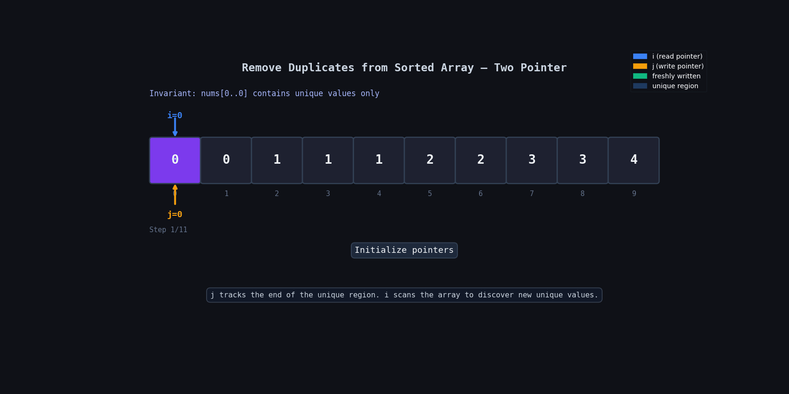

**Question Description: Remove Duplicates from Sorted Array**

```js
Given an integer array nums sorted in non-decreasing order, remove the duplicates in-place such that each unique element appears only once. The relative order of the elements should be kept the same.

Consider the number of unique elements in nums to be k​​​​​​​​​​​​​​. After removing duplicates, return the number of unique elements k.

The first k elements of nums should contain the unique numbers in sorted order. The remaining elements beyond index k - 1 can be ignored.

Example 1:

Input: nums = [1,1,2]
Output: 2, nums = [1,2,_]
Explanation: Your function should return k = 2, with the first two elements of nums being 1 and 2 respectively.
It does not matter what you leave beyond the returned k (hence they are underscores).
Example 2:

Input: nums = [0,0,1,1,1,2,2,3,3,4]
Output: 5, nums = [0,1,2,3,4,_,_,_,_,_]
Explanation: Your function should return k = 5, with the first five elements of nums being 0, 1, 2, 3, and 4 respectively.
It does not matter what you leave beyond the returned k (hence they are underscores).
```

**code**

```js
var removeDuplicates = function (nums) {
  let j = 0;

  for (let i = 0; i < nums.length; i++) {
    if (nums[i] !== nums[j]) {
      j = j + 1;
      nums[j] = nums[i];
    }
  }

  return j + 1;
};

removeDuplicates([1, 1, 2]);
removeDuplicates([0, 0, 1, 1, 1, 2, 2, 3, 3, 4]);
```

## 📋 Logic Summary

- **Two pointers, different work:**  
  `i` is used to traverse the array, while `j` keeps track of the position of the last unique element.

- **Why this works on a sorted array:**  
  Since the array is sorted, duplicate values will always come next to each other. So we only need to compare the current element with the last unique element.

- **When we find a new element:**  
  If `nums[i] !== nums[j]`, it means we found a new unique value.

- **Place the unique element:**  
  We move `j` one step forward and store the new unique value at `nums[j]`.

- **No extra array needed:**  
  We update the same array instead of creating a new one, so the solution works in-place.

- **Final answer:**  
  `j` always points to the last unique element, so `j + 1` gives the total count of unique elements.

---

## 🔍 Dry Run

Input: `[0, 0, 1, 1, 1, 2, 2, 3, 3, 4]`

| Step | `i` | `j` | `nums[i]` | `nums[j]` | Match? | Array state             | Action       |
| ---- | --- | --- | --------- | --------- | ------ | ----------------------- | ------------ |
| Init | 0   | 0   | 0         | 0         | ✅     | `[0,0,1,1,1,2,2,3,3,4]` | skip         |
| 1    | 1   | 0   | 0         | 0         | ✅     | `[0,0,1,1,1,2,2,3,3,4]` | skip         |
| 2    | 2   | 0   | 1         | 0         | ❌     | `[0,1,1,1,1,2,2,3,3,4]` | j→1, write 1 |
| 3    | 3   | 1   | 1         | 1         | ✅     | `[0,1,1,1,1,2,2,3,3,4]` | skip         |
| 4    | 4   | 1   | 1         | 1         | ✅     | `[0,1,1,1,1,2,2,3,3,4]` | skip         |
| 5    | 5   | 1   | 2         | 1         | ❌     | `[0,1,2,1,1,2,2,3,3,4]` | j→2, write 2 |
| 6    | 6   | 2   | 2         | 2         | ✅     | `[0,1,2,1,1,2,2,3,3,4]` | skip         |
| 7    | 7   | 2   | 3         | 2         | ❌     | `[0,1,2,3,1,2,2,3,3,4]` | j→3, write 3 |
| 8    | 8   | 3   | 3         | 3         | ✅     | `[0,1,2,3,1,2,2,3,3,4]` | skip         |
| 9    | 9   | 3   | 4         | 3         | ❌     | `[0,1,2,3,4,2,2,3,3,4]` | j→4, write 4 |
| Done | —   | 4   | —         | —         | —      | `[0,1,2,3,4,_,_,_,_,_]` | return **5** |

---

## 🔍 Dry Run With Animation



## ⏱️ Complexity

**Time: O(n)**
`i` makes exactly one pass through all `n` elements. Each element is visited once, and the comparison + optional write are O(1).

**Space: O(1)**
No auxiliary array, no hash set. Only two integer pointers (`i`, `j`) are allocated regardless of input size. Mutations happen in-place.

---

## 🔑 Pattern to Remember

> Whenever you see **"remove/deduplicate in-place from a sorted array"**, think **slow-fast two pointer** — slow = write head, fast = read head.
> The same skeleton applies to: _Remove Element_, _Remove Duplicates II (allow k copies)_, _Move Zeroes_, etc.
