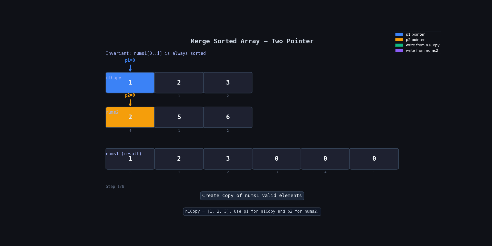
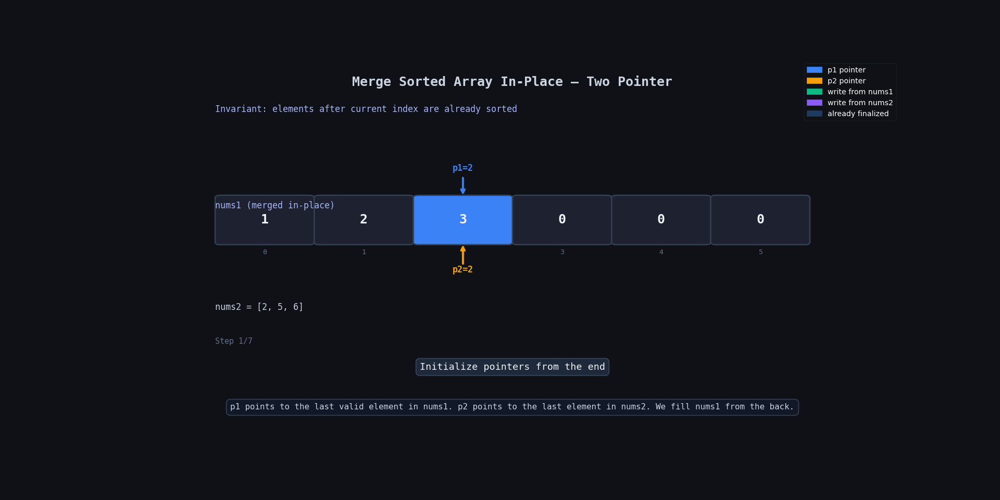

**Question Description: Merge Sorted Array**

```js
You are given two integer arrays nums1 and nums2, sorted in non-decreasing order, and two integers m and n, representing the number of elements in nums1 and nums2 respectively.

Merge nums1 and nums2 into a single array sorted in non-decreasing order.

The final sorted array should not be returned by the function, but instead be stored inside the array nums1. To accommodate this, nums1 has a length of m + n, where the first m elements denote the elements that should be merged, and the last n elements are set to 0 and should be ignored. nums2 has a length of n.

Example 1:

Input: nums1 = [1,2,3,0,0,0], m = 3, nums2 = [2,5,6], n = 3
Output: [1,2,2,3,5,6]
Explanation: The arrays we are merging are [1,2,3] and [2,5,6].
The result of the merge is [1,2,2,3,5,6] with the underlined elements coming from nums1.

Example 2:

Input: nums1 = [1], m = 1, nums2 = [], n = 0
Output: [1]
Explanation: The arrays we are merging are [1] and [].
The result of the merge is [1].

Example 3:

Input: nums1 = [0], m = 0, nums2 = [1], n = 1
Output: [1]
Explanation: The arrays we are merging are [] and [1].
The result of the merge is [1].
Note that because m = 0, there are no elements in nums1. The 0 is only there to ensure the merge result can fit in nums1.
```

**code**

```js
// With extra space
var merge = function (nums1, m, nums2, n) {
  let n1Copy = nums1?.slice(0, m);

  let p1 = 0;
  let p2 = 0;

  for (let i = 0; i < m + n; i++) {
    if (p2 >= n || (p1 < m && n1Copy[p1] < nums2[p2])) {
      nums1[i] = n1Copy[p1];
      p1 = p1 + 1;
    } else {
      nums1[i] = nums2[p2];
      p2 = p2 + 1;
    }
  }
};

// Without extra space
var merge = function (nums1, m, nums2, n) {
  let p1 = m - 1;
  let p2 = n - 1;

  for (let i = nums1?.length - 1; i >= 0; i--) {
    // if nums2 is fully used
    if (p2 < 0) return;

    if (p1 >= 0 && nums1[p1] >= nums2[p2]) {
      nums1[i] = nums1[p1];
      p1 = p1 - 1;
    } else {
      nums1[i] = nums2[p2];
      p2 = p2 - 1;
    }
  }
};
```

# Merge Sorted Array

## 💡 Main Idea

Both arrays are already sorted.

The trick is:

- Start from the end
- Compare the biggest elements
- Put the bigger value at the back of `nums1`

Why from the back?

Because `nums1` already has empty space at the end.  
So we can safely fill values without overwriting important elements.

---

# 🔍 Dry Run

## Input

```js
nums1 = [1, 2, 3, 0, 0, 0];
m = 3;

nums2 = [2, 5, 6];
n = 3;
```

---

## Initial Setup

```js
p1 = 2; // points to 3
p2 = 2; // points to 6
i = 5; // last index
```

---

## Step-by-Step Table

| Step | i   | p1  | p2  | nums1[p1] | nums2[p2] | Array State   | Action                    |
| ---- | --- | --- | --- | --------- | --------- | ------------- | ------------------------- |
| Init | -   | 2   | 2   | 3         | 6         | [1,2,3,0,0,0] | start                     |
| 1    | 5   | 2   | 2   | 3         | 6         | [1,2,3,0,0,6] | place 6, p2→1             |
| 2    | 4   | 2   | 1   | 3         | 5         | [1,2,3,0,5,6] | place 5, p2→0             |
| 3    | 3   | 2   | 0   | 3         | 2         | [1,2,3,3,5,6] | place 3, p1→1             |
| 4    | 2   | 1   | 0   | 2         | 2         | [1,2,2,3,5,6] | place 2 from nums1, p1→0  |
| 5    | 1   | 0   | 0   | 1         | 2         | [1,2,2,3,5,6] | place 2 from nums2, p2→-1 |
| Done | -   | 0   | -1  | -         | -         | [1,2,2,3,5,6] | return                    |

---

## 🔍 Dry Run With Animation With Extra Space Solution



---

## 🔍 Dry Run With Animation Without Extra Space Solution



---

# 🧠 Important Observation

We fill from the back because:

- biggest values belong at the end
- empty space already exists there
- no important value gets overwritten

---

# ⚠️ Important Condition

```js
if (p2 < 0) return;
```

Why only check `p2`?

Because:

- if nums2 finishes, merging is done
- remaining nums1 values are already in correct position

---

# ⏱ Time Complexity

```txt
O(m + n)
```

We visit each element once.

---

# 📦 Space Complexity

```txt
O(1)
```

No extra array is used.

---

# 🔑 Difference Between Both Approaches

| Approach              | Space | Idea                 |
| --------------------- | ----- | -------------------- |
| Extra Space Method    | O(m)  | copy nums1 first     |
| Backward Merge Method | O(1)  | fill nums1 from back |

---

# 🎯 Interview Tip

Whenever you see:

- merge into same array
- empty space given at end

Think:

```txt
Can I solve it from the back?
```

That is usually the optimized solution.
