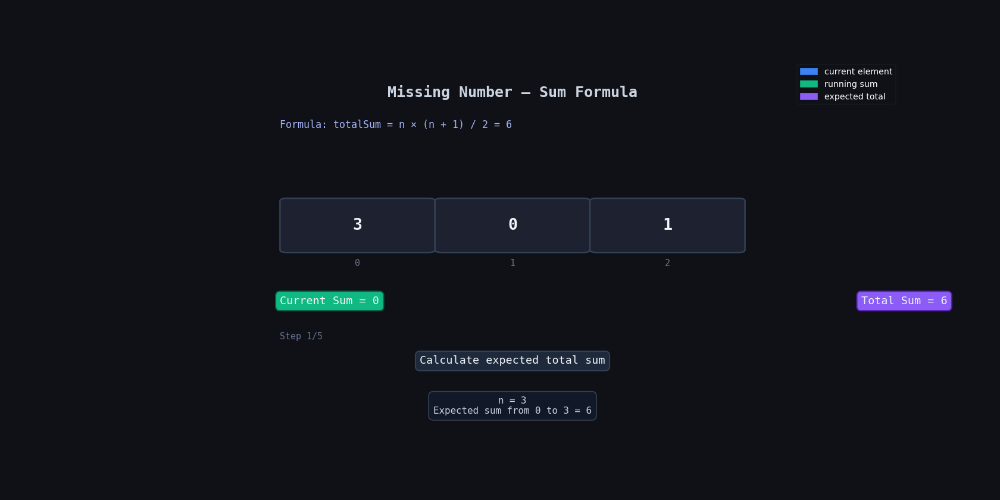

**Question Description: Missing Number**

```js
Given an array nums containing n distinct numbers in the range [0, n], return the only number in the range that is missing from the array.

Example 1:

Input: nums = [3,0,1]

Output: 2

Explanation:

n = 3 since there are 3 numbers, so all numbers are in the range [0,3]. 2 is the missing number in the range since it does not appear in nums.

Example 2:

Input: nums = [0,1]

Output: 2

Explanation:

n = 2 since there are 2 numbers, so all numbers are in the range [0,2]. 2 is the missing number in the range since it does not appear in nums.

Example 3:

Input: nums = [9,6,4,2,3,5,7,0,1]

Output: 8

Explanation:

n = 9 since there are 9 numbers, so all numbers are in the range [0,9]. 8 is the missing number in the range since it does not appear in nums.
```

**code**

```js
var missingNumber = function (nums) {
  let n = nums.length;

  let sum = 0;
  let totalSum = (n * (n + 1)) / 2;

  for (let i = 0; i < n; i++) {
    sum = sum + nums[i];
  }

  return totalSum - sum;
};
```

## 💡 Logic Summary

We know the array contains numbers from `0` to `n`.

So if we find:

- the **expected sum** of numbers from `0 → n`
- and subtract the **actual array sum**

then the remaining value will be the missing number.

Formula for sum of first `n` numbers:

:contentReference[oaicite:0]{index=0}

---

## 🔍 Dry Run

Input: `[3,0,1]`

| Step | `i` | `nums[i]` | `sum` | `totalSum` | Action                      |
| ---- | --- | --------- | ----- | ---------- | --------------------------- |
| Init | —   | —         | 0     | 6          | `n = 3`, total sum of `0→3` |
| 1    | 0   | 3         | 3     | 6          | add 3                       |
| 2    | 1   | 0         | 3     | 6          | add 0                       |
| 3    | 2   | 1         | 4     | 6          | add 1                       |
| Done | —   | —         | 4     | 6          | `6 - 4 = 2`                 |

Final Answer: `2`

---

## 🔍 Dry Run With Animation



---

## 🧠 Why This Works

Array should contain all numbers from `0` to `n`.

Example:

`[0,1,2,3]`

But one number is missing.

So:

- expected sum = sum of all numbers from `0 → n`
- actual sum = sum of numbers inside array

Difference between them gives the missing number.

---

## ⏱️ Complexity

| Complexity | Value  |
| ---------- | ------ |
| Time       | `O(n)` |
| Space      | `O(1)` |

---

## 📌 Quick Revision

- Find expected sum using formula
- Find actual array sum
- Return difference
- No sorting needed
- No extra array needed
