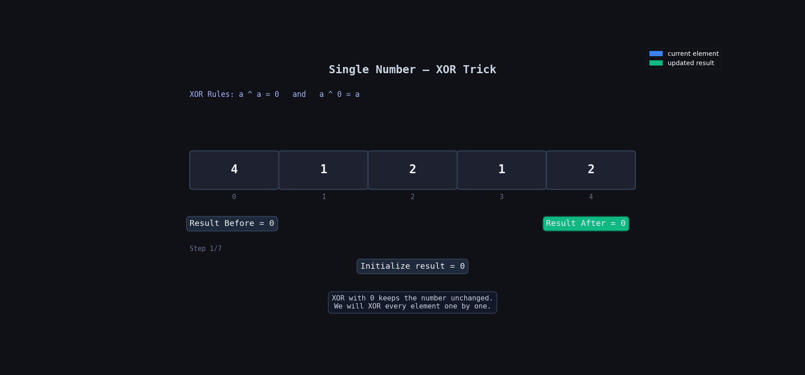

**Question Description: Single Number**

```js
Given a non-empty array of integers nums, every element appears twice except for one. Find that single one.

You must implement a solution with a linear runtime complexity and use only constant extra space.

Example 1:

Input: nums = [2,2,1]

Output: 1

Example 2:

Input: nums = [4,1,2,1,2]

Output: 4

Example 3:

Input: nums = [1]

Output: 1
```

**code**

```js
// using xor
var singleNumber = function (nums) {
  let result = 0;

  for (let i = 0; i < nums.length; i++) {
    result = result ^ nums[i];
  }

  return result;
};
```

---

```js
// using map
var singleNumber = function (nums) {
  let map = new Map();

  for (let i = 0; i < nums.length; i++) {
    if (map.has(nums[i])) {
      let existingItemValue = map.get(nums[i]);
      map.set(nums[i], existingItemValue + 1);
    } else {
      map.set(nums[i], 1);
    }
  }

  for (let [key, value] of map) {
    if (value === 1) {
      return key;
    }
  }
};
```

## 🧠 Problem Idea

In the array, every number appears **2 times** except one number which appears only **1 time**.

We need to find that single number.

Conditions:

- Time Complexity → `O(n)`
- Extra Space → `O(1)`

---

## 💡 Main Logic

XOR (`^`) has some special properties:

```js
a ^ a = 0
a ^ 0 = a
```

So when we XOR all numbers:

```js
2 ^ 2 = 0
1 stays as it is
```

Duplicate numbers cancel each other.

Only the single number remains at the end.

---

## 🔍 Dry Run

Input:

```js
[4, 1, 2, 1, 2];
```

| Step | `i` | `nums[i]` | Current `result` | Operation | New `result` |
| ---- | --- | --------- | ---------------- | --------- | ------------ |
| Init | —   | —         | 0                | start     | 0            |
| 1    | 0   | 4         | 0                | `0 ^ 4`   | 4            |
| 2    | 1   | 1         | 4                | `4 ^ 1`   | 5            |
| 3    | 2   | 2         | 5                | `5 ^ 2`   | 7            |
| 4    | 3   | 1         | 7                | `7 ^ 1`   | 6            |
| 5    | 4   | 2         | 6                | `6 ^ 2`   | 4            |
| Done | —   | —         | 4                | return    | 4            |

---

## 🔍 Dry Run With Animation



---

## 🎯 Why XOR Works

Array:

```js
[4, 1, 2, 1, 2];
```

Actually becomes:

```js
4 ^ 1 ^ 2 ^ 1 ^ 2;
```

Rearrange:

```js
1 ^ 1 ^ (2 ^ 2) ^ 4;
```

Duplicates become `0`:

```js
0 ^ 0 ^ 4;
```

Final answer:

```js
4;
```

---

## ⏱ Complexity

| Type  | Complexity |
| ----- | ---------- |
| Time  | `O(n)`     |
| Space | `O(1)`     |

---

## 💡 Logic of Map Solution

1. Store frequency of every number in map
2. Loop through map
3. Return the number whose count is `1`

---

## 🔍 Dry Run (Map)

Input:

```js
[2, 2, 1];
```

### First Loop → Store Frequency

| Step | `nums[i]` | Map State        |
| ---- | --------- | ---------------- |
| 1    | 2         | `{2 => 1}`       |
| 2    | 2         | `{2 => 2}`       |
| 3    | 1         | `{2 => 2, 1=>1}` |

---

### Second Loop → Find Single Number

| Key | Value | Action     |
| --- | ----- | ---------- |
| 2   | 2     | skip       |
| 1   | 1     | return `1` |

---

## ⏱ Complexity (Map Solution)

| Type  | Complexity |
| ----- | ---------- |
| Time  | `O(n)`     |
| Space | `O(n)`     |

---
