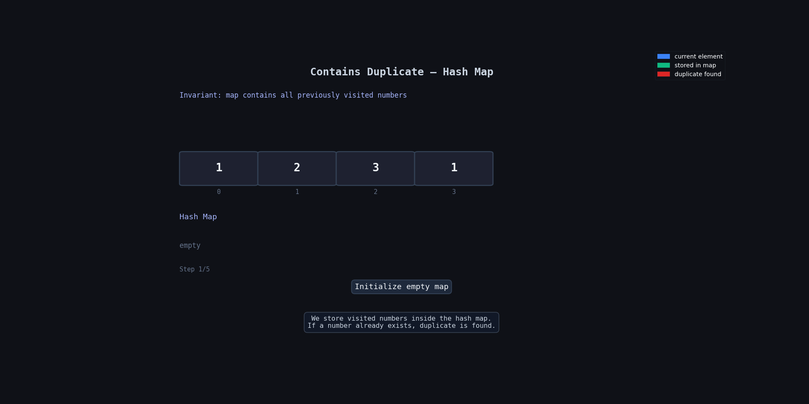

**Question Description: Contains Duplicate**

```js
Given an integer array nums, return true if any value appears at least twice in the array, and return false if every element is distinct.


Example 1:

Input: nums = [1,2,3,1]

Output: true

Explanation:

The element 1 occurs at the indices 0 and 3.

Example 2:

Input: nums = [1,2,3,4]

Output: false

Explanation:

All elements are distinct.

Example 3:

Input: nums = [1,1,1,3,3,4,3,2,4,2]

Output: true
```

**code**

```js
var containsDuplicate = function (nums) {
  let map = new Map();

  for (let i = 0; i < nums.length; i++) {
    if (map.has(nums[i])) {
      return true;
    } else {
      map.set(nums[i], 1);
    }
  }

  return false;
};
```

## 🧠 Idea

We need to check if any number appears more than once in the array.

We use a `Map` to store numbers we have already seen.

- If the current number already exists in the map → duplicate found → return `true`
- Otherwise, store it in the map and continue

If the loop finishes without finding duplicates, return `false`.

---

## 🔍 Dry Run

Input: `[1,2,3,1]`

| Step | `i` | `nums[i]` | Already in Map? | Map State | Action          |
| ---- | --- | --------- | --------------- | --------- | --------------- |
| Init | —   | —         | —               | `{}`      | start           |
| 1    | 0   | 1         | ❌ No           | `{1}`     | add 1           |
| 2    | 1   | 2         | ❌ No           | `{1,2}`   | add 2           |
| 3    | 2   | 3         | ❌ No           | `{1,2,3}` | add 3           |
| 4    | 3   | 1         | ✅ Yes          | `{1,2,3}` | duplicate found |
| Done | —   | —         | —               | `{1,2,3}` | return `true`   |

---

## 🔍 Dry Run With Animation



---

## 🧩 Why This Works

The map keeps track of all numbers we have already visited.

When we see a number again:

- `map.has(nums[i])` becomes `true`
- which means the number already exists
- so we immediately return `true`

If no duplicate is found after checking all elements, return `false`.

---

## ⏱️ Time and Space Complexity

| Complexity | Value  |
| ---------- | ------ |
| Time       | `O(n)` |
| Space      | `O(n)` |

### Why?

- We loop through the array once → `O(n)`
- In worst case, map stores all elements → `O(n)`

---

## 📌 Important Point

```js
if (map.has(nums[i])) {
  return true;
}
```

This is the main logic.

It checks:

- Have we already seen this number before?

If yes → duplicate exists.
