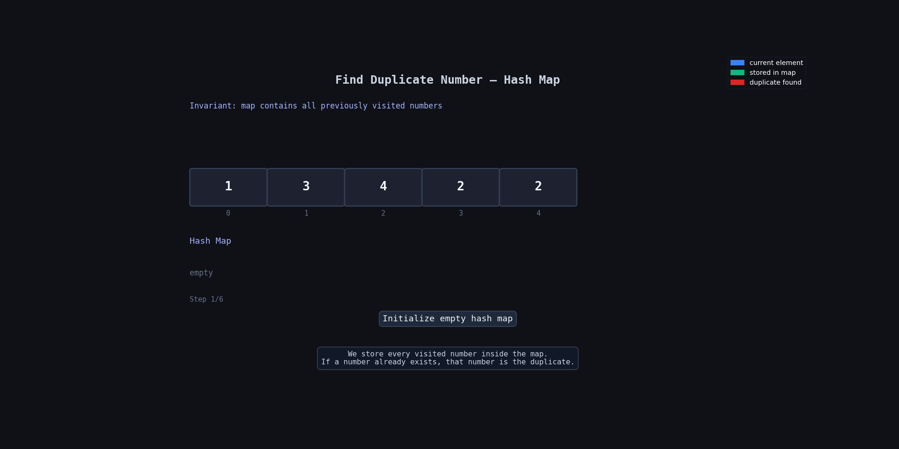

**Question Description: Find The Duplicate Number**

```js
Given an array of integers nums containing n + 1 integers where each integer is in the range [1, n] inclusive.

There is only one repeated number in nums, return this repeated number.

Example 1:

Input: nums = [1,3,4,2,2]
Output: 2

Example 2:

Input: nums = [3,1,3,4,2]
Output: 3

Example 3:

Input: nums = [3,3,3,3,3]
Output: 3
```

**code**

```js
// With extra space
var findDuplicate = function (nums) {
  let map = new Map();

  for (let i = 0; i < nums.length; i++) {
    if (map.has(nums[i])) {
      return nums[i];
    } else {
      map.set(nums[i], 1);
    }
  }

  return 0;
};
```

## 💡 Logic

We use a `Map` to keep track of numbers we already saw.

- Loop through the array
- If the current number already exists in the map:
  - that means it is repeated
  - return it immediately
- Otherwise store it in the map

The first duplicate we find is the answer.

---

# 🔍 Dry Run

Input: `[1,3,4,2,2]`

| Step | `i` | `nums[i]` | Already in Map? | Map State   | Action     |
| ---- | --- | --------- | --------------- | ----------- | ---------- |
| Init | —   | —         | —               | `{}`        | start      |
| 1    | 0   | 1         | ❌ No           | `{1}`       | add 1      |
| 2    | 1   | 3         | ❌ No           | `{1,3}`     | add 3      |
| 3    | 2   | 4         | ❌ No           | `{1,3,4}`   | add 4      |
| 4    | 3   | 2         | ❌ No           | `{1,3,4,2}` | add 2      |
| 5    | 4   | 2         | ✅ Yes          | `{1,3,4,2}` | return `2` |

---

## 🔍 Dry Run With Animation



---

# 🎯 Why This Works

A duplicate means the same number appears again.

So before inserting a number into the map, we check:

```js
map.has(nums[i]);
```

- `true` → duplicate found
- `false` → store it

Because map lookup is fast, the solution works efficiently.

---

# ⏱️ Time Complexity

```js
O(n);
```

We visit each element once.

---

# 📦 Space Complexity

```js
O(n);
```

Because the map may store up to `n` elements.

---

# 📌 Key Takeaway

This is one of the easiest ways to detect duplicates.

Main idea:

- Store seen values
- If value already exists → duplicate found

Very useful pattern for:

- duplicate problems
- frequency counting
- quick lookup questions
