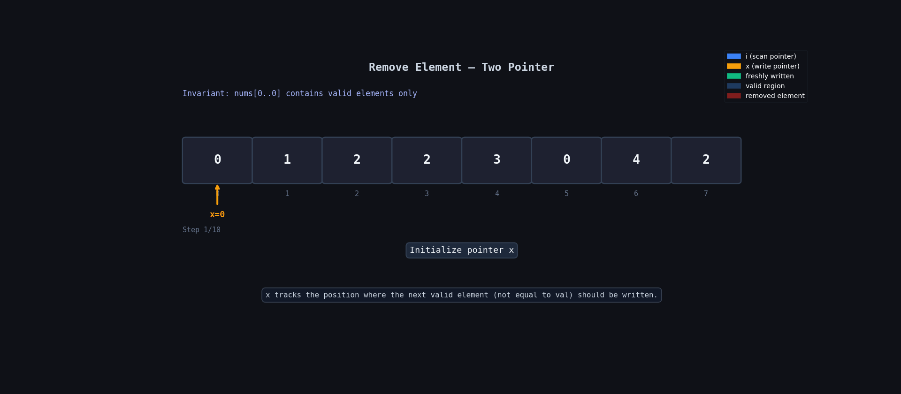

**Question Description: Remove Element**

```js

Given an integer array nums and an integer val, remove all occurrences of val in nums in-place. The order of the elements may be changed. Then return the number of elements in nums which are not equal to val.

Consider the number of elements in nums which are not equal to val be k, to get accepted, you need to do the following things:

* Change the array nums such that the first k elements of nums contain the elements which are not equal to val. The remaining elements of nums are not important as well as the size of nums.
* Return k.

Example 1:

Input: nums = [3,2,2,3], val = 3
Output: 2, nums = [2,2,_,_]
Explanation: Your function should return k = 2, with the first two elements of nums being 2.
It does not matter what you leave beyond the returned k (hence they are underscores).

Example 2:

Input: nums = [0,1,2,2,3,0,4,2], val = 2
Output: 5, nums = [0,1,4,0,3,_,_,_]
Explanation: Your function should return k = 5, with the first five elements of nums containing 0, 0, 1, 3, and 4.
Note that the five elements can be returned in any order.
It does not matter what you leave beyond the returned k (hence they are underscores).

```

**code**

```js
var removeElement = function (nums, val) {
  let x = 0;

  for (let i = 0; i < nums.length; i++) {
    if (nums[i] !== val) {
      nums[x] = nums[i];
      x = x + 1;
    }
  }

  return x;
};

removeElement([3, 2, 2, 3], 3);
removeElement([0, 1, 2, 2, 3, 0, 4, 2], 2);
```

## 📋 Logic Summary

- We use **two pointers** here:
  - `i` → used to traverse the array
  - `x` → used to place the next valid element

- While looping, we check:
  - if `nums[i] !== val`
  - then it means this element should stay in the array

- We place that valid element at index `x`:

  ```js
  nums[x] = nums[i];
  ```

- After placing the element, we move `x` forward because the next valid element should go to the next position.

- Main idea / aha moment:
  - Instead of deleting elements, we simply overwrite the unwanted values and keep all valid values at the beginning of the array.

---

## 🔍 Dry Run Table

Example:

```js
nums = [3, 2, 2, 3];
val = 3;
```

| Step  | i   | nums[i] | x   | Array State | Action / Note        |
| ----- | --- | ------- | --- | ----------- | -------------------- |
| Start | -   | -       | 0   | [3,2,2,3]   | Initial state        |
| 1     | 0   | 3       | 0   | [3,2,2,3]   | `3 === val`, skip    |
| 2     | 1   | 2       | 0   | [2,2,2,3]   | Put `2` at index `0` |
| 3     | 1   | 2       | 1   | [2,2,2,3]   | Increase `x`         |
| 4     | 2   | 2       | 1   | [2,2,2,3]   | Put `2` at index `1` |
| 5     | 2   | 2       | 2   | [2,2,2,3]   | Increase `x`         |
| 6     | 3   | 3       | 2   | [2,2,2,3]   | `3 === val`, skip    |

Final:

```js
x = 2;
```

First `2` elements are valid:

```js
[2, 2];
```

---

## 🔍 Dry Run With Animation



---

## ⏱️ Complexity

### Time Complexity: `O(n)`

- We traverse the array only once.
- `n` = length of array.

So total operations are proportional to array size.

---

### Space Complexity: `O(1)`

- We are not using any extra array.
- Changes are done directly inside the same array.

So extra space used is constant.

---

## ⚠️ Edge Cases & Gotchas

### 1. Array contains only `val`

```js
nums = [3, 3, 3];
val = 3;
```

- No element is copied.
- `x` remains `0`.

---

### 2. Array contains no `val`

```js
nums = [1, 2, 4];
val = 3;
```

- Every element is valid.
- Array stays the same.

---

### 3. Empty array

```js
nums = [];
```

- Loop never runs.
- Return `0`.

---

### 4. `x` is NOT the last index

Important:

- `x` represents the count of valid elements.
- It is also the next position where a valid element should go.

So returning `x` directly gives the answer.

---

### 5. Order after `k` does not matter

Question only cares about:

```js
nums[0 ... k-1]
```

Anything after that can be ignored.

```js
[2, 2, _, _];
```

So no need to clean remaining elements.
