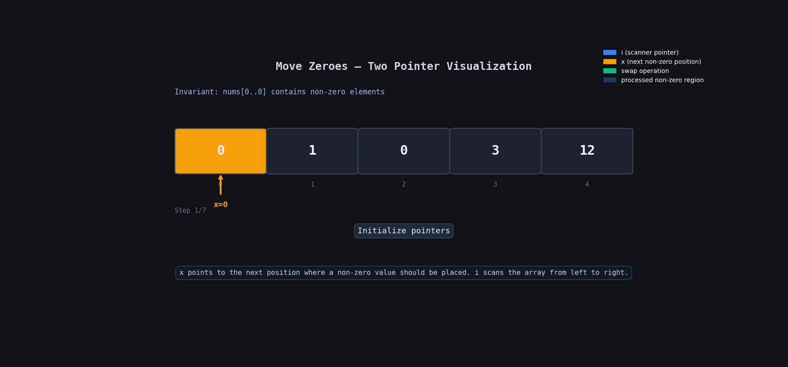

**Question Description: Move Zeroes**

```js

Given an integer array nums, move all 0's to the end of it while maintaining the relative order of the non-zero elements.

Note that you must do this in-place without making a copy of the array.

Example 1:

Input: nums = [0,1,0,3,12]
Output: [1,3,12,0,0]
Example 2:

Input: nums = [0]
Output: [0]

```

**code**

```js
var moveZeroes = function (nums) {
  let x = 0;
  let val = 0;
  for (let i = 0; i < nums.length; i++) {
    if (nums[i] !== val) {
      // Switch them so that zero are at the end
      let temp = nums[x];
      nums[x] = nums[i];
      nums[i] = temp;
      x = x + 1;
    }
  }

  return nums;
};

moveZeroes([0, 1, 0, 3, 12]);
moveZeroes([0]);
```

## Logic Summary

We need to move all `0`s to the end while keeping the order of non-zero elements the same.

The main trick here is:

- Keep one pointer `x`
- `x` tells us the position where the next non-zero element should go
- Traverse the array
- Whenever we find a non-zero element:
  - swap it with `nums[x]`
  - move `x` forward

This way:

- all non-zero values come to the front
- all zeroes automatically move to the back

---

## 🔍 Dry Run With Animation



# Step by Step Dry Run

Input:

```js
[0, 1, 0, 3, 12];
```

Initial:

```js
x = 0;
```

---

## i = 0

```js
nums[i] = 0;
```

It is zero, so skip.

Array:

```js
[0, 1, 0, 3, 12];
```

---

## i = 1

```js
nums[i] = 1;
```

Non-zero found.

Swap `nums[x]` and `nums[i]`

Swap:

```js
nums[0] ↔ nums[1]
```

Array becomes:

```js
[1, 0, 0, 3, 12];
```

Move `x`

```js
x = 1;
```

---

## i = 2

```js
nums[i] = 0;
```

Skip.

Array stays same.

---

## i = 3

```js
nums[i] = 3;
```

Swap:

```js
nums[1] ↔ nums[3]
```

Array:

```js
[1, 3, 0, 0, 12];
```

Move `x`

```js
x = 2;
```

---

## i = 4

```js
nums[i] = 12;
```

Swap:

```js
nums[2] ↔ nums[4]
```

Array:

```js
[1, 3, 12, 0, 0];
```

Move `x`

```js
x = 3;
```

---

# Final Output

```js
[1, 3, 12, 0, 0];
```

---

# Why This Works

`x` always points to the position where the next non-zero number should be placed.

Whenever we find a non-zero:

- we move it to the correct front position
- zeroes get pushed backward automatically

Also:

- order of non-zero elements stays same
- no extra array is used

---

# Time Complexity

```txt
O(n)
```

We traverse the array only once.

---

# Space Complexity

```txt
O(1)
```

No extra space used.

---

# Easy Way to Remember

Think like this:

```txt
x = "next correct place for non-zero element"
```

Whenever you see a non-zero:

- put it at `x`
- move `x` ahead

That's it.
