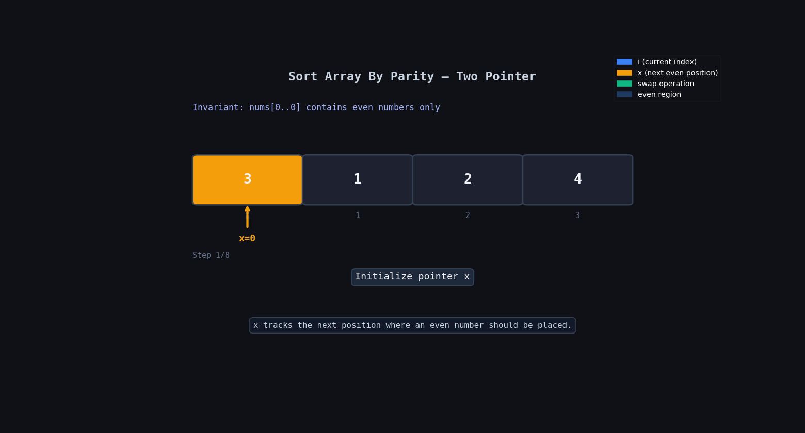

**Question Description: Sort Array By Parity**

```js

Given an integer array nums, move all the even integers at the beginning of the array followed by all the odd integers.

Return any array that satisfies this condition.

Example 1:

Input: nums = [3,1,2,4]
Output: [2,4,3,1]
Explanation: The outputs [4,2,3,1], [2,4,1,3], and [4,2,1,3] would also be accepted.
Example 2:

Input: nums = [0]
Output: [0]

```

**code**

```js
function isEven(num) {
  return num % 2 == 0;
}

var sortArrayByParity = function (nums) {
  let x = 0;

  for (let i = 0; i < nums.length; i++) {
    if (isEven(nums[i])) {
      let temp = nums[x];
      nums[x] = nums[i];
      nums[i] = temp;

      x = x + 1;
    }
  }

  return nums;
};

sortArrayByParity([3, 1, 2, 4]);
sortArrayByParity([0]);
```

# Main Idea

We use a pointer `x` to track the position where the next even number should be placed.

Whenever we find an even number:

1. Swap it with the element at index `x`
2. Move `x` forward

So:

- Left side of `x` always contains even numbers
- Remaining part contains unchecked elements or odd numbers

---

## 🔍 Dry Run

Input: `[3, 1, 2, 4]`

| Step | `i` | `x` | `nums[i]` | Even? | Array State | Action           |
| ---- | --- | --- | --------- | ----- | ----------- | ---------------- |
| Init | —   | 0   | —         | —     | `[3,1,2,4]` | start            |
| 1    | 0   | 0   | 3         | ❌    | `[3,1,2,4]` | skip             |
| 2    | 1   | 0   | 1         | ❌    | `[3,1,2,4]` | skip             |
| 3    | 2   | 0   | 2         | ✅    | `[2,1,3,4]` | swap(0,2), `x→1` |
| 4    | 3   | 1   | 4         | ✅    | `[2,4,3,1]` | swap(1,3), `x→2` |
| Done | —   | 2   | —         | —     | `[2,4,3,1]` | return array     |

---

## 🔍 Dry Run With Animation



# Why This Works

At every step:

- All indices before `x` contain even numbers
- We keep pushing even numbers to the front using swapping

This is similar to partition logic used in quick sort.

---

# Time Complexity

```txt
O(n)
```

We traverse the array only once.

---

# Space Complexity

```txt
O(1)
```

No extra array is used.

---

# Easy Memory Trick

Think like this:

```txt
x = "next position for even number"
```

Whenever you see an even number:

- place it at `x`
- move `x` ahead

---
