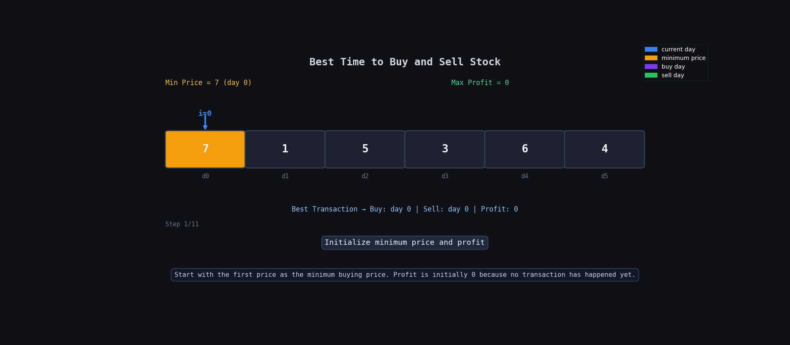

**Question Description: Best Time to Buy and Sell Stock**

```js
You are given an array prices where prices[i] is the price of a given stock on the ith day.

You want to maximize your profit by choosing a single day to buy one stock and choosing a different day in the future to sell that stock.

Return the maximum profit you can achieve from this transaction. If you cannot achieve any profit, return 0.

Example 1:

Input: prices = [7,1,5,3,6,4]
Output: 5
Explanation: Buy on day 2 (price = 1) and sell on day 5 (price = 6), profit = 6-1 = 5.
Note that buying on day 2 and selling on day 1 is not allowed because you must buy before you sell.
Example 2:

Input: prices = [7,6,4,3,1]
Output: 0
Explanation: In this case, no transactions are done and the max profit = 0.

```

**code**

```js
var maxProfit = function (prices) {
  let min = prices[0];
  let profit = 0;

  for (let i = 0; i < prices.length; i++) {
    if (min > prices[i]) {
      min = prices[i];
    }

    let currProfit = prices[i] - min;

    if (currProfit > profit) {
      profit = currProfit;
    }
  }

  return profit;
};
```

# 🧠 Logic

We traverse the array only once.

We keep track of:

- the minimum price seen so far
- the maximum profit possible

### Steps

### 1. Store minimum price

```js
let min = prices[0];
```

This stores the cheapest stock price till now.

---

### 2. Store maximum profit

```js
let profit = 0;
```

Initially profit is `0`.

---

### 3. Traverse the array

```js
for (let i = 0; i < prices.length; i++)
```

Check every stock price.

---

### 4. Update minimum price

```js
if (min > prices[i]) {
  min = prices[i];
}
```

If current price is smaller, update `min`.

This means:

> we found a better day to buy stock

---

### 5. Calculate current profit

```js
let currProfit = prices[i] - min;
```

Meaning:

```js
sell today - buy at minimum price
```

---

### 6. Update maximum profit

```js
if (currProfit > profit) {
  profit = currProfit;
}
```

If current profit is bigger, update answer.

---

# 🔍 Dry Run

Input: `[7,1,5,3,6,4]`

| Step | `i` | `prices[i]` | `min` | `currProfit` | `profit` | Action        |
| ---- | --- | ----------- | ----- | ------------ | -------- | ------------- |
| Init | —   | —           | 7     | —            | 0        | start         |
| 1    | 0   | 7           | 7     | 0            | 0        | no change     |
| 2    | 1   | 1           | 1     | 0            | 0        | update min    |
| 3    | 2   | 5           | 1     | 4            | 4        | update profit |
| 4    | 3   | 3           | 1     | 2            | 4        | no change     |
| 5    | 4   | 6           | 1     | 5            | 5        | update profit |
| 6    | 5   | 4           | 1     | 3            | 5        | no change     |
| Done | —   | —           | 1     | —            | 5        | return profit |

---

## 🔍 Dry Run With Animation



# 📌 Visualization

```text
prices = [7,1,5,3,6,4]

Buy at 1
Sell at 6

Profit = 6 - 1 = 5
```

---

# ⏱ Time Complexity

```text
O(n)
```

We traverse the array once.

---

# 📦 Space Complexity

```text
O(1)
```

Only a few variables are used.

---

# ✅ Important Point

We always try to:

- buy at the lowest price
- sell later for maximum profit

That is why tracking the minimum value works perfectly.
