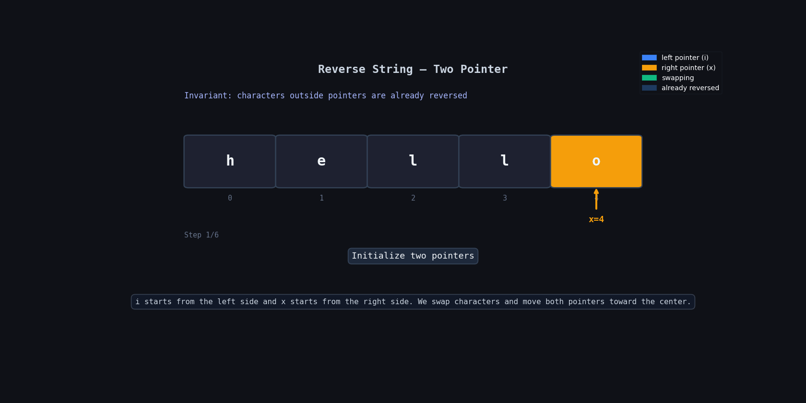

**Question Description: Reverse String**

```js
Write a function that reverses a string. The input string is given as an array of characters s.

You must do this by modifying the input array in-place with O(1) extra memory.

Example 1:

Input: s = ["h","e","l","l","o"]
Output: ["o","l","l","e","h"]
Example 2:

Input: s = ["H","a","n","n","a","h"]
Output: ["h","a","n","n","a","H"]
```

**code**

```js
var reverseString = function (s) {
  let x = s.length - 1;

  for (let i = 0; i < s.length / 2; i++) {
    let temp = s[i];
    s[i] = s[x];
    s[x] = temp;

    x = x - 1;
  }
};
```

## 🧠 Logic Summary

We need to reverse the array **in-place**, which means we should not create a new array.

So the best way is:

- Start one pointer from the beginning
- Start another pointer from the end
- Swap both values
- Move both pointers toward the center

We keep doing this until we reach the middle.

---

## 🔍 Dry Run

Input: `["h","e","l","l","o"]`

| Step | i   | x   | s[i] | s[x] | Array State           | Action         |
| ---- | --- | --- | ---- | ---- | --------------------- | -------------- |
| Init | —   | 4   | —    | —    | ["h","e","l","l","o"] | start          |
| 1    | 0   | 4   | h    | o    | ["o","e","l","l","h"] | swap(0,4)      |
| 2    | 1   | 3   | e    | l    | ["o","l","l","e","h"] | swap(1,3)      |
| Done | —   | 2   | —    | —    | ["o","l","l","e","h"] | array reversed |

---

## 🔍 Dry Run With Animation



## 💡 Why `s.length / 2`?

We only need to go till the middle.

Because one swap fixes **two positions**:

- front character
- back character

If we continue after the middle, we will undo the swaps again.

Example:

```txt
h ↔ o
e ↔ l
```

Now array is already reversed.

---

## ⏱ Time Complexity

```txt
O(n)
```

We loop through half of the array, but in Big-O it is still `O(n)`.

---

## 📦 Space Complexity

```txt
O(1)
```

We only use a temporary variable for swapping.

No extra array is created.

---

## 🎯 Important Points to Remember

- Use two pointers
- Swap start and end values
- Move both pointers toward center
- Stop at middle
- In-place means modify original array only
