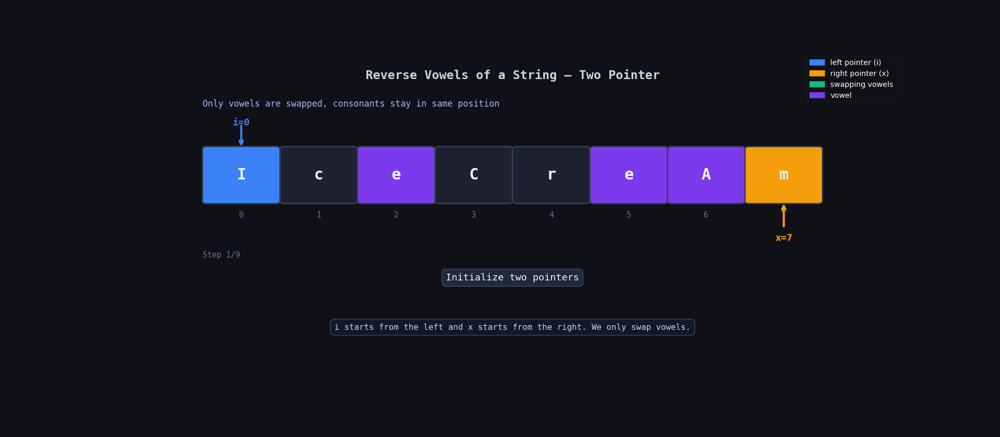

**Question Description: Valid Palindrome**

```js

A phrase is a palindrome if, after converting all uppercase letters into lowercase letters and removing all non-alphanumeric characters, it reads the same forward and backward. Alphanumeric characters include letters and numbers.

Given a string s, return true if it is a palindrome, or false otherwise.

Example 1:

Input: s = "A man, a plan, a canal: Panama"
Output: true
Explanation: "amanaplanacanalpanama" is a palindrome.

Example 2:

Input: s = "race a car"
Output: false
Explanation: "raceacar" is not a palindrome.

Example 3:

Input: s = " "
Output: true
Explanation: s is an empty string "" after removing non-alphanumeric characters.
Since an empty string reads the same forward and backward, it is a palindrome.

```

**code**

```js
/**
 * @param {string} s
 * @return {boolean}
 */
var isPalindrome = function (s) {
  let transformedStr = s?.toLowerCase()?.replace(/[^a-z0-9]/g, "");

  let n = transformedStr?.length;
  let x = n - 1;

  for (let i = 0; i < n / 2; i++) {
    if (transformedStr[i] !== transformedStr[x]) {
      return false;
    }

    x = x - 1;
  }

  return true;
};
```

## 🧠 Idea

We only care about letters and numbers.

So first:

- convert everything to lowercase
- remove spaces, commas, symbols, etc.

After that, check:

- does the string read same from left → right and right → left?

We use:

- one pointer from start (`i`)
- one pointer from end (`x`)

If any character does not match → return `false`.

If all characters match → return `true`.

---

# ✅ Step-by-Step Logic

### 1. Convert string to lowercase

```js
s.toLowerCase();
```

Example:

```txt
"AaB" → "aab"
```

---

### 2. Remove non-alphanumeric characters

```js
replace(/[^a-z0-9]/g, "");
```

This removes:

- spaces
- commas
- colons
- special characters

Example:

```txt
"A man, a plan!" → "amanaplan"
```

---

### 3. Compare characters from both sides

Use:

- `i` → start pointer
- `x` → end pointer

If:

```js
transformedStr[i] !== transformedStr[x];
```

then it is not a palindrome.

---

# 🔍 Dry Run

Input:

```txt
"A man, a plan, a canal: Panama"
```

After cleaning:

```txt
"amanaplanacanalpanama"
```

| Step | i   | x   | transformedStr[i] | transformedStr[x] | Match? | Action      |
| ---- | --- | --- | ----------------- | ----------------- | ------ | ----------- |
| Init | —   | 20  | —                 | —                 | —      | start       |
| 1    | 0   | 20  | a                 | a                 | ✅     | continue    |
| 2    | 1   | 19  | m                 | m                 | ✅     | continue    |
| 3    | 2   | 18  | a                 | a                 | ✅     | continue    |
| 4    | 3   | 17  | n                 | n                 | ✅     | continue    |
| 5    | 4   | 16  | a                 | a                 | ✅     | continue    |
| 6    | 5   | 15  | p                 | p                 | ✅     | continue    |
| ...  | ... | ... | ...               | ...               | ✅     | continue    |
| Done | —   | —   | —                 | —                 | ✅     | return true |

---

# ❌ Dry Run (Not Palindrome)

Input:

```txt
"race a car"
```

After cleaning:

```txt
"raceacar"
```

| Step | i   | x   | transformedStr[i] | transformedStr[x] | Match? | Action       |
| ---- | --- | --- | ----------------- | ----------------- | ------ | ------------ |
| Init | —   | 7   | —                 | —                 | —      | start        |
| 1    | 0   | 7   | r                 | r                 | ✅     | continue     |
| 2    | 1   | 6   | a                 | a                 | ✅     | continue     |
| 3    | 2   | 5   | c                 | c                 | ✅     | continue     |
| 4    | 3   | 4   | e                 | a                 | ❌     | return false |

---

## 🔍 Dry Run With Animation



# ⏱️ Time Complexity

```txt
O(n)
```

We traverse the string once.

---

# 📦 Space Complexity

```txt
O(n)
```

Because we create a new cleaned string.

---
