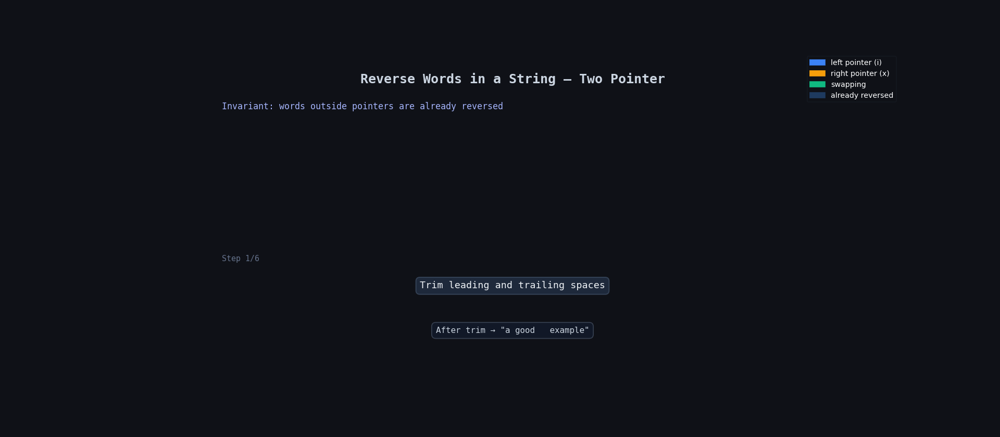

**Question Description: Reverse Words in a String**

```js

Given an input string s, reverse the order of the words.

A word is defined as a sequence of non-space characters. The words in s will be separated by at least one space.

Return a string of the words in reverse order concatenated by a single space.

Note that s may contain leading or trailing spaces or multiple spaces between two words. The returned string should only have a single space separating the words. Do not include any extra spaces.

Example 1:

Input: s = "the sky is blue"
Output: "blue is sky the"

Example 2:

Input: s = "  hello world  "
Output: "world hello"
Explanation: Your reversed string should not contain leading or trailing spaces.

Example 3:

Input: s = "a good   example"
Output: "example good a"
Explanation: You need to reduce multiple spaces between two words to a single space in the reversed string.

```

**code**

```js
var reverseWords = function (s) {
  const str = s?.trim()?.replace(/\s+/g, " ");
  const arr = str?.split(" ");

  let x = arr.length - 1;
  for (let i = 0; i < arr.length / 2; i++) {
    let temp = arr[i];
    arr[i] = arr[x];
    arr[x] = temp;
    x = x - 1;
  }
  return arr?.join(" ");
};
```

## 🧠 Idea

We need to return all words in reverse order.

But the string can contain:

- extra spaces at start
- extra spaces at end
- multiple spaces between words

So first we clean the string, then reverse the words.

---

## ✅ Steps

1. Remove extra spaces using `trim()`
2. Replace multiple spaces with single space
3. Convert string into array using `split(" ")`
4. Reverse array using two pointers
5. Join array back into string

---

## 🔍 Dry Run

### Input:

```js
s = "  hello world  ";
```

### After Cleaning String

```js
str = "hello world";
```

### Convert to Array

```js
arr = ["hello", "world"];
```

---

| Step | i   | x   | arr[i] | arr[x] | Array State       | Action          |
| ---- | --- | --- | ------ | ------ | ----------------- | --------------- |
| Init | —   | 1   | —      | —      | ["hello","world"] | start           |
| 1    | 0   | 1   | hello  | world  | ["world","hello"] | swap(0,1)       |
| Done | —   | 0   | —      | —      | ["world","hello"] | join with space |

---

## 🔍 Dry Run With Animation



---

## ✅ Final Output

```js
"world hello";
```

---

## ⏱ Time Complexity

```js
O(n);
```

We traverse the string and array a few times.

---

## 📦 Space Complexity

```js
O(n);
```

Because we create a new array using `split()`.

---

## 💡 Important Points

### `trim()`

Removes spaces from start and end.

```js
"  hello world  " -> "hello world"
```

---

### `replace(/\s+/g, " ")`

Converts multiple spaces into one space.

```js
"a   good    example" -> "a good example"
```

---

### Two Pointer Reverse

We swap:

- first word with last
- second word with second last

until middle is reached.

---

## 🎯 Explanation

First I clean the string by removing extra spaces.  
Then I split the string into words.  
After that I reverse the array using two pointers and finally join the words using single space.
