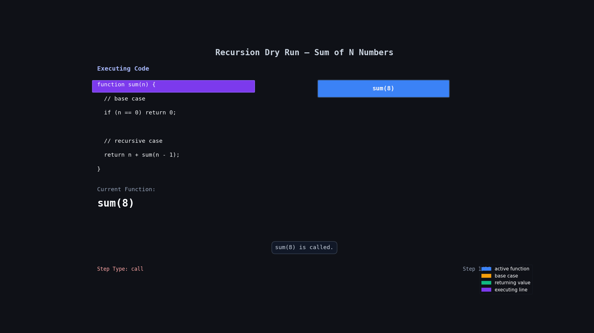

## Sum of n Numbers Using Recursion

## Problem Statement

Given an integer `n`, return the sum of the first `n` natural numbers using recursion.

You must solve the problem without using loops.

### Examples

```txt
Input: n = 8
Output: 36

Explanation:
1 + 2 + 3 + 4 + 5 + 6 + 7 + 8 = 36
```

```txt
Input: n = 3
Output: 6

Explanation:
1 + 2 + 3 = 6
```

---

# Code

```js
function sum(n) {
  // base case
  if (n == 0) return 0;

  // recursive case
  return n + sum(n - 1);
}

console.log(sum(8));
```

---

# Simple Understanding

The function keeps adding the current number `n` and calls itself with a smaller number (`n - 1`).

It keeps going smaller and smaller until it reaches `0`.

When it reaches `0`, recursion stops and all the answers start coming back.

---

# Important Parts

## Base Case

```js
if (n == 0) return 0;
```

This is the stopping condition.

If we do not stop recursion, the function will keep calling forever.

---

## Recursive Case

```js
return n + sum(n - 1);
```

This means:

- Add current number `n`
- Then solve the smaller problem `sum(n - 1)`

---

# Flow Visualization

For:

```js
sum(4);
```

The function calls happen like this:

```txt
sum(4)
= 4 + sum(3)

= 4 + 3 + sum(2)

= 4 + 3 + 2 + sum(1)

= 4 + 3 + 2 + 1 + sum(0)

= 4 + 3 + 2 + 1 + 0

= 10
```

---

# 🔍 Dry Run

Input:

```js
n = 4;
```

| Step | Function Call | What Happens      | Return Value |
| ---- | ------------- | ----------------- | ------------ |
| 1    | `sum(4)`      | `4 + sum(3)`      | waits        |
| 2    | `sum(3)`      | `3 + sum(2)`      | waits        |
| 3    | `sum(2)`      | `2 + sum(1)`      | waits        |
| 4    | `sum(1)`      | `1 + sum(0)`      | waits        |
| 5    | `sum(0)`      | base case reached | `0`          |
| 6    | `sum(1)`      | `1 + 0`           | `1`          |
| 7    | `sum(2)`      | `2 + 1`           | `3`          |
| 8    | `sum(3)`      | `3 + 3`           | `6`          |
| 9    | `sum(4)`      | `4 + 6`           | `10`         |

---

## 🔍 Dry Run With Animation



---

# How Recursion Stack Works

```txt
sum(4)
  sum(3)
    sum(2)
      sum(1)
        sum(0)
```

Now returning back:

```txt
sum(0) = 0
sum(1) = 1
sum(2) = 3
sum(3) = 6
sum(4) = 10
```

---

# Time Complexity

```txt
O(n)
```

Because function runs `n` times.

---

# Space Complexity

```txt
O(n)
```

Because recursion uses call stack memory.

---

# Key Learning

- Recursion means function calling itself.
- Every recursion needs:
  - Base case
  - Recursive case
- First function calls go deep.
- Then answers come back step by step.

---

# Pattern To Remember

```js
function recursion(n) {
  // base case
  if (condition) return answer;

  // recursive case
  return small_work + recursion(smaller_input);
}
```
