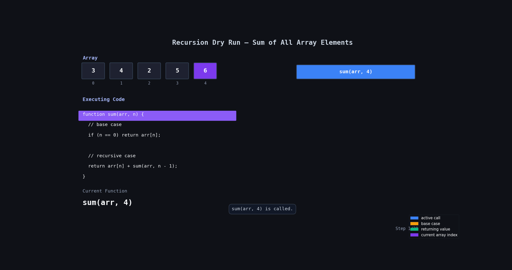

# Sum of all elements in array

## Problem Statement

Given an integer array `arr` of size `n`, return the sum of all elements in the array using recursion.

You must solve the problem without using loops.

### Examples

```js
Input: arr = [3, 4, 2, 5, 6];
Output: 20;

Input: arr = [1];
Output: 1;
```

---

# Code

```js
let arr = [3, 4, 2, 5, 6];

function sum(arr, n) {
  // base case
  if (n == 0) return arr[n];

  // recursive case
  return arr[n] + sum(arr, n - 1);
}

console.log(sum(arr, arr.length - 1));
```

---

# Simple Idea

We start from the last index.

At every step:

- take current element `arr[n]`
- add it with the sum of remaining elements
- move to smaller problem using `n - 1`

Recursion keeps moving left until it reaches index `0`.

---

# Base Case

```js
if (n == 0) return arr[n];
```

When only one element is left, return it directly.

Example:

```js
arr[0] = 3;
```

So return:

```js
3;
```

---

# Recursive Case

```js
return arr[n] + sum(arr, n - 1);
```

Meaning:

```js
current element + sum of remaining array
```

Example:

```js
6 + sum(arr, 3);
```

Then:

```js
5 + sum(arr, 2);
```

And so on...

---

# 🔍 Dry Run

## Input

```js
arr = [3, 4, 2, 5, 6];
```

## Function Call

```js
sum(arr, 4);
```

| Step | `n` | `arr[n]` | Function Call     | Returned Value |
| ---- | --- | -------- | ----------------- | -------------- |
| 1    | 4   | 6        | `6 + sum(arr, 3)` | `6 + 14 = 20`  |
| 2    | 3   | 5        | `5 + sum(arr, 2)` | `5 + 9 = 14`   |
| 3    | 2   | 2        | `2 + sum(arr, 1)` | `2 + 7 = 9`    |
| 4    | 1   | 4        | `4 + sum(arr, 0)` | `4 + 3 = 7`    |
| 5    | 0   | 3        | Base Case         | `3`            |

---

# Recursive Flow

```txt
sum(arr, 4)

= 6 + sum(arr, 3)

= 6 + 5 + sum(arr, 2)

= 6 + 5 + 2 + sum(arr, 1)

= 6 + 5 + 2 + 4 + sum(arr, 0)

= 6 + 5 + 2 + 4 + 3

= 20
```

---

## 🔍 Dry Run With Animation



---

# Time Complexity

```txt
O(n)
```

Because recursion runs once for every element.

---

# Space Complexity

```txt
O(n)
```

Because recursive calls are stored in call stack.
