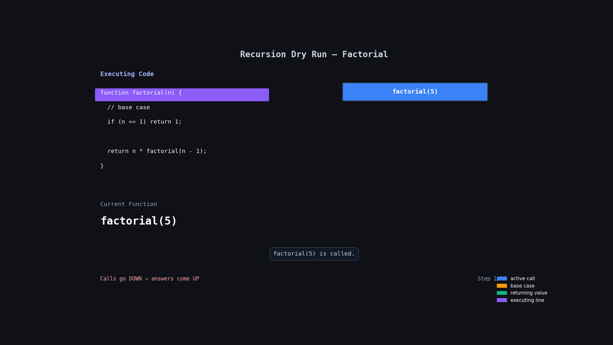

# Find Factorial

## Problem Statement

Given a positive integer `n`, find the factorial of `n`.

### Examples

```js
Input: n = 5
Output: 120
Explanation: 1 x 2 x 3 x 4 x 5 = 120

Input: n = 4
Output: 24
Explanation: 1 x 2 x 3 x 4 = 24
```

---

# Code

```js
function factorial(n) {
  // base case
  if (n == 1) return 1;

  // recursive case
  return n * factorial(n - 1);
}
```

---

# Simple Idea

Factorial means:

```txt
multiply all numbers from n to 1
```

Example:

```txt
5! = 5 × 4 × 3 × 2 × 1
```

In recursion:

- take current number `n`
- multiply it with factorial of smaller number
- keep reducing by `1`

---

# Base Case

```js
if (n == 1) return 1;
```

Why?

Because factorial of `1` is already known.

```txt
1! = 1
```

This stops the recursion.

---

# Recursive Case

```js
return n * factorial(n - 1);
```

Meaning:

```txt
current number × factorial of smaller number
```

Example:

```js
5 * factorial(4);
```

Then:

```js
4 * factorial(3);
```

And so on...

---

# 🔍 Dry Run

## Input

```js
n = 5;
```

---

## 🔍 Dry Run With Animation



---

## Function Call

```js
factorial(5);
```

| Step | `n` | Function Call      | Returned Value |
| ---- | --- | ------------------ | -------------- |
| 1    | 5   | `5 * factorial(4)` | `5 * 24 = 120` |
| 2    | 4   | `4 * factorial(3)` | `4 * 6 = 24`   |
| 3    | 3   | `3 * factorial(2)` | `3 * 2 = 6`    |
| 4    | 2   | `2 * factorial(1)` | `2 * 1 = 2`    |
| 5    | 1   | Base Case          | `1`            |

---

# Recursive Flow

```txt
factorial(5)

= 5 * factorial(4)

= 5 * 4 * factorial(3)

= 5 * 4 * 3 * factorial(2)

= 5 * 4 * 3 * 2 * factorial(1)

= 5 * 4 * 3 * 2 * 1

= 120
```

---

# Important Thing To Notice

This line is very important:

```js
return n * factorial(n - 1);
```

We multiply while coming back from recursion.

First recursion goes down:

```txt
5 → 4 → 3 → 2 → 1
```

Then answers come back upward:

```txt
1 → 2 → 6 → 24 → 120
```

---

# Time Complexity

```txt
O(n)
```

Because recursion runs `n` times.

---

# Space Complexity

```txt
O(n)
```

Because recursive calls are stored in call stack.
