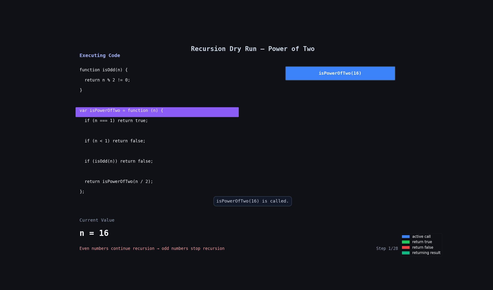

# Power of Two

## Problem Statement

Given an integer `n`, return `true` if it is a power of two. Otherwise, return `false`.

An integer `n` is a power of two if there exists an integer `x` such that:

```txt
n = 2^x
```

### Examples

```js
Input: n = 1
Output: true
Explanation: 2^0 = 1

Input: n = 16
Output: true
Explanation: 2^4 = 16

Input: n = 3
Output: false
```

---

# Code

```js
function isOdd(n) {
  return n % 2 != 0;
}

var isPowerOfTwo = function (n) {
  // base case
  if (n === 1) return true;

  // invalid case
  if (n < 1) return false;

  // odd numbers cannot be power of 2
  if (isOdd(n)) return false;

  // recursive case
  return isPowerOfTwo(n / 2);
};
```

---

# Simple Idea

A power of two can always be divided by `2`.

Example:

```txt
16 → 8 → 4 → 2 → 1
```

If we finally reach `1`, then number is a power of two.

If at some point:

- number becomes odd
- or becomes smaller than `1`

then answer is `false`.

---

# Base Case

```js
if (n === 1) return true;
```

Why?

Because:

```txt
2^0 = 1
```

So reaching `1` means the number is a valid power of two.

---

# Invalid Case

```js
if (n < 1) return false;
```

Negative numbers and `0` cannot be powers of two.

Example:

```txt
0 → false
-4 → false
```

---

# Odd Number Check

```js
if (isOdd(n)) return false;
```

Power of two numbers are always divisible by `2`.

If number is odd before reaching `1`, it cannot be a power of two.

Example:

```txt
3 → odd → false
10 → 5 → odd → false
```

---

# Recursive Case

```js
return isPowerOfTwo(n / 2);
```

Meaning:

```txt
keep dividing by 2
```

Until:

- we reach `1`
- or find an invalid condition

---

# 🔍 Dry Run

## Input

```js
n = 16;
```

## Function Call

```js
isPowerOfTwo(16);
```

| Step | `n` | Odd? | Function Call     | Result   |
| ---- | --- | ---- | ----------------- | -------- |
| 1    | 16  | ❌   | `isPowerOfTwo(8)` | continue |
| 2    | 8   | ❌   | `isPowerOfTwo(4)` | continue |
| 3    | 4   | ❌   | `isPowerOfTwo(2)` | continue |
| 4    | 2   | ❌   | `isPowerOfTwo(1)` | continue |
| 5    | 1   | —    | Base Case         | `true`   |

Final Answer:

```js
true;
```

---

# 🔍 Dry Run 2

## Input

```js
n = 10;
```

## Function Call

```js
isPowerOfTwo(10);
```

| Step | `n` | Odd? | Function Call     | Result   |
| ---- | --- | ---- | ----------------- | -------- |
| 1    | 10  | ❌   | `isPowerOfTwo(5)` | continue |
| 2    | 5   | ✅   | Odd Number        | `false`  |

Final Answer:

```js
false;
```

---

# Recursive Flow

## Example: `n = 16`

```txt
isPowerOfTwo(16)

→ isPowerOfTwo(8)

→ isPowerOfTwo(4)

→ isPowerOfTwo(2)

→ isPowerOfTwo(1)

→ true
```

---

## 🔍 Dry Run With Animation



---

# Important Thing To Notice

This line is very important:

```js
return isPowerOfTwo(n / 2);
```

We keep reducing the problem size by half.

That is why recursion becomes fast here.

Also notice:

```js
if (isOdd(n)) return false;
```

Odd numbers cannot be powers of two except `1`.

---

# Time Complexity

```txt
O(log n)
```

Because number gets divided by `2` every time.

---

# Space Complexity

```txt
O(log n)
```

Because recursive calls are stored in call stack.
