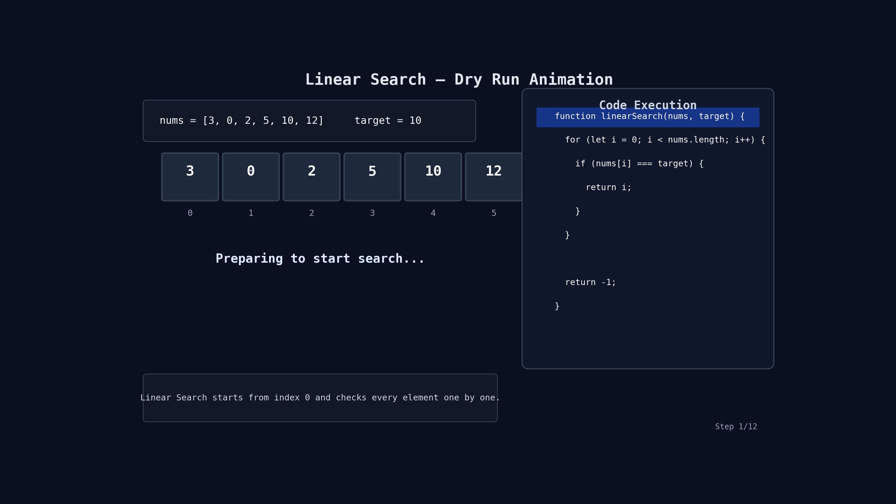

# Linear Search

## Problem

Given an array `nums` and a `target`, return the index of the target if it exists in the array.

If the target is not present, return `-1`.

---

## Example

```js
Input: ((nums = [3, 0, 2, 5, 10, 12]), (target = 10));
Output: 4;
```

```js
Input: ((nums = [-1, 0, 13, 52, 9, 12]), (target = 2));
Output: -1;
```

---

## Code

```js
function linearSearch(nums, target) {
  for (let i = 0; i < nums.length; i++) {
    if (nums[i] === target) {
      return i;
    }
  }

  return -1;
}
```

---

## Simple Idea

We check every element one by one.

- If current element equals target → return index
- If target is not found till the end → return `-1`

---

## Step-by-Step Flow

```text
Start loop from i = 0

Check:
nums[i] === target ?

YES → return i
NO  → move to next index

If loop finishes:
return -1
```

---

## 🔍 Dry Run

Input:

```js
nums = [3, 0, 2, 5, 10, 12];
target = 10;
```

| Step | `i` | `nums[i]` | `target` | Match? | Action     |
| ---- | --- | --------- | -------- | ------ | ---------- |
| 1    | 0   | 3         | 10       | ❌     | move ahead |
| 2    | 1   | 0         | 10       | ❌     | move ahead |
| 3    | 2   | 2         | 10       | ❌     | move ahead |
| 4    | 3   | 5         | 10       | ❌     | move ahead |
| 5    | 4   | 10        | 10       | ✅     | return `4` |

Final Answer:

```js
4;
```

---

## 🔍 Dry Run (Target Not Found)

Input:

```js
nums = [-1, 0, 13, 52, 9, 12];
target = 2;
```

| Step | `i` | `nums[i]` | `target` | Match? | Action        |
| ---- | --- | --------- | -------- | ------ | ------------- |
| 1    | 0   | -1        | 2        | ❌     | move ahead    |
| 2    | 1   | 0         | 2        | ❌     | move ahead    |
| 3    | 2   | 13        | 2        | ❌     | move ahead    |
| 4    | 3   | 52        | 2        | ❌     | move ahead    |
| 5    | 4   | 9         | 2        | ❌     | move ahead    |
| 6    | 5   | 12        | 2        | ❌     | loop finished |

Target not found, so return:

```js
-1;
```

---

## 🔍 Dry Run With Animation



---

## Time Complexity

- Worst Case: `O(n)`
- Best Case: `O(1)`

---

## Space Complexity

```text
O(1)
```

---

## Quick Revision

```text
1. Start from index 0
2. Compare each element with target
3. If found → return index
4. Else return -1
```
