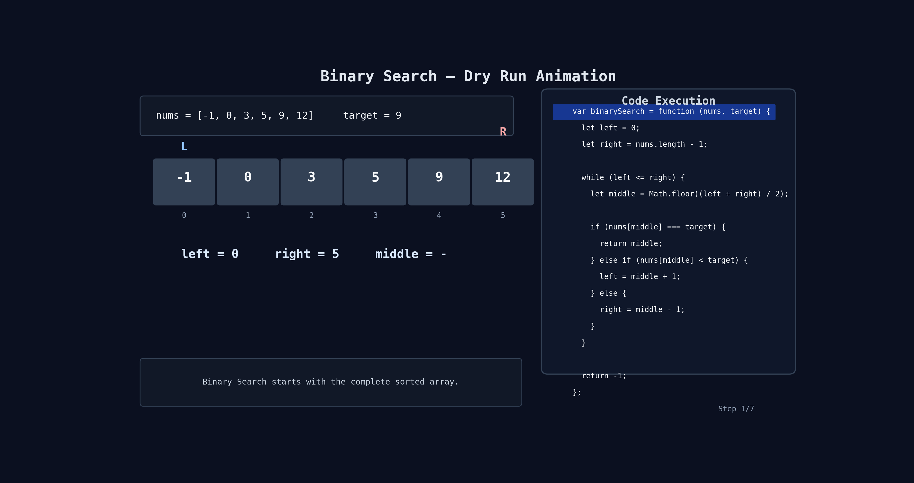

# Binary Search

## Problem

Given a sorted array `nums` in ascending order and a `target`, return the index of the target if it exists.

If target does not exist, return `-1`.

You must solve it in `O(log n)` time complexity.

---

## Example

```js
Input: ((nums = [-1, 0, 3, 5, 9, 12]), (target = 9));
Output: 4;
```

```js
Input: ((nums = [-1, 0, 3, 5, 9, 12]), (target = 2));
Output: -1;
```

---

## Code

```js
var binarySearch = function (nums, target) {
  let left = 0;
  let right = nums.length - 1;

  while (left <= right) {
    let middle = Math.floor((left + right) / 2);

    if (nums[middle] === target) {
      return middle;
    } else if (nums[middle] < target) {
      left = middle + 1;
    } else {
      right = middle - 1;
    }
  }

  return -1;
};
```

---

## Simple Idea

Binary Search works only on **sorted arrays**.

Instead of checking every element one by one, we:

- Find the middle element
- Compare it with target
- Ignore half of the array

This makes the search very fast.

---

## Step-by-Step Flow

```text
Start with:

left = 0
right = nums.length - 1

While left <= right:

1. Find middle index
2. Compare nums[middle] with target

If equal:
return middle

If nums[middle] < target:
search in right half

If nums[middle] > target:
search in left half

If loop finishes:
return -1
```

---

## Why It Is Fast

Every time we remove half of the array.

Example:

```text
16 elements → 8 → 4 → 2 → 1
```

That is why time complexity becomes:

```text
O(log n)
```

---

## 🔍 Dry Run

Input:

```js
nums = [-1, 0, 3, 5, 9, 12];
target = 9;
```

| Step | `left` | `right` | `middle` | `nums[middle]` | Comparison | Action                  |
| ---- | ------ | ------- | -------- | -------------- | ---------- | ----------------------- |
| 1    | 0      | 5       | 2        | 3              | `3 < 9`    | move right → `left = 3` |
| 2    | 3      | 5       | 4        | 9              | `9 === 9`  | return `4`              |

Final Answer:

```js
4;
```

---

## 🔍 Dry Run (Target Not Found)

Input:

```js
nums = [-1, 0, 3, 5, 9, 12];
target = 2;
```

| Step | `left` | `right` | `middle` | `nums[middle]` | Comparison | Action                  |
| ---- | ------ | ------- | -------- | -------------- | ---------- | ----------------------- |
| 1    | 0      | 5       | 2        | 3              | `3 > 2`    | move left → `right = 1` |
| 2    | 0      | 1       | 0        | -1             | `-1 < 2`   | move right → `left = 1` |
| 3    | 1      | 1       | 1        | 0              | `0 < 2`    | move right → `left = 2` |

Now:

```text
left = 2
right = 1
```

Condition fails:

```text
left > right
```

So target does not exist.

Return:

```js
-1;
```

---

## 🔍 Dry Run With Animation



---

## Important Points

- Array must be sorted
- Much faster than Linear Search
- Removes half of the search space every time

---

## Time Complexity

### Best Case

```text
O(1)
```

When middle element itself is target.

### Worst Case

```text
O(log n)
```

Because we divide array into half every time.

---

## Space Complexity

```text
O(1)
```

No extra space is used.

---

## Common Mistake

Wrong:

```js
while (left < right)
```

Correct:

```js
while (left <= right)
```

Because when `left === right`, there is still one element left to check.

---

## Quick Revision

```text
1. Binary Search works on sorted arrays
2. Find middle element
3. If target is bigger → go right
4. If target is smaller → go left
5. Repeat until found
6. If not found → return -1
```
