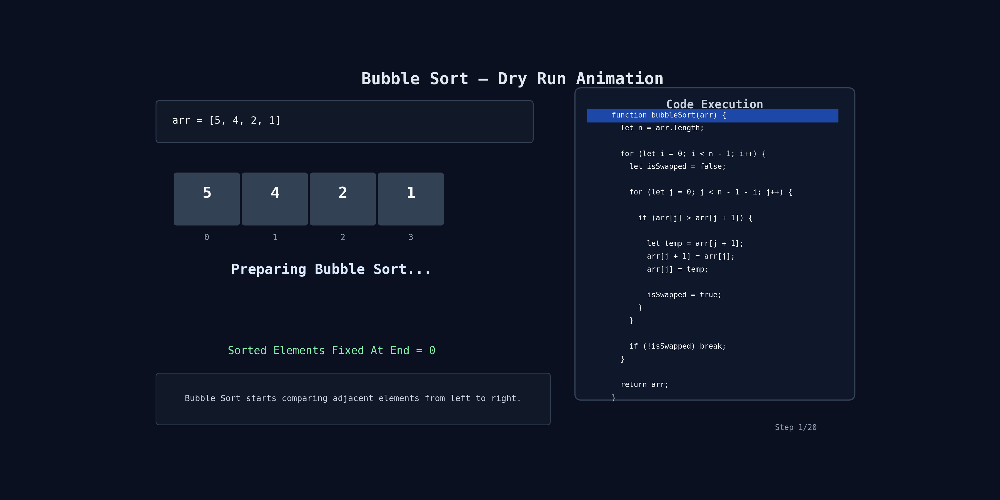

# Question: Bubble Sort

## Problem

Given an array `arr` of integers, sort the array in ascending order using Bubble Sort.

Return the sorted array.

Optimizations used:

- Stop early if array becomes sorted
- Ignore already sorted elements at the end after every pass

---

## Example

```js
Input: [5, 4, 2, 1];
Output: [1, 2, 4, 5];
```

```js
Input: [1, 2, 3, 4];
Output: [1, 2, 3, 4];
```

---

## Code

```js
let arr = [5, 4, 2, 1];

function bubbleSort(arr) {
  let n = arr.length;

  // Run outer loop till n - 1 for sorting arr
  for (let i = 0; i < n - 1; i++) {
    // Optimization 2:
    // Track if any swap happens
    let isSwapped = false;

    // Optimization 1:
    // Last i elements are already sorted
    for (let j = 0; j < n - 1 - i; j++) {
      // Compare current and next element
      if (arr[j] > arr[j + 1]) {
        // Swap elements
        let temp = arr[j + 1];
        arr[j + 1] = arr[j];
        arr[j] = temp;

        isSwapped = true;
      }
    }

    // If no swap happened, array is already sorted
    if (!isSwapped) break;
  }

  return arr;
}
```

---

## Simple Idea

Bubble Sort compares adjacent elements.

If left element is bigger than right element:

```text
swap them
```

After every pass:

```text
largest element moves to the end
```

Just like bubbles moving upward.

---

## Step-by-Step Flow

```text
1. Start from index 0
2. Compare current and next element
3. Swap if current > next
4. Continue till end
5. After one pass, largest element gets fixed at end
6. Repeat for remaining array
7. Stop early if no swap happens
```

---

## Understanding The Optimizations

### Optimization 1

```js
j < n - 1 - i;
```

Why?

Because after every pass, last elements become sorted already.

So no need to compare them again.

---

### Optimization 2

```js
isSwapped;
```

If no swap happens in a full pass:

```text
array is already sorted
```

So we stop early.

This saves extra work.

---

## 🔍 Dry Run

Input:

```js
[5, 4, 2, 1];
```

---

## Pass 1

| Step | Compare | Swap? | Array State |
| ---- | ------- | ----- | ----------- |
| 1    | 5 & 4   | ✅    | `[4,5,2,1]` |
| 2    | 5 & 2   | ✅    | `[4,2,5,1]` |
| 3    | 5 & 1   | ✅    | `[4,2,1,5]` |

Largest element `5` fixed at end.

---

## Pass 2

| Step | Compare | Swap? | Array State |
| ---- | ------- | ----- | ----------- |
| 1    | 4 & 2   | ✅    | `[2,4,1,5]` |
| 2    | 4 & 1   | ✅    | `[2,1,4,5]` |

Now `4` fixed.

---

## Pass 3

| Step | Compare | Swap? | Array State |
| ---- | ------- | ----- | ----------- |
| 1    | 2 & 1   | ✅    | `[1,2,4,5]` |

Now `2` fixed.

---

## Final Sorted Array

```js
[1, 2, 4, 5];
```

---

## 🔍 Dry Run (Already Sorted Array)

Input:

```js
[1, 2, 3, 4];
```

### Pass 1

| Step | Compare | Swap? | Array State |
| ---- | ------- | ----- | ----------- |
| 1    | 1 & 2   | ❌    | `[1,2,3,4]` |
| 2    | 2 & 3   | ❌    | `[1,2,3,4]` |
| 3    | 3 & 4   | ❌    | `[1,2,3,4]` |

No swaps happened.

```text
isSwapped = false
```

Loop breaks early.

---

## 🔍 Dry Run With Animation



---

## Important Points

- Bubble Sort uses swapping
- Largest element reaches end after every pass
- Works in-place
- Easy to understand but slow for large arrays

---

## Time Complexity

### Worst Case

```text
O(n²)
```

When array is reverse sorted.

---

### Best Case

```text
O(n)
```

Because optimized version stops early if array is already sorted.

---

## Space Complexity

```text
O(1)
```

No extra array is used.

---

## Common Mistake

Wrong:

```js
j < n;
```

Correct:

```js
j < n - 1 - i;
```

Because we compare:

```js
arr[j] and arr[j + 1]
```

Also last sorted elements should be skipped.

---

## Quick Revision

```text
1. Compare adjacent elements
2. Swap if left > right
3. Largest element moves to end after every pass
4. Reduce comparisons after every pass
5. Stop early if no swap happens
```
