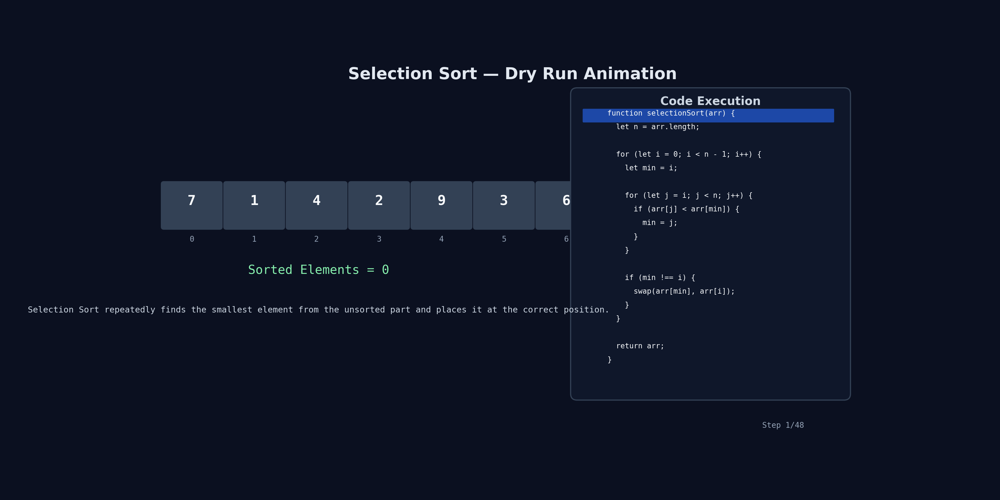

# Selection Sort

## Problem

Given an array `arr` of integers, sort the array in ascending order using Selection Sort.

Return the sorted array.

---

## Example

```js
Input: [5, 4, 2, 1];
Output: [1, 2, 4, 5];
```

```js
Input: [7, 1, 4, 2, 9, 3, 6];
Output: [1, 2, 3, 4, 6, 7, 9];
```

---

## Code

```js
const arr = [7, 1, 4, 2, 9, 3, 6];

function selectionSort(arr) {
  let n = arr.length;

  for (let i = 0; i < n - 1; i++) {
    let min = i;

    for (let j = i; j < n; j++) {
      if (arr[j] < arr[min]) {
        min = j;
      }
    }

    // Swap only if a smaller element was found
    if (min !== i) {
      let temp = arr[min];
      arr[min] = arr[i];
      arr[i] = temp;
    }
  }

  return arr;
}
```

---

## Simple Idea

Selection Sort divides the array into two parts:

```text
Sorted Part | Unsorted Part
```

In every pass:

- Find the smallest element from the unsorted part
- Place it at its correct position

After each pass, one element gets fixed permanently.

---

## Step-by-Step Flow

```text
1. Assume current index is the minimum
2. Search the remaining array
3. Find the actual minimum element
4. Swap it with current index
5. Move to next position
6. Repeat until array is sorted
```

---

## Visual Understanding

Example:

```js
[7, 1, 4, 2, 9, 3, 6];
```

### Pass 1

Find smallest element from entire array.

```text
Smallest = 1
```

Swap with first element.

```js
[1, 7, 4, 2, 9, 3, 6];
```

Now `1` is fixed forever.

---

### Pass 2

Find smallest element from:

```js
[7, 4, 2, 9, 3, 6];
```

Smallest:

```text
2
```

Swap with index 1.

```js
[1, 2, 4, 7, 9, 3, 6];
```

Now `2` is fixed forever.

---

And so on...

---

## 🔍 Dry Run with animation



---

## 🔍 Dry Run

Input:

```js
[7, 1, 4, 2, 9, 3, 6];
```

---

## Pass 1 (`i = 0`)

| Step | `j` | Current Min Index | Value Compared | New Min?   |
| ---- | --- | ----------------- | -------------- | ---------- |
| Init | -   | 0                 | 7              | -          |
| 1    | 1   | 0                 | 1              | ✅ min = 1 |
| 2    | 2   | 1                 | 4              | ❌         |
| 3    | 3   | 1                 | 2              | ❌         |
| 4    | 4   | 1                 | 9              | ❌         |
| 5    | 5   | 1                 | 3              | ❌         |
| 6    | 6   | 1                 | 6              | ❌         |

Swap:

```js
swap(0, 1);
```

Array:

```js
[1, 7, 4, 2, 9, 3, 6];
```

---

## Pass 2 (`i = 1`)

Search in:

```js
[7, 4, 2, 9, 3, 6];
```

Smallest:

```text
2
```

Swap:

```js
swap(1, 3);
```

Array:

```js
[1, 2, 4, 7, 9, 3, 6];
```

---

## Pass 3 (`i = 2`)

Search in:

```js
[4, 7, 9, 3, 6];
```

Smallest:

```text
3
```

Swap:

```js
swap(2, 5);
```

Array:

```js
[1, 2, 3, 7, 9, 4, 6];
```

---

## Pass 4 (`i = 3`)

Search in:

```js
[7, 9, 4, 6];
```

Smallest:

```text
4
```

Swap:

```js
swap(3, 5);
```

Array:

```js
[1, 2, 3, 4, 9, 7, 6];
```

---

## Pass 5 (`i = 4`)

Search in:

```js
[9, 7, 6];
```

Smallest:

```text
6
```

Swap:

```js
swap(4, 6);
```

Array:

```js
[1, 2, 3, 4, 6, 7, 9];
```

---

## Pass 6 (`i = 5`)

Search in:

```js
[7, 9];
```

Minimum already at correct position.

No swap needed.

Array remains:

```js
[1, 2, 3, 4, 6, 7, 9];
```

---

## Final Sorted Array

```js
[1, 2, 3, 4, 6, 7, 9];
```

---

## Why `if(min !== i)` ?

Without this check:

```js
swap(arr[i], arr[i]);
```

can happen.

That swap is unnecessary.

So we only swap when a different minimum element is found.

```js
if(min !== i)
```

saves extra work.

---

## Important Points

- Finds minimum element in every pass
- One element gets fixed after every pass
- Performs fewer swaps compared to Bubble Sort
- Does not stop early even if array is already sorted

---

## Time Complexity

### Best Case

```text
O(n²)
```

---

### Average Case

```text
O(n²)
```

---

### Worst Case

```text
O(n²)
```

Selection Sort always searches the remaining array to find the minimum.

---

## Space Complexity

```text
O(1)
```

No extra array is used.

---

## Common Mistakes

### Mistake 1

Starting inner loop from:

```js
j = 0;
```

Correct:

```js
j = i;
```

Because elements before `i` are already sorted.

---

### Mistake 2

Swapping immediately whenever a smaller element is found.

Selection Sort should:

```text
First find minimum
Then do one swap
```

---

## Bubble Sort vs Selection Sort

| Feature             | Bubble Sort            | Selection Sort                      |
| ------------------- | ---------------------- | ----------------------------------- |
| Strategy            | Swap adjacent elements | Find minimum and place it correctly |
| Swaps               | More                   | Less                                |
| Early Stop Possible | ✅ Yes                 | ❌ No                               |
| Time Complexity     | O(n²)                  | O(n²)                               |

---

## Quick Revision

```text
1. Divide array into sorted and unsorted parts
2. Find minimum from unsorted part
3. Swap with current index
4. One element gets fixed after every pass
5. Repeat until array is sorted
6. Time Complexity = O(n²)
7. Space Complexity = O(1)
```
