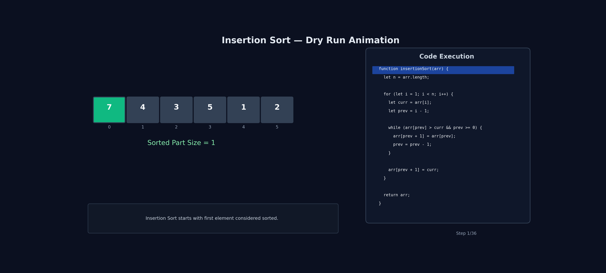

# Insertion Sort

## Problem

Given an array `arr` of integers, sort the array in ascending order using Insertion Sort.

Return the sorted array.

---

## Example

```js
Input: [5, 4, 2, 1];
Output: [1, 2, 4, 5];
```

```js
Input: [7, 1, 4, 2, 9, 3, 6];
Output: [1, 2, 3, 4, 6, 7, 9];
```

---

## Code

```js
let arr = [7, 4, 3, 5, 1, 2];

function insertionSort(arr) {
  let n = arr.length;

  for (let i = 1; i < n; i++) {
    let curr = arr[i];
    let prev = i - 1;

    while (arr[prev] > curr && prev >= 0) {
      arr[prev + 1] = arr[prev];
      prev = prev - 1;
    }

    arr[prev + 1] = curr;
  }

  return arr;
}
```

---

## Simple Idea

Insertion Sort works the same way many people sort playing cards in their hands.

We take one element at a time and place it in its correct position among the already sorted elements.

At every step:

```text
Left side = Sorted
Right side = Unsorted
```

We pick an element from the unsorted side and insert it into the correct position in the sorted side.

---

## Step-by-Step Flow

```text
1. Start from index 1
2. Store current element
3. Compare it with elements on the left
4. Shift bigger elements one position to the right
5. Insert current element at its correct position
6. Repeat until array is sorted
```

---

## Visual Understanding

Example:

```js
[7, 4, 3, 5, 1, 2];
```

Initially:

```text
[7] | [4,3,5,1,2]

Left side is sorted.
```

Take:

```text
4
```

Compare with:

```text
7
```

Since:

```text
4 < 7
```

Shift 7 to the right and insert 4.

```js
[4, 7, 3, 5, 1, 2];
```

Now:

```text
[4,7] | [3,5,1,2]
```

Sorted portion grows after every iteration.

---

## 🔍 Dry Run with animation



---

## 🔍 Dry Run

Input:

```js
[7, 4, 3, 5, 1, 2];
```

---

## Pass 1 (`i = 1`)

```text
curr = 4
prev = 0
```

Compare:

```text
7 > 4
```

Shift:

```js
[7, 7, 3, 5, 1, 2];
```

Insert 4:

```js
[4, 7, 3, 5, 1, 2];
```

---

## Pass 2 (`i = 2`)

```text
curr = 3
prev = 1
```

Compare:

```text
7 > 3
```

Shift:

```js
[4, 7, 7, 5, 1, 2];
```

Compare:

```text
4 > 3
```

Shift:

```js
[4, 4, 7, 5, 1, 2];
```

Insert 3:

```js
[3, 4, 7, 5, 1, 2];
```

---

## Pass 3 (`i = 3`)

```text
curr = 5
prev = 2
```

Compare:

```text
7 > 5
```

Shift:

```js
[3, 4, 7, 7, 1, 2];
```

Insert 5:

```js
[3, 4, 5, 7, 1, 2];
```

---

## Pass 4 (`i = 4`)

```text
curr = 1
```

Shift all bigger elements:

```js
[3, 4, 5, 7, 7, 2][(3, 4, 5, 5, 7, 2)][(3, 4, 4, 5, 7, 2)][(3, 3, 4, 5, 7, 2)];
```

Insert 1:

```js
[1, 3, 4, 5, 7, 2];
```

---

## Pass 5 (`i = 5`)

```text
curr = 2
```

Shift bigger elements:

```js
[1, 3, 4, 5, 7, 7][(1, 3, 4, 5, 5, 7)][(1, 3, 4, 4, 5, 7)][(1, 3, 3, 4, 5, 7)];
```

Insert 2:

```js
[1, 2, 3, 4, 5, 7];
```

---

## Final Sorted Array

```js
[1, 2, 3, 4, 5, 7];
```

---

## Dry Run Summary

| Pass | Current Element | Array After Insertion |
| ---- | --------------- | --------------------- |
| 1    | 4               | `[4,7,3,5,1,2]`       |
| 2    | 3               | `[3,4,7,5,1,2]`       |
| 3    | 5               | `[3,4,5,7,1,2]`       |
| 4    | 1               | `[1,3,4,5,7,2]`       |
| 5    | 2               | `[1,2,3,4,5,7]`       |

---

## Why Do We Shift Instead Of Swap?

Bubble Sort uses swapping.

Insertion Sort uses shifting.

Example:

```js
[3, 4, 5, 7, 1];
```

Instead of many swaps:

```text
swap(1,7)
swap(1,5)
swap(1,4)
swap(1,3)
```

We simply shift larger elements right and insert once.

This makes Insertion Sort efficient for small arrays.

---

## Important Points

- Builds sorted array gradually
- Works in-place
- Very efficient for small datasets
- Performs well when array is already nearly sorted

---

## Time Complexity

### Best Case

Array already sorted.

```text
O(n)
```

Only comparisons happen.

---

### Average Case

```text
O(n²)
```

---

### Worst Case

Reverse sorted array.

```text
O(n²)
```

Every element needs maximum shifting.

---

## Space Complexity

```text
O(1)
```

No extra array is used.

---

## Common Mistakes

### Mistake 1

Wrong:

```js
while (arr[prev] > curr)
```

Correct:

```js
while (arr[prev] > curr && prev >= 0)
```

Need boundary check.

---

### Mistake 2

Forgetting to insert `curr` after shifting.

```js
arr[prev + 1] = curr;
```

This line is mandatory.

---

## Bubble vs Selection vs Insertion Sort

| Feature                       | Bubble Sort            | Selection Sort       | Insertion Sort                       |
| ----------------------------- | ---------------------- | -------------------- | ------------------------------------ |
| Main Idea                     | Swap adjacent elements | Find minimum element | Insert element into correct position |
| Swaps                         | Many                   | Few                  | Very few                             |
| Best Case                     | O(n)                   | O(n²)                | O(n)                                 |
| Worst Case                    | O(n²)                  | O(n²)                | O(n²)                                |
| Good For Nearly Sorted Arrays | ❌                     | ❌                   | ✅                                   |

---

## Quick Revision

```text
1. Consider first element as sorted
2. Pick next element
3. Compare with left side
4. Shift bigger elements right
5. Insert current element in correct position
6. Repeat for all elements
7. Best Case = O(n)
8. Worst Case = O(n²)
9. Space Complexity = O(1)
```
