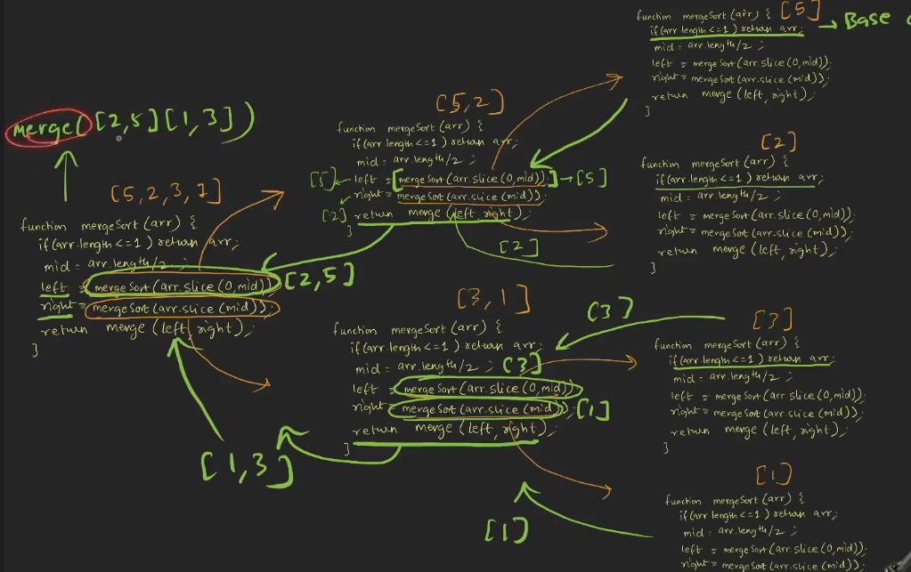
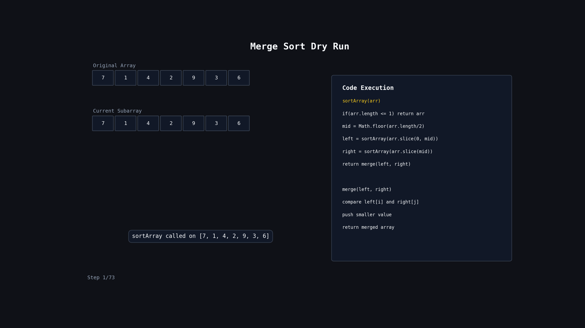

# Merge Sort

## Problem

Given an array `arr` of integers, sort the array in ascending order using Merge Sort.

Return the sorted array.

---

## Example

```js
Input: [5, 4, 2, 1];
Output: [1, 2, 4, 5];
```

```js
Input: [7, 1, 4, 2, 9, 3, 6];
Output: [1, 2, 3, 4, 6, 7, 9];
```

---

## Code

```js
var sortArray = function (arr) {
  if (arr.length <= 1) return arr;

  let mid = Math.floor(arr.length / 2);

  let left = sortArray(arr.slice(0, mid));
  let right = sortArray(arr.slice(mid));

  return merge(left, right);
};

function merge(left, right) {
  let res = [],
    i = 0;
  j = 0;

  while (i < left.length && j < right.length) {
    if (left[i] < right[j]) {
      res.push(left[i]);
      i++;
    } else {
      res.push(right[j]);
      j++;
    }
  }

  return [...res, ...left.slice(i), ...right.slice(j)];
}
```

---

## Simple Idea

Merge Sort follows the:

```text
Divide and Conquer
```

approach.

Instead of sorting the entire array at once:

1. Divide the array into smaller halves
2. Keep dividing until each array contains only one element
3. Merge the smaller arrays back in sorted order

---

## Step-by-Step Flow

```text
1. Find middle index
2. Split array into left and right halves
3. Recursively sort both halves
4. Merge both sorted halves
5. Return merged sorted array
```

---

## Why Does It Work?

A single element array is already sorted.

Example:

```js
[7];
```

is already sorted.

So Merge Sort keeps breaking the problem into smaller problems until it reaches arrays of size 1.

Then it starts combining them back in sorted order.

---

## Recursion Tree

Input:

```js
[7, 1, 4, 2, 9, 3, 6];
```

```text
                    [7,1,4,2,9,3,6]
                   /               \
            [7,1,4]               [2,9,3,6]
            /    \                /       \
         [7]   [1,4]          [2,9]     [3,6]
               /   \          /   \     /   \
             [1]  [4]       [2] [9]   [3] [6]
```

Now start merging from bottom to top.

---

## Merge Phase

```text
[1] + [4]
↓
[1,4]

[2] + [9]
↓
[2,9]

[3] + [6]
↓
[3,6]
```

Next level:

```text
[7] + [1,4]
↓
[1,4,7]

[2,9] + [3,6]
↓
[2,3,6,9]
```

Final merge:

```text
[1,4,7] + [2,3,6,9]
↓
[1,2,3,4,6,7,9]
```

---

## 🔍 Dry Run Recursion Image



## 🔍 Dry Run with animation



---

## 🔍 Dry Run

Input:

```js
[7, 1, 4, 2, 9, 3, 6];
```

---

### Step 1: Divide

```text
[7,1,4,2,9,3,6]

→ [7,1,4]
→ [2,9,3,6]
```

---

### Step 2: Divide Again

```text
[7,1,4]
→ [7]
→ [1,4]

[2,9,3,6]
→ [2,9]
→ [3,6]
```

---

### Step 3: Reach Single Elements

```text
[7]
[1]
[4]
[2]
[9]
[3]
[6]
```

These are already sorted.

---

### Step 4: Start Merging

Merge:

```text
[1] + [4]
```

| Compare   | Result |
| --------- | ------ |
| 1 vs 4    | 1      |
| Remaining | 4      |

Result:

```js
[1, 4];
```

---

Merge:

```text
[2] + [9]
```

| Compare   | Result |
| --------- | ------ |
| 2 vs 9    | 2      |
| Remaining | 9      |

Result:

```js
[2, 9];
```

---

Merge:

```text
[3] + [6]
```

| Compare   | Result |
| --------- | ------ |
| 3 vs 6    | 3      |
| Remaining | 6      |

Result:

```js
[3, 6];
```

---

### Step 5: Merge Bigger Arrays

Merge:

```text
[7] + [1,4]
```

| Compare   | Result |
| --------- | ------ |
| 7 vs 1    | 1      |
| 7 vs 4    | 4      |
| Remaining | 7      |

Result:

```js
[1, 4, 7];
```

---

Merge:

```text
[2,9] + [3,6]
```

| Compare   | Result |
| --------- | ------ |
| 2 vs 3    | 2      |
| 9 vs 3    | 3      |
| 9 vs 6    | 6      |
| Remaining | 9      |

Result:

```js
[2, 3, 6, 9];
```

---

### Step 6: Final Merge

Merge:

```text
[1,4,7]
+
[2,3,6,9]
```

| Compare   | Result Array    |
| --------- | --------------- |
| 1 vs 2    | [1]             |
| 4 vs 2    | [1,2]           |
| 4 vs 3    | [1,2,3]         |
| 4 vs 6    | [1,2,3,4]       |
| 7 vs 6    | [1,2,3,4,6]     |
| 7 vs 9    | [1,2,3,4,6,7]   |
| Remaining | [1,2,3,4,6,7,9] |

Final Result:

```js
[1, 2, 3, 4, 6, 7, 9];
```

---

## Understanding The Merge Function

The merge function combines two already sorted arrays.

Example:

```js
left = [1, 4, 7];
right = [2, 3, 6, 9];
```

We compare:

```text
1 vs 2
```

Take smaller:

```text
1
```

Then:

```text
4 vs 2
```

Take:

```text
2
```

Keep doing this until one array finishes.

Finally append remaining elements.

---

## Important Points

- Uses Divide and Conquer
- Recursion is used for splitting
- Merging creates the final sorted array
- Very efficient for large datasets
- Stable sorting algorithm

---

## Time Complexity

### Best Case

```text
O(n log n)
```

---

### Average Case

```text
O(n log n)
```

---

### Worst Case

```text
O(n log n)
```

Merge Sort performs the same number of splits and merges regardless of input.

---

## Space Complexity

```text
O(n)
```

Extra arrays are created during merging.

---

## Common Mistakes

### Mistake 1

Forgetting the base case.

Wrong:

```js
function sortArray(arr) {
  ...
}
```

Correct:

```js
if (arr.length <= 1) return arr;
```

Without this recursion never stops.

---

### Mistake 2

Returning only `res`.

Wrong:

```js
return res;
```

Correct:

```js
return [...res, ...left.slice(i), ...right.slice(j)];
```

Need to add remaining elements.

---

### Mistake 3

Thinking Merge Sort sorts while dividing.

Actually:

```text
Divide phase → only splitting

Merge phase → actual sorting happens
```

---

## Merge Sort vs Bubble Sort

| Feature               | Bubble Sort | Merge Sort       |
| --------------------- | ----------- | ---------------- |
| Approach              | Swapping    | Divide & Conquer |
| Time Complexity       | O(n²)       | O(n log n)       |
| Fast For Large Arrays | ❌          | ✅               |
| Uses Extra Space      | ❌          | ✅               |
| Stable Sort           | ✅          | ✅               |

---

## Quick Revision

```text
1. Divide array into halves
2. Keep dividing until size becomes 1
3. Merge sorted halves together
4. Compare elements while merging
5. Time Complexity = O(n log n)
6. Space Complexity = O(n)
7. Divide phase does not sort
8. Merge phase does the actual sorting
```
