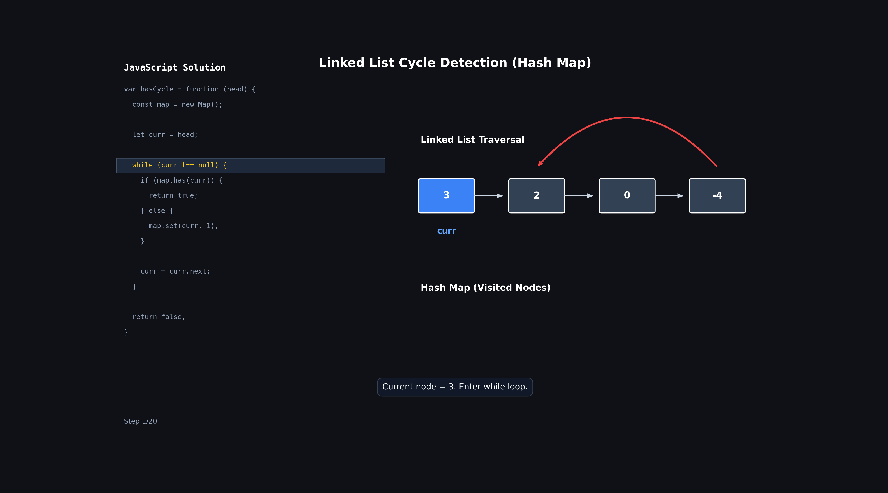

# Linked List Cycle (Using Hash Map)

## Problem

Given the head of a linked list, determine if the linked list contains a cycle.

A cycle exists if following the `next` pointers eventually brings us back to a node we have already visited.

Return:

```js
true; // if cycle exists
false; // otherwise
```

### Example

```text
3 -> 2 -> 0 -> -4
     ^         |
     |_________|
```

Output:

```js
true;
```

Because after reaching `-4`, the list goes back to node `2`.

---

## Intuition

Normally, while traversing a linked list:

```text
Every node should be visited only once.
```

If we ever visit the same node again, it means:

```text
We are moving in a loop.
```

which means:

```text
A cycle exists.
```

So the idea is simple:

- Keep track of every node we visit.
- Before visiting a node, check if we have already seen it.
- If yes → cycle found.
- If no → store it and continue.

---

## Approach

1. Create a `Map`.
2. Start traversing from `head`.
3. For every node:
   - Check if it already exists in the map.
   - If yes, return `true`.
   - Otherwise store it in the map.
4. If traversal reaches `null`, return `false`.

---

## Code

```js
var hasCycle = function (head) {
  const map = new Map();

  let curr = head;

  while (curr !== null) {
    if (map.has(curr)) {
      return true;
    } else {
      map.set(curr, 1);
    }

    curr = curr.next;
  }

  return false;
};
```

---

## Important Observation

We are storing:

```js
map.set(curr, 1);
```

not:

```js
map.set(curr.val, 1);
```

because multiple nodes can have the same value.

Example:

```text
1 -> 2 -> 1 -> 3
```

The two nodes containing `1` are different nodes.

We must store:

```text
Node Reference
```

not:

```text
Node Value
```

---

## Dry Run

### Input

```text
3 -> 2 -> 0 -> -4
     ^         |
     |_________|
```

---

### Step-by-Step Table

| Step | curr | Already in Map? | Map Contents | Action      |
| ---- | ---- | --------------- | ------------ | ----------- |
| Init | 3    | No              | {}           | Start       |
| 1    | 3    | No              | {3}          | Store node  |
| 2    | 2    | No              | {3,2}        | Store node  |
| 3    | 0    | No              | {3,2,0}      | Store node  |
| 4    | -4   | No              | {3,2,0,-4}   | Store node  |
| 5    | 2    | Yes             | {3,2,0,-4}   | Return true |

---

## 🔍 Dry Run with animation



## Visualization

### Initial

```text
3 -> 2 -> 0 -> -4
     ^         |
     |_________|

Visited = {}
```

---

### Visit 3

```text
Visited = {3}
```

Move:

```text
3 -> 2
```

---

### Visit 2

```text
Visited = {3,2}
```

Move:

```text
2 -> 0
```

---

### Visit 0

```text
Visited = {3,2,0}
```

Move:

```text
0 -> -4
```

---

### Visit -4

```text
Visited = {3,2,0,-4}
```

Move:

```text
-4 -> 2
```

---

### Reach Node 2 Again

```text
Visited = {3,2,0,-4}
```

Check:

```js
map.has(curr);
```

returns:

```js
true;
```

So:

```js
return true;
```

Cycle detected.

---

## Dry Run (No Cycle)

### Input

```text
1 -> 2 -> 3 -> 4 -> null
```

### Step-by-Step Table

| Step | curr | Already in Map? | Action       |
| ---- | ---- | --------------- | ------------ |
| 1    | 1    | No              | Store        |
| 2    | 2    | No              | Store        |
| 3    | 3    | No              | Store        |
| 4    | 4    | No              | Store        |
| End  | null | -               | Return false |

---

### Visualization

```text
1 -> 2 -> 3 -> 4 -> null
```

Visited nodes:

```text
{1}
{1,2}
{1,2,3}
{1,2,3,4}
```

Eventually:

```text
curr = null
```

Loop ends.

Return:

```js
false;
```

---

## Why This Works

If there is:

```text
No cycle
```

we eventually reach:

```text
null
```

and stop.

If there is:

```text
A cycle
```

then some node will be visited again.

Since every visited node is stored in the map:

```js
map.has(curr);
```

will become:

```js
true;
```

and we immediately detect the cycle.

---

## Time Complexity

```text
O(n)
```

Each node is processed at most once before we either:

- reach `null`
- find a repeated node

---

## Space Complexity

```text
O(n)
```

In the worst case, we store all nodes in the map.

---

## Pattern

```text
Hashing / Visited Nodes
```

Commonly used when:

- Detecting cycles
- Detecting duplicate visits
- Graph traversal
- Tracking previously seen elements

---

## Interview Follow-up

A very common follow-up is:

```text
Can you solve this using O(1) space?
```

Answer:

```text
Yes, using Slow and Fast Pointers (Floyd's Cycle Detection Algorithm).
```

That approach uses:

```text
Time  : O(n)
Space : O(1)
```

while this Hash Map approach uses:

```text
Time  : O(n)
Space : O(n)
```

---

## Revision Notes

- Store visited nodes inside a `Map`.
- Store node references, not node values.
- If a node is seen again → cycle exists.
- If traversal reaches `null` → no cycle.
- Easy to understand and implement.
- Time: `O(n)`
- Space: `O(n)`
- Key check:

```js
if (map.has(curr)) {
  return true;
}
```

- If the same node appears again, we have found a cycle.
