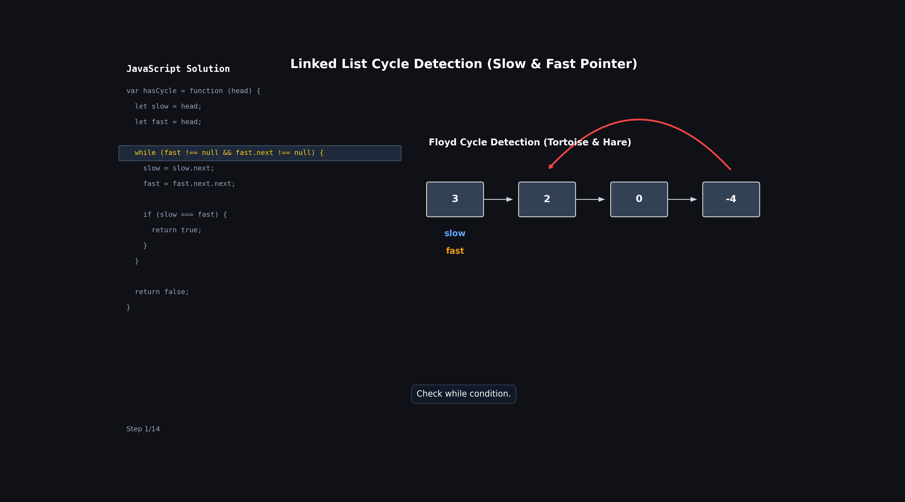

# Linked List Cycle (Using Slow and Fast Pointer)

## Problem

Given the head of a linked list, determine if the linked list contains a cycle.

A cycle exists if following the `next` pointers eventually brings us back to a node we have already visited.

Return:

```js
true; // if cycle exists
false; // otherwise
```

### Example

```text
3 -> 2 -> 0 -> -4
     ^         |
     |_________|
```

Output:

```js
true;
```

---

## Intuition

Instead of storing visited nodes in a Map, we can use two pointers.

- `slow` moves 1 step at a time.
- `fast` moves 2 steps at a time.

Think of it like two people running on a circular track:

- One person walks slowly.
- One person runs faster.

If the track is circular, eventually the faster person will catch the slower person.

The same thing happens in a linked list cycle.

If a cycle exists:

```text
slow and fast will eventually meet.
```

If no cycle exists:

```text
fast will reach null.
```

---

## Approach

1. Start both pointers at `head`.
2. Move:
   - `slow = slow.next`
   - `fast = fast.next.next`
3. After every move, check:

```js
slow === fast;
```

4. If they meet, return `true`.
5. If `fast` reaches the end (`null`), return `false`.

---

## Code

```js
var hasCycle = function (head) {
  let slow = head;
  let fast = head;

  while (fast !== null && fast.next !== null) {
    slow = slow.next;
    fast = fast.next.next;

    if (slow === fast) {
      return true;
    }
  }

  return false;
};
```

---

## Why Start Both at Head?

```js
let slow = head;
let fast = head;
```

Both pointers start from the same node.

We don't check:

```js
slow === fast;
```

before moving them because they will obviously be equal at the start.

That's why the comparison happens after moving the pointers.

---

## Dry Run (Cycle Exists)

### Input

```text
3 -> 2 -> 0 -> -4
     ^         |
     |_________|
```

---

## Step-by-Step Table

| Step | slow | fast | Same Node? | Action                  |
| ---- | ---- | ---- | ---------- | ----------------------- |
| Init | 3    | 3    | Yes        | Ignore initial position |
| 1    | 2    | 0    | No         | Continue                |
| 2    | 0    | 2    | No         | Continue                |
| 3    | -4   | -4   | Yes        | Return true             |

---

## 🔍 Dry Run with animation



## Visualization

### Initial

```text
3 -> 2 -> 0 -> -4
     ^         |
     |_________|

slow = 3
fast = 3
```

---

### Iteration 1

Move:

```text
slow = slow.next
fast = fast.next.next
```

Result:

```text
3 -> 2 -> 0 -> -4
     ^    ^
     |    |
   slow  fast

slow = 2
fast = 0
```

Pointers are different.

Continue.

---

### Iteration 2

Move again:

```text
slow = 0
fast = 2
```

Visualization:

```text
3 -> 2 -> 0 -> -4
     ^    ^
     |    |
   fast  slow
```

Pointers are different.

Continue.

---

### Iteration 3

Move again:

```text
slow = -4
fast = -4
```

Visualization:

```text
3 -> 2 -> 0 -> -4
               ^
               |
        slow & fast
```

Both pointers meet.

Return:

```js
true;
```

---

## Why Do They Always Meet?

Inside a cycle:

```text
slow moves 1 step
fast moves 2 steps
```

Every iteration:

```text
fast gains 1 node on slow
```

Eventually:

```text
fast catches slow
```

just like a faster runner catches a slower runner on a circular track.

So if a cycle exists:

```text
Meeting is guaranteed.
```

---

## Dry Run (No Cycle)

### Input

```text
1 -> 2 -> 3 -> 4 -> null
```

---

### Step-by-Step Table

| Step   | slow | fast | Action    |
| ------ | ---- | ---- | --------- |
| Init   | 1    | 1    | Start     |
| 1      | 2    | 3    | Continue  |
| 2      | 3    | null | Loop ends |
| Return | -    | -    | false     |

---

## Visualization

### Initial

```text
1 -> 2 -> 3 -> 4 -> null

slow = 1
fast = 1
```

---

### Iteration 1

```text
slow = 2
fast = 3
```

---

### Iteration 2

```text
slow = 3
fast = null
```

Now:

```js
fast === null;
```

Loop stops.

Return:

```js
false;
```

---

## Why This Works

### Case 1: No Cycle

Eventually:

```text
fast reaches null
```

because it moves faster than `slow`.

So:

```js
return false;
```

---

### Case 2: Cycle Exists

Eventually:

```text
fast enters the cycle
```

After entering:

```text
fast gains 1 node on slow every iteration
```

so they must meet.

When:

```js
slow === fast;
```

we have detected a cycle.

Return:

```js
true;
```

---

## Understanding the While Condition

```js
while (fast !== null && fast.next !== null)
```

Why?

Because:

```js
fast = fast.next.next;
```

needs two nodes available.

Without this check:

```js
fast.next.next;
```

could cause an error.

---

## Time Complexity

```text
O(n)
```

At most, each pointer moves through the list a limited number of times.

---

## Space Complexity

```text
O(1)
```

Only two pointers are used.

No extra data structure is needed.

---

## Hash Map vs Slow-Fast Pointer

| Approach            | Time | Space |
| ------------------- | ---- | ----- |
| Hash Map            | O(n) | O(n)  |
| Slow & Fast Pointer | O(n) | O(1)  |

---

## Pattern

```text
Slow and Fast Pointer (Floyd's Cycle Detection)
```

Commonly used for:

- Detecting linked list cycles
- Finding cycle starting point
- Finding middle of linked list
- Happy Number
- Circular array problems

---

## Revision Notes

- Use two pointers:
  - `slow` moves 1 step
  - `fast` moves 2 steps
- If they ever meet, a cycle exists.
- If `fast` reaches `null`, no cycle exists.
- No extra memory required.
- Time: `O(n)`
- Space: `O(1)`
- Key check:

```js
if (slow === fast) {
  return true;
}
```

- This is Floyd's Cycle Detection Algorithm.
- Preferred interview solution because it uses constant space.
