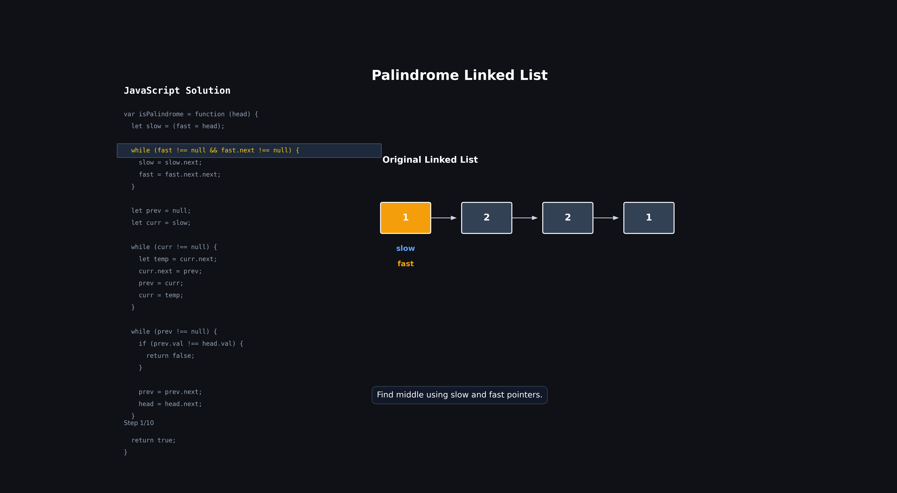

# Palindrome Linked List

## Problem

Given the head of a singly linked list, return: true;

if the linked list is a palindrome, otherwise return: false;

A palindrome reads the same forward and backward.

### Examples

```js
Input: [1, 2, 2, 1];
Output: true;
```

```js
Input: [1, 2];
Output: false;
```

---

## Intuition

A palindrome means:

```text
First value = Last value
Second value = Second Last value
...
```

For an array, we can easily compare from both ends.

But in a singly linked list:

```text
We can only move forward.
```

So we need another way.

### Idea

1. Find the middle of the linked list.
2. Reverse the second half.
3. Compare the first half and reversed second half.
4. If all values match → palindrome.
5. Otherwise → not a palindrome.

---

## Code

```js
var isPalindrome = function (head) {
  let slow = (fast = head);

  while (fast !== null && fast.next !== null) {
    slow = slow.next;
    fast = fast.next.next;
  }

  let prev = null;
  let curr = slow;

  while (curr !== null) {
    let temp = curr.next;
    curr.next = prev;
    prev = curr;
    curr = temp;
  }

  while (prev !== null) {
    if (prev.val !== head.val) {
      return false;
    }

    prev = prev.next;
    head = head.next;
  }

  return true;
};
```

---

## Approach

### Step 1: Find the Middle

Use slow and fast pointers.

```text
slow -> 1 step
fast -> 2 steps
```

When `fast` reaches the end:

```text
slow will be at the middle.
```

---

### Step 2: Reverse the Second Half

Starting from the middle node:

```text
Reverse the remaining linked list.
```

After reversing:

```text
First Half  -> forward
Second Half -> backward (because reversed)
```

Now both halves can be compared easily.

---

### Step 3: Compare Both Halves

Compare:

```text
head
```

with

```text
prev
```

(the head of the reversed half)

If any value differs:

```js
return false;
```

Otherwise:

```js
return true;
```

---

## 🔍 Dry Run with animation



# Step 1: Find Middle

## Dry Run

### Input

```text
1 -> 2 -> 2 -> 1
```

| Step | slow | fast |
| ---- | ---- | ---- |
| Init | 1    | 1    |
| 1    | 2    | 2    |
| 2    | 2    | null |

Middle:

```text
slow = second 2
```

Visualization:

```text
1 -> 2 -> 2 -> 1
          ^
        slow
```

---

# Step 2: Reverse Second Half

Current position:

```text
1 -> 2 -> 2 -> 1
          ^
        slow
```

Reverse from:

```text
2 -> 1
```

---

## Dry Run

| Step | prev | curr | Reversed Part |
| ---- | ---- | ---- | ------------- |
| Init | null | 2    | empty         |
| 1    | 2    | 1    | 2             |
| 2    | 1    | null | 1 -> 2        |

Result:

```text
Original First Half

1 -> 2


Reversed Second Half

1 -> 2
```

Visualization:

```text
1 -> 2

1 -> 2
```

Now both halves can be compared directly.

---

# Step 3: Compare Both Halves

## Dry Run

### First Half

```text
1 -> 2 -> 2 -> 1
^
head
```

### Reversed Half

```text
1 -> 2
^
prev
```

---

## Comparison Table

| Step | head.val | prev.val | Same? |
| ---- | -------- | -------- | ----- |
| 1    | 1        | 1        | ✅    |
| 2    | 2        | 2        | ✅    |

All values match.

Return:

```js
true;
```

---

# Complete Visualization

### Original List

```text
1 -> 2 -> 2 -> 1
```

---

### Find Middle

```text
1 -> 2 -> 2 -> 1
          ^
        slow
```

---

### Reverse Second Half

Before:

```text
2 -> 1
```

After:

```text
1 -> 2
```

---

### Compare

```text
First Half

1 -> 2


Reversed Second Half

1 -> 2
```

Every value matches.

Return:

```js
true;
```

---

# Dry Run (Not a Palindrome)

### Input

```text
1 -> 2
```

---

## Find Middle

| Step | slow | fast |
| ---- | ---- | ---- |
| Init | 1    | 1    |
| 1    | 2    | null |

Middle:

```text
slow = 2
```

---

## Reverse Second Half

```text
2 -> null
```

Remains:

```text
2 -> null
```

---

## Compare

| Step | head.val | prev.val | Same? |
| ---- | -------- | -------- | ----- |
| 1    | 1        | 2        | ❌    |

Values differ.

Return:

```js
false;
```

---

## Why Compare Until prev Becomes Null?

Notice:

```js
while (prev !== null)
```

and not:

```js
while (head !== null)
```

Why?

Because after reversing:

```text
prev only contains the second half.
```

We only need to compare that many nodes.

For odd length lists, the middle node automatically matches itself.

---

## Example with Odd Length

Input:

```text
1 -> 2 -> 3 -> 2 -> 1
```

Middle:

```text
3
```

Reverse from middle:

```text
1 -> 2 -> 3
```

Compare:

```text
1 == 1
2 == 2
3 == 3
```

All match.

Return:

```js
true;
```

---

## Why This Works

### Slow/Fast Pointer

Finds the middle in:

```text
O(n)
```

---

### Reverse Second Half

Allows backward comparison without extra memory.

---

### Compare Values

If every corresponding node matches:

```text
Forward == Backward
```

which means:

```text
Palindrome
```

---

## Time Complexity

### Finding Middle

```text
O(n)
```

### Reversing Half

```text
O(n)
```

### Comparing

```text
O(n)
```

Overall:

```text
O(n)
```

---

## Space Complexity

```text
O(1)
```

No extra array, stack, or map is used.

---

## Pattern

```text
Slow and Fast Pointer
+
Reverse Linked List
```

Very common combination in linked list problems.

---

## Similar Problems

- Middle of Linked List
- Reverse Linked List
- Linked List Cycle
- Reorder List
- Reverse Linked List II
- Reverse Nodes in K Group

---

## Revision Notes

- Find middle using slow and fast pointers.
- Reverse the linked list from the middle.
- Compare first half and reversed second half.
- If any value differs → return false.
- If all values match → return true.
- Compare until `prev === null`.
- Time: `O(n)`
- Space: `O(1)`

### Key Steps

```js
// Find middle
while (fast && fast.next)

// Reverse second half
curr.next = prev

// Compare both halves
if (prev.val !== head.val)
```

### Core Idea

```text
Find Middle
      ↓
Reverse Second Half
      ↓
Compare Both Halves
```

This is the optimal solution for Palindrome Linked List.
