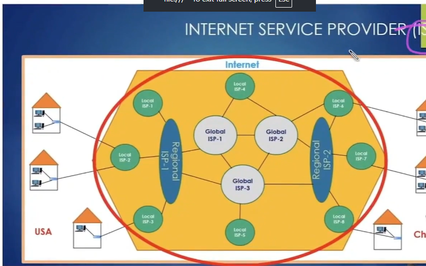
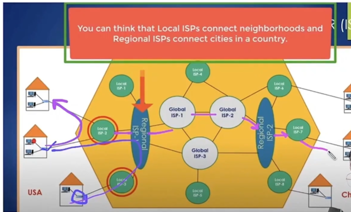
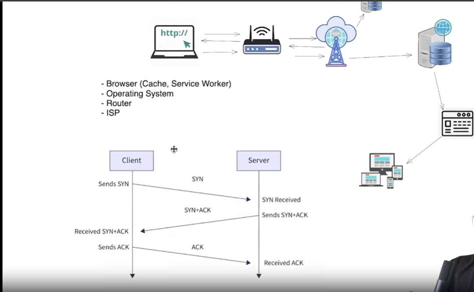
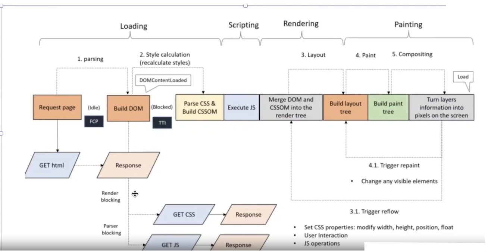
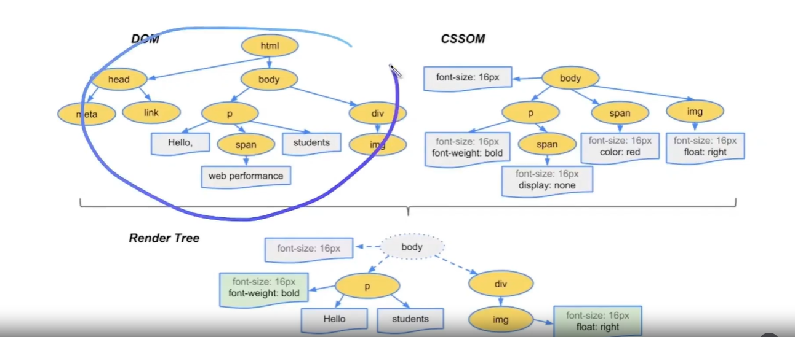
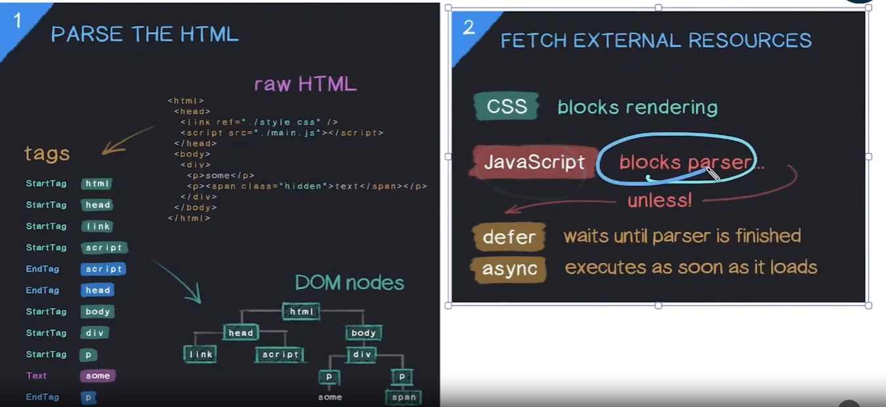
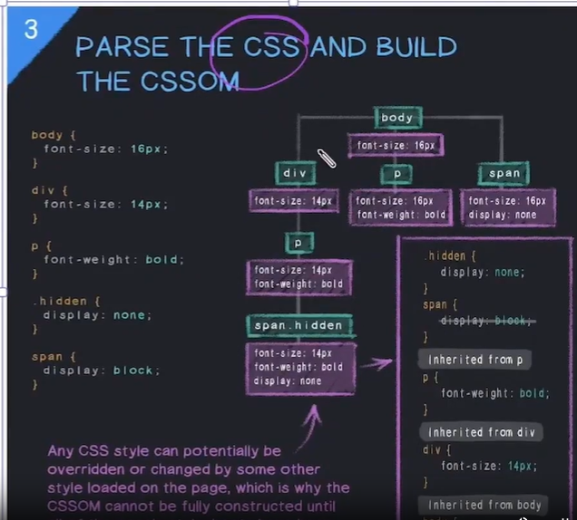
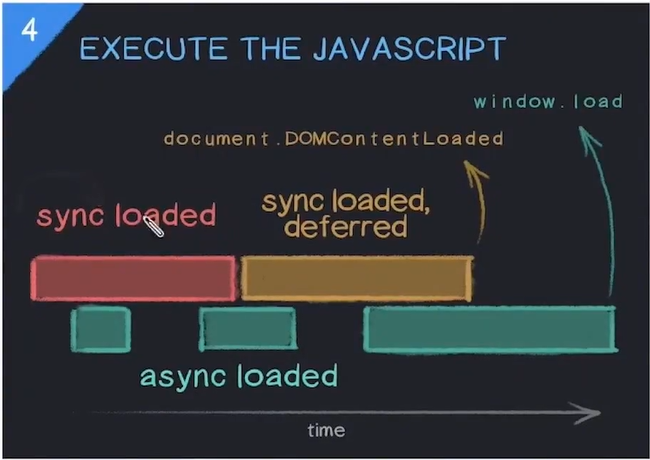
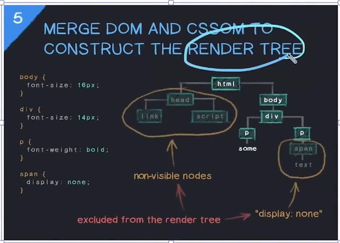
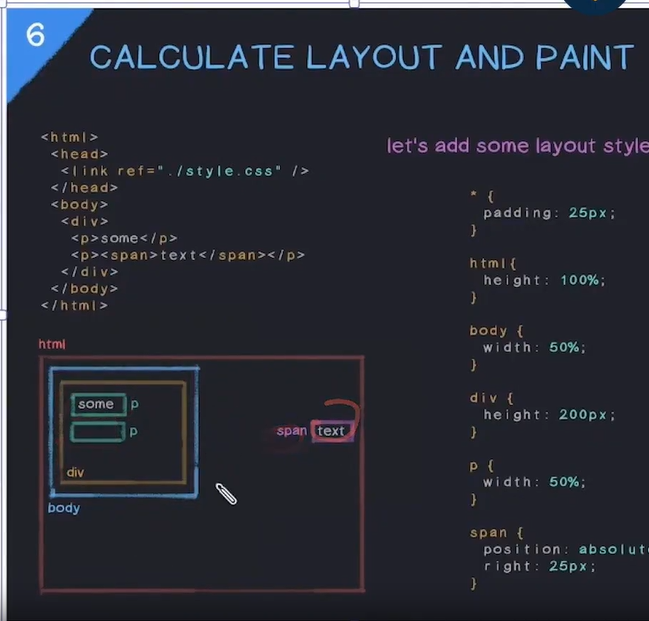

# How the Web Works

---

## 1. Overview — What Happens When You Visit a Website?

When you type something like `www.google.com` into your browser, a lot happens in the background before the page appears. At a high level, your browser sends a request to Google's server, and the server responds with HTML, CSS, JavaScript, and other assets that your browser uses to render (display) the page.

> 💡 **Analogy:** Think of it like ordering food, you (browser) place an order (request) at a restaurant (server), and they send back your meal (HTML/CSS/JS). The browser is your kitchen, it takes the raw ingredients and puts together the final dish you see.

### Key File Types the Server Sends Back

- **HTML** — The structure/skeleton of the page (headings, paragraphs, buttons)
- **CSS** — The styling (colors, fonts, layout)
- **JavaScript** — Interactivity and logic (clicks, animations, API calls)
- **Assets** — Images, videos, fonts, etc.

---

## 2. What Is a Server?

A server is simply a machine that stores data and responds to requests over the internet. Your own laptop can technically be a server if it's connected to the internet and has server software running on it.

### Why Not Just Use Your Own Machine?

There are real-world limitations with using a personal computer as a server:

- **Uptime** — Your laptop isn't on 24/7. Servers need to be always available.
- **Network stability** — Home internet can be unstable. Data centers have redundant connections.
- **Overheating** — A personal machine can't handle thousands of simultaneous requests.
- **Limited specs** — Storage and RAM on a personal machine are limited. Servers have terabytes of storage and massive RAM.

### What Does a Real Server Look Like?

In practice, a server is a powerful machine (or cluster of machines) hosted in a data center. These can be:

- **On-premise** — Owned and managed by the company itself (e.g., in their own building)
- **Cloud-based** — Rented from providers like AWS, Google Cloud, or Azure

> 💡 **Example:** When you visit Netflix, your request goes to one of their thousands of servers distributed around the world, these are called CDN nodes (Content Delivery Networks). The server closest to you responds to keep things fast.

---

## 3. DNS — Turning a Domain Name Into an IP Address

Two devices on the internet communicate using **IP addresses** (e.g., `142.250.195.46`). Domain names like `google.com` are just human-readable aliases for those IP addresses. The system that translates domain names to IP addresses is called **DNS (Domain Name System)**.

> 💡 **Analogy:** DNS is like a phone book, you know your friend's name (`google.com`), but you need their number (IP address) to actually call them.

### Step-by-Step DNS Lookup Flow

**Step 1 — Browser Cache Check**
The browser first checks its own cache. If it has visited `google.com` before, it already knows the IP. If found, it skips straight to making the request.

**Step 2 — Router / OS Cache Check**
If not in browser cache, the OS and router are checked next. Your router often caches recent DNS lookups too.

**Step 3 — ISP DNS Server**
If still not found, the request goes to your Internet Service Provider's (ISP) DNS resolver, a server run by your ISP (like Jio, Airtel, etc.) specifically to handle DNS lookups.

**Step 4 — Root / TLD / Authoritative DNS Servers**
If the ISP doesn't know the IP, it queries the global DNS hierarchy:
Root servers → TLD servers (for `.com`, `.in`, etc.) → Authoritative DNS server for `google.com` → IP returned.

### Full Flow (No Cache)
```
Browser → OS → Router → ISP → DNS Server     [asks: what's the IP for google.com?]
DNS Server → ISP → Router → OS → Browser     [returns: 142.250.195.46]
Browser → OS → Router → ISP → Server         [makes actual request using the IP]
```

- 
- 
- 

---

### DNS Caching

To avoid this full lookup every time, DNS results are cached at multiple levels:

- **Browser cache** — Fastest, stored locally for a short TTL (Time to Live)
- **OS / Router cache** — Checked after browser cache
- **ISP cache** — Most DNS queries stop here on repeat visits

---

## 4. TCP Handshake — Establishing a Connection

Once the browser has the server's IP address, it needs to establish a reliable connection before sending the actual request. This is done via the **TCP (Transmission Control Protocol) Three-Way Handshake**.

TCP guarantees that data arrives correctly and in order. Before sending your actual page request, both sides agree to communicate, this is the handshake.

### The Three Steps

| Step | Message | Meaning |
|------|---------|---------|
| 1 | **SYN** | Client → Server: "Hey, I want to connect. Are you there?" |
| 2 | **SYN-ACK** | Server → Client: "Yes I'm here! I acknowledge your request. Ready?" |
| 3 | **ACK** | Client → Server: "Ready! Let's go." — Connection established ✅ |

> 💡 **Analogy:** TCP handshake is like calling someone before sending a package. You call (SYN), they pick up and confirm (SYN-ACK), you say "great, sending now" (ACK). Only then do you courier the package (the HTTP request).

---

## 5. HTTPS & the SSL/TLS Handshake — Securing the Connection

**HTTP** is the standard protocol for web communication. **HTTPS** adds a security layer using **SSL/TLS** (Secure Sockets Layer / Transport Layer Security) to encrypt data between client and server.

### Why Does HTTPS Matter?

- Without HTTPS, data travels in **plain text** — anyone "in the middle" (like on the same Wi-Fi) can read it.
- With HTTPS, data is **encrypted** — even if intercepted, it's unreadable without the decryption key.

### SSL/TLS Handshake — Step by Step

| Step | What Happens |
|------|-------------|
| 1 | TCP Handshake happens first (as described above) |
| 2 | **Client Hello** — Browser tells the server which SSL/TLS versions and encryption methods it supports |
| 3 | **Server Hello + Certificate** — Server picks an encryption method and sends its SSL Certificate (a digital ID card proving its identity) |
| 4 | **Key Exchange** — Client verifies the certificate against trusted Certificate Authorities (CAs). Both sides generate a shared secret encryption key |
| 5 | **Encrypted Connection** — All further communication is encrypted. No one in the middle can read it 🔐 |

> 💡 **Analogy:** Imagine exchanging a locked box with a padlock (the certificate). The other person puts their message in and locks it. Only you have the key to open it. That's essentially what TLS does.

---

- 
- 
- 

---

## 6. Full Flow Summary — From URL to Webpage

| # | Phase | What Happens |
|---|-------|-------------|
| 1 | **DNS Lookup** | Browser → OS → Router → ISP → DNS Server → IP returned |
| 2 | **TCP Handshake** | SYN → SYN-ACK → ACK (connection established) |
| 3 | **SSL Handshake** | *(HTTPS only)* Certificate exchanged, encryption established |
| 4 | **HTTP Request** | Browser sends `GET` request to server |
| 5 | **Server Response** | Server sends back HTML, CSS, JS, assets |
| 6 | **Browser Rendering** | Browser parses HTML, applies CSS, runs JS, shows page |

---

# How the Web Page Renders

## 1. Overview What Happens After the Browser Gets the HTML?

Once the browser receives HTML, CSS, JS, and assets from the server, it doesn't just instantly show the page. It goes through a structured pipeline called the **Critical Rendering Path** to turn raw files into the pixels you see on screen.

### The Full Pipeline at a Glance
```
HTML Parsing (DOM)  →  Fetch External Resources (CSS/JS)  →  CSS Parsing (CSSOM)
→  JS Execution  →  Render Tree  →  Layout  →  Paint  →  Compositing
```

---

## 2. Step 1 — HTML Parsing → DOM Tree

The browser starts reading the HTML from top to bottom and **parses** it into a tree structure called the **DOM (Document Object Model)**.

- Each HTML element becomes a **node** in the tree
- Nested elements become **child nodes** (branches of the tree)
- The DOM represents the full structure of the page in memory

### Example
```html
<html>
  <body>
    <h1>Hello</h1>
    <p>World</p>
  </body>
</html>
```

Gets parsed into this DOM tree:
```
html
 └── body
      ├── h1  ("Hello")
      └── p   ("World")
```

### What Happens When the Parser Hits CSS or JS Links?

- **CSS link** (`<link rel="stylesheet">`) → browser fetches the CSS file externally
- **JS script** (`<script src="...">`) → browser **stops parsing HTML** and fetches + executes JS immediately (unless `async` or `defer` is used, more on this in Step 3)

---

## 3. Step 2 — CSS Parsing → CSSOM Tree

Once the CSS file is downloaded, the browser parses it and builds the **CSSOM (CSS Object Model)** the CSS equivalent of the DOM.

- The CSSOM maps **every CSS rule** to the HTML elements it applies to
- It also resolves **inheritance** (e.g. a `font-size` set on `body` cascades to all children)

### Why Is CSS "Render Blocking"?

CSS parsing is **render blocking** the browser will not proceed to building the Render Tree until the CSSOM is fully built. This is because rendering with incomplete styles would produce a broken-looking page (a flash of unstyled content).

> 💡 **Analogy:** Imagine painting a room without knowing the final colour plan. You'd have to redo it. The browser waits for the full CSS before painting anything.

### Example
```css
body { font-size: 16px; }
h1   { color: blue; }
p    { color: grey; }
```

CSSOM maps:
```
body → font-size: 16px
 ├── h1 → color: blue  (also inherits font-size: 16px)
 └── p  → color: grey  (also inherits font-size: 16px)
```

---

## 4. Step 3 — JavaScript Execution

After CSS is parsed, JavaScript executes. JS can read and modify both the DOM and CSSOM, so it runs before the Render Tree is created.

### JS Is "Parser Blocking" by Default

When the HTML parser hits a `<script>` tag, it **stops parsing HTML** until the JS is fully downloaded and executed. This is why putting scripts at the bottom of `<body>` is a common performance tip.

### `async` and `defer` — How to Avoid Blocking

| Attribute | Download | Execution | Use Case |
|-----------|----------|-----------|----------|
| *(none)* | Blocks HTML parsing | Immediately | Avoid for large scripts |
| `async` | Parallel with HTML parsing | As soon as downloaded | Independent scripts (e.g. analytics) |
| `defer` | Parallel with HTML parsing | After HTML fully parsed | Scripts that need the full DOM |

### How JS Actually Executes — 3 Internal Phases

| Phase | What Happens |
|-------|-------------|
| **Parsing** | JS engine reads the code and converts it to an AST (Abstract Syntax Tree) |
| **Compilation** | Modern JS engines (like V8) compile the AST to bytecode via JIT (Just-In-Time compilation) |
| **Execution** | Code runs on the **Call Stack** functions are pushed/popped as they execute |

> 💡 **Note:** The JS runtime environment (JRE) provides the engine (V8 in Chrome) + Web APIs + the Event Loop + the Callback Queue.

---

## 5. Step 4 — Render Tree

Once the DOM, CSSOM, and JS execution are all complete, the browser **merges the DOM and CSSOM** into a single **Render Tree**.

### What the Render Tree Contains

- Only the **visible elements** elements with `display: none` are excluded entirely
- Each node has its **final computed styles** applied (after resolving specificity, inheritance, and any JS-applied styles)

### DOM vs CSSOM vs Render Tree

| DOM | CSSOM | Render Tree |
|-----|-------|-------------|
| All HTML elements | All CSS rules | Only visible elements |
| No style info | No structure info | Structure + final styles combined |
| Includes `display:none` elements | Includes all selectors | Excludes `display:none` elements |

> 💡 **Example:** If your CSS has `.hidden { display: none }` and a `<div class="hidden">` in your HTML, the div exists in the DOM, but it is NOT in the Render Tree.

---

## 6. Step 5 — Layout (a.k.a. Reflow)

With the Render Tree built, the browser now calculates the **exact size and position** of every element on the page. This phase is called **Layout** (also called **Reflow**).

- Every element gets a **box** with width, height, x-position, and y-position
- Positions are calculated relative to the viewport and parent elements
- CSS properties like `position`, `flex`, `grid`, `margin`, `padding` all affect this step

> 💡 **Analogy:** Layout is like the architect measuring exactly where each room, door, and window goes on a floorplan — before anything is actually built or painted.

### What Triggers a Re-Layout?

If JS changes something that affects dimensions or position (e.g. changing `width`, adding/removing elements), the browser has to **redo the layout** this is expensive and can hurt performance.

---

## 7. Step 6 — Painting

Once layout is done, the browser **paints** each element onto the screen filling in the visual details: colours, fonts, borders, shadows, background images, etc.

- Painting is done **layer by layer**
- The browser creates a list of **paint records** (draw commands) for each element
- This phase does NOT place elements that was Layout. Paint just fills in the visuals.

> 💡 **Analogy:** If Layout is the floorplan, Paint is when the painters come in and fill the walls with colour, hang the wallpaper, and add the decorations.

---

## 8. Step 7 — Compositing

The final phase. The browser takes all the painted layers and **composites (stacks) them** in the correct order to produce the final image shown on screen.

### Why Layers?

Some elements are promoted to their **own layer** for performance or rendering reasons:

- Elements with `z-index`
- CSS properties like `transform`, `opacity`, `will-change`
- Modals, dialogs, fixed/sticky elements

Each layer is painted independently and then combined (composited) by the GPU.

> 💡 **Analogy:** Think of compositing like layering transparencies on an overhead projector each sheet is separate, but stacked together they form the complete image.

## 9. Full Pipeline Summary

| Step | Name | What Happens |
|------|------|-------------|
| 1 | **HTML Parsing** | HTML → DOM Tree |
| 2 | **Fetch Resources** | CSS/JS files downloaded |
| 3 | **CSS Parsing** | CSS → CSSOM Tree (render blocking) |
| 4 | **JS Execution** | JS runs, can modify DOM/CSSOM (parser blocking by default) |
| 5 | **Render Tree** | DOM + CSSOM merged → only visible elements with final styles |
| 6 | **Layout** | Calculate exact size and position of every element |
| 7 | **Paint** | Fill in colours, fonts, borders, backgrounds |
| 8 | **Compositing** | Stack layers in correct order → final screen output |

---

- 
- 

- 
- 
- 
- 
- 

---