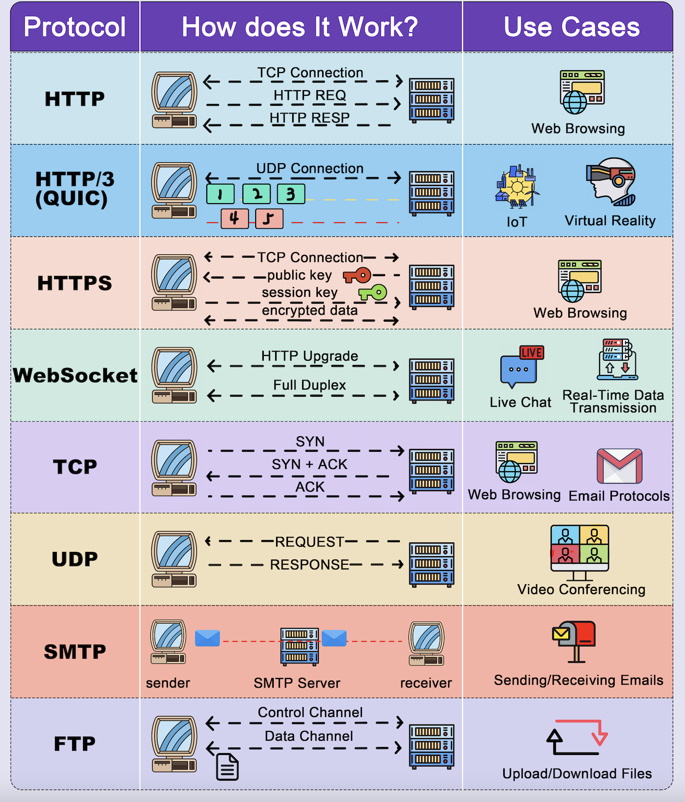

## Communication Protocols Quick Revision

---

**Quick Summary Table**

| Protocol | Speed | Reliable | Encrypted | Best For |
|----------|-------|----------|-----------|----------|
| **TCP** | Medium | ✅ Yes | ❌ No | Reliable data delivery |
| **UDP** | ⚡ Fast | ❌ No | ❌ No | Speed over reliability |
| **HTTP** | Medium | ✅ Yes | ❌ No | Web pages & APIs |
| **HTTPS** | Medium | ✅ Yes | ✅ Yes | Secure web browsing |
| **HTTP/3** | ⚡ Fast | ✅ Yes | ✅ Yes | Streaming, mobile apps |
| **WebSocket** | ⚡ Fast | ✅ Yes | Optional | Real-time, live data |
| **SMTP** | Medium | ✅ Yes | Optional | Sending emails |
| **FTP** | Medium | ✅ Yes | ❌ No | Large file transfers |

---

**1. TCP**
- Connection-oriented, reliable protocol
- 3-way handshake: `SYN → SYN-ACK → ACK`
- Guarantees all packets arrive, re-sends lost ones
- Use cases: web browsing, email, file transfer

**2. UDP**
- No handshake, no confirmation, just send
- Fast but packets can be lost, no re-sending
- Use cases: video calls, live streaming, gaming

**3. HTTP**
- Runs on top of TCP
- Flow: `TCP connection → HTTP request → HTTP response → close`
- Each request is independent (stateless)
- Use cases: web browsing, REST APIs

**4. HTTPS**
- HTTP + SSL/TLS encryption
- Extra step: `TCP connection → SSL/TLS handshake → encrypted HTTP`
- Data encrypted in transit can't be read if intercepted
- Use cases: all modern web browsing, login/payment pages

**5. HTTP/3 (QUIC)**
- Runs on UDP instead of TCP
- Adds: built-in encryption (TLS 1.3), header compression, multiplexing, connection migration
- No head-of-line blocking streams are independent
- Use cases: video streaming, IoT, mobile apps

**6. WebSocket**
- Starts as HTTP, upgrades to full-duplex `ws://` connection
- Both client and server can send messages at any time
- Single persistent connection (no re-connecting per message)
- Use cases: live chat, real-time dashboards, collaborative apps

**7. SMTP**
- For sending emails only (receiving uses IMAP/POP3)
- Sender → SMTP server → recipient's mail server → recipient
- One-way push protocol
- Use cases: emails, OTPs, notifications

**8. FTP**
- For uploading/downloading large files
- Two channels: one for commands, one for data
- SFTP = secure version (encrypted)
- Use cases: deploying files to servers, large data transfers

---

**Protocol Stack (Who Sits on Top of What)**
```
WebSocket → HTTP → TCP
HTTP/HTTPS → TCP
HTTP/3     → UDP (QUIC)
SMTP / FTP → TCP
```

---

**Key Terms**

| Term | Meaning |
|------|---------|
| **Handshake** | Setup process before data is sent (TCP = 3-way, SSL = certificate exchange) |
| **Full-duplex** | Both sides can send and receive simultaneously |
| **Stateless** | Each request is independent, server remembers nothing between requests |
| **Head-of-Line Blocking** | In TCP, a lost packet stalls everything behind it |
| **Multiplexing** | Multiple requests over one connection simultaneously |
| **Packet loss** | Some data units don't arrive UDP doesn't recover these, TCP does |

---

**Analogies at a Glance**

| Protocol | Analogy |
|----------|---------|
| **TCP** | Tracked courier confirms delivery, re-sends if lost |
| **UDP** | Shouting across a room fast, some words missed |
| **HTTP** | Letter exchange, you write, wait, get reply |
| **HTTPS** | Sealed tamper-proof envelope, same as HTTP but unreadable if intercepted |
| **WebSocket** | Phone call, both sides talk freely once connected |
| **SMTP** | Post office, you drop a letter, they route it to the recipient |

- 
