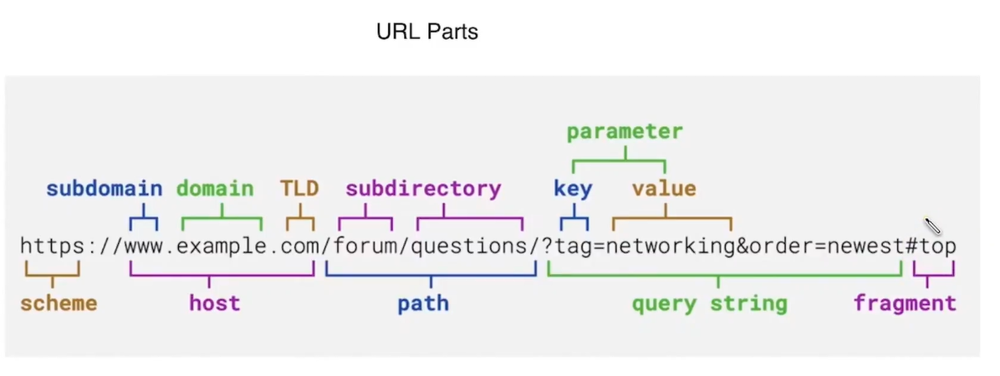

## REST APIs

**API (Application Programming Interface)** — A way for two different services/applications to talk to each other. Instead of knowing how the other service works internally, you just use its API.

**REST (Representational State Transfer)** — A set of rules/conventions that defines how data should be structured and transferred between two services over the web. REST is built on top of HTTP.

> 💡 **Analogy:** An API is like a waiter in a restaurant. You (client) don't go into the kitchen (server) directly, you tell the waiter (API) what you want, and they bring back what you asked for. REST is the menu format, a standard way of placing that order.

---

**Why REST? — Benefits**

**1. Ease of Use** — Built on HTTP, which developers already know. Follows a predictable set of rules so there's less to learn.

**2. Stateless** — The server does not remember anything between requests. Every request must carry all the information it needs on its own (like auth tokens, user info, etc.). This keeps the server simple and scalable.

> 💡 **Example:** When you call `GET /api/orders`, you must send your auth token with that request. The server doesn't remember you from your last request.

**3. Scalability** — Because requests are stateless, you can add more servers easily (horizontal scaling) any server can handle any request without needing shared session memory.

**4. Flexibility of Data** — REST doesn't lock you into one data format. You can use JSON (most common), XML, plain text, etc. depending on what suits your use case.

**5. Uniform Interface** — Because REST follows HTTP conventions, every REST API works similarly. A developer who knows REST can pick up any REST API quickly.

**6. Caching** — Responses that don't change often (like a list of countries) can be cached. REST gets HTTP-level caching for free the browser or intermediary can cache responses without extra setup.

**7. Separation of Concerns** — The client and server are independent. The frontend doesn't care how the backend works internally, and vice versa. They just agree on the API contract.

**8. Language Agnostic** — A Python backend can serve a React frontend. A Node.js service can talk to a Java service. REST doesn't care what language either side is written in, it only cares about HTTP.

**9. Ease of Testing** — REST APIs are easy to test using tools like Postman, Insomnia, or even `curl` in the terminal. You can test each endpoint independently.

**10. Security** — Use HTTPS to encrypt all traffic. Add `Authorization` headers (Bearer tokens, API keys) to protect endpoints. REST doesn't enforce security itself, but it integrates cleanly with standard HTTP security mechanisms.

---

**Building Blocks of REST APIs**

---

**1. URL (Uniform Resource Locator)**

The URL identifies the specific resource or action you want to interact with. Every REST endpoint has a unique URL.
```
http://localhost:5000/api/users
http://localhost:5000/api/todos/123
```

**Parts of a URL:**

| Part | Example | Purpose |
|------|---------|---------|
| Protocol | `http://` or `https://` | How the request is sent |
| Host | `localhost` or `api.example.com` | Which server to reach |
| Port | `:5000` | Which port on that server |
| Path | `/api/users` | Which resource/endpoint |
| Query Params | `?page=1&limit=10` | Filters, pagination, options |
| Fragment | `#section` | Client-side only (not sent to server) |

- 

> 💡 **REST convention for paths:**
> - `GET /api/users` → get all users
> - `GET /api/users/42` → get user with ID 42
> - `POST /api/users` → create a new user
> - `DELETE /api/users/42` → delete user 42

---

**2. HTTP Methods**

Methods tell the server what operation to perform on the resource.

| Method | Purpose | Example |
|--------|---------|---------|
| **GET** | Fetch/read data — no side effects | `GET /api/users` |
| **POST** | Create a new resource | `POST /api/users` with body `{name: "Raj"}` |
| **PUT** | Replace/update a full resource | `PUT /api/users/42` — sends complete updated object |
| **PATCH** | Partially update a resource | `PATCH /api/users/42` — sends only changed fields |
| **DELETE** | Remove a resource | `DELETE /api/users/42` |
| **HEAD** | Same as GET but returns only headers, no body | Used to check if a resource exists |
| **OPTIONS** | Returns what methods are allowed on this endpoint used in CORS preflight checks | Browser sends this before a cross-origin request |
| **CONNECT** | Establishes a tunnel (used for HTTPS proxying) | Rarely used directly in REST |
| **TRACE** | Echoes back the request for debugging, **disabled in production** | Used in development/diagnostics only |

> 💡 **PUT vs PATCH:**
> Imagine updating a user profile with fields `{name, email, age}`.
> - `PUT` — you must send all three fields. Missing fields get overwritten with empty/null.
> - `PATCH` — you send only `{age: 26}`. Only age changes. Name and email stay the same.

---

**3. Headers**

Headers are metadata attached to every HTTP request and response. They tell both sides important information about the request/response, content type, authentication, encoding, caching, etc.

**Request Headers:**

| Header | Purpose | Example |
|--------|---------|---------|
| `Host` | Target server hostname | `api.example.com` |
| `Origin` | Where the request is coming from | `https://www.example.com` |
| `Referer` | The previous page that triggered the request | `https://www.example.com/home` |
| `User-Agent` | Info about the client's browser and OS | `Mozilla/5.0 (Windows NT 10.0...)` |
| `Accept` | What content type the client can handle | `application/json` |
| `Accept-Language` | Preferred response language | `en-US,en;q=0.9` |
| `Accept-Encoding` | Compression algorithm the client supports | `gzip, deflate, br` |
| `Connection` | Whether to keep the TCP connection open | `keep-alive` or `close` |
| `Authorization` | Auth credentials for protected routes | `Bearer eyJhbGci...` |
| `Cookie` | Send stored cookies back to the server | `session=abc123` |

**Response Headers:**

| Header | Purpose | Example |
|--------|---------|---------|
| `Date` | When the response was generated | `Sat, 14 Mar 2026 12:12:11 GMT` |
| `Server` | Info about the server software | `nginx` or `cloudflare` |
| `Content-Type` | Format of the response body | `application/json` |
| `Content-Length` | Size of the response body in bytes | `73` |
| `Set-Cookie` | Tells the client to store a cookie | `token=ey123; HttpOnly` |
| `Content-Encoding` | How the response body is compressed | `br` (Brotli) or `gzip` |

---

**4. Status Codes**

Every HTTP response includes a status code a 3-digit number that tells the client what happened with the request.

**1xx — Informational**

| Code | Name | Meaning |
|------|------|---------|
| 100 | Continue | Server received the request headers, client can proceed to send the body |
| 101 | Switching Protocols | Upgrading connection (e.g. HTTP → WebSocket) |

**2xx — Success**

| Code | Name | Meaning |
|------|------|---------|
| 200 | OK | Request succeeded, response body contains the result |
| 201 | Created | A new resource was successfully created (e.g. after POST) |
| 202 | Accepted | Request accepted but processing is async, result not ready yet |
| 204 | No Content | Success, but nothing to return (e.g. after DELETE) |
| 206 | Partial Content | Returning a chunk of data (e.g. video streaming, resumable uploads) |

**3xx — Redirection**

| Code | Name | Meaning |
|------|------|---------|
| 301 | Moved Permanently | Resource has a new permanent URL, update your bookmarks |
| 302 | Found (Temp Redirect) | Temporarily at a different URL |
| 307 | Temporary Redirect | Same as 302 but **preserves the HTTP method** (POST stays POST) |
| 308 | Permanent Redirect | Same as 301 but **preserves the HTTP method** |

> 💡 **301 vs 307:** If you POST to a URL and get a 301, the browser may change it to a GET on redirect. With 307, the method is preserved, your POST stays a POST.

**4xx — Client Errors** (you sent something wrong)

| Code | Name | Meaning |
|------|------|---------|
| 400 | Bad Request | Request is malformed or has invalid data |
| 401 | Unauthorized | Not logged in / no valid auth token |
| 403 | Forbidden | Logged in, but not allowed to access this resource |
| 404 | Not Found | Resource doesn't exist at this URL |
| 405 | Method Not Allowed | The method used (e.g. DELETE) isn't allowed on this endpoint |
| 429 | Too Many Requests | Rate limit exceeded, slow down |

> 💡 **401 vs 403:**
> - 401 = "Who are you?" (not authenticated)
> - 403 = "I know who you are, but you can't come in" (not authorized)

**5xx — Server Errors** (server did something wrong)

| Code | Name | Meaning |
|------|------|---------|
| 500 | Internal Server Error | Generic server crash — check server logs |
| 502 | Bad Gateway | Server got a bad response from an upstream service |
| 503 | Service Unavailable | Server is down or overloaded — try again later |
| 504 | Gateway Timeout | Upstream server took too long to respond |
| 507 | Insufficient Storage | Server ran out of storage (common with file uploads) |

**Using Status Codes in Frontend Logic:**

You can and should write frontend logic based on status codes:
- `401` → redirect to login page
- `403` → show "Access Denied" message
- `404` → show "Not Found" page
- `503` → **retry** (server was temporarily down, worth trying again)
- `400` → **don't retry** (your request is wrong, fix the data first)
- `429` → retry after a delay (respect the rate limit)

- Practical example of rest api at - /practical
