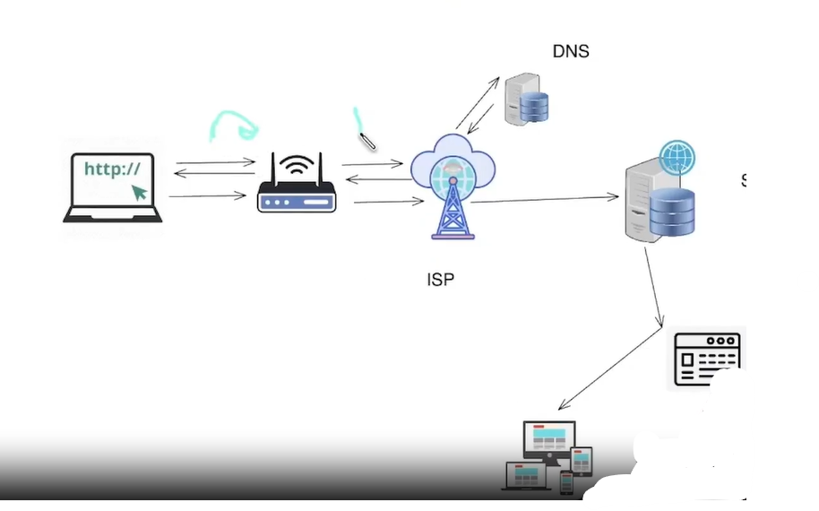
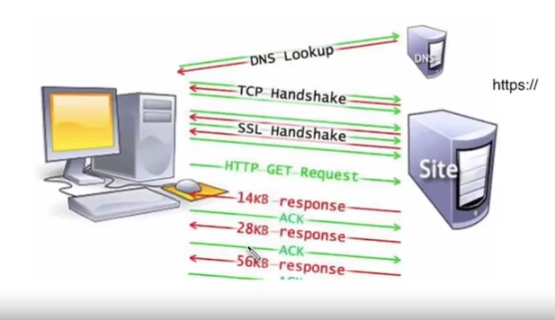
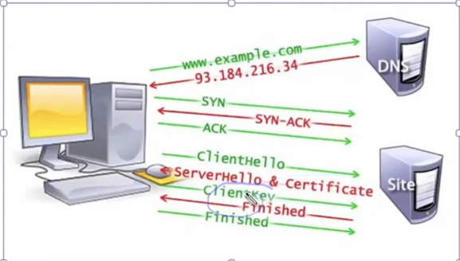

# How the Web Works

---

## 1. Overview — What Happens When You Visit a Website?

When you type something like `www.google.com` into your browser, a lot happens in the background before the page appears. At a high level, your browser sends a request to Google's server, and the server responds with HTML, CSS, JavaScript, and other assets that your browser uses to render (display) the page.

> 💡 **Analogy:** Think of it like ordering food, you (browser) place an order (request) at a restaurant (server), and they send back your meal (HTML/CSS/JS). The browser is your kitchen, it takes the raw ingredients and puts together the final dish you see.

### Key File Types the Server Sends Back

- **HTML** — The structure/skeleton of the page (headings, paragraphs, buttons)
- **CSS** — The styling (colors, fonts, layout)
- **JavaScript** — Interactivity and logic (clicks, animations, API calls)
- **Assets** — Images, videos, fonts, etc.

---

## 2. What Is a Server?

A server is simply a machine that stores data and responds to requests over the internet. Your own laptop can technically be a server if it's connected to the internet and has server software running on it.

### Why Not Just Use Your Own Machine?

There are real-world limitations with using a personal computer as a server:

- **Uptime** — Your laptop isn't on 24/7. Servers need to be always available.
- **Network stability** — Home internet can be unstable. Data centers have redundant connections.
- **Overheating** — A personal machine can't handle thousands of simultaneous requests.
- **Limited specs** — Storage and RAM on a personal machine are limited. Servers have terabytes of storage and massive RAM.

### What Does a Real Server Look Like?

In practice, a server is a powerful machine (or cluster of machines) hosted in a data center. These can be:

- **On-premise** — Owned and managed by the company itself (e.g., in their own building)
- **Cloud-based** — Rented from providers like AWS, Google Cloud, or Azure

> 💡 **Example:** When you visit Netflix, your request goes to one of their thousands of servers distributed around the world, these are called CDN nodes (Content Delivery Networks). The server closest to you responds to keep things fast.

---

## 3. DNS — Turning a Domain Name Into an IP Address

Two devices on the internet communicate using **IP addresses** (e.g., `142.250.195.46`). Domain names like `google.com` are just human-readable aliases for those IP addresses. The system that translates domain names to IP addresses is called **DNS (Domain Name System)**.

> 💡 **Analogy:** DNS is like a phone book, you know your friend's name (`google.com`), but you need their number (IP address) to actually call them.

### Step-by-Step DNS Lookup Flow

**Step 1 — Browser Cache Check**
The browser first checks its own cache. If it has visited `google.com` before, it already knows the IP. If found, it skips straight to making the request.

**Step 2 — Router / OS Cache Check**
If not in browser cache, the OS and router are checked next. Your router often caches recent DNS lookups too.

**Step 3 — ISP DNS Server**
If still not found, the request goes to your Internet Service Provider's (ISP) DNS resolver, a server run by your ISP (like Jio, Airtel, etc.) specifically to handle DNS lookups.

**Step 4 — Root / TLD / Authoritative DNS Servers**
If the ISP doesn't know the IP, it queries the global DNS hierarchy:
Root servers → TLD servers (for `.com`, `.in`, etc.) → Authoritative DNS server for `google.com` → IP returned.

### Full Flow (No Cache)
```
Browser → OS → Router → ISP → DNS Server     [asks: what's the IP for google.com?]
DNS Server → ISP → Router → OS → Browser     [returns: 142.250.195.46]
Browser → OS → Router → ISP → Server         [makes actual request using the IP]
```

- 
- 
- 

---

### DNS Caching

To avoid this full lookup every time, DNS results are cached at multiple levels:

- **Browser cache** — Fastest, stored locally for a short TTL (Time to Live)
- **OS / Router cache** — Checked after browser cache
- **ISP cache** — Most DNS queries stop here on repeat visits

---

## 4. TCP Handshake — Establishing a Connection

Once the browser has the server's IP address, it needs to establish a reliable connection before sending the actual request. This is done via the **TCP (Transmission Control Protocol) Three-Way Handshake**.

TCP guarantees that data arrives correctly and in order. Before sending your actual page request, both sides agree to communicate, this is the handshake.

### The Three Steps

| Step | Message | Meaning |
|------|---------|---------|
| 1 | **SYN** | Client → Server: "Hey, I want to connect. Are you there?" |
| 2 | **SYN-ACK** | Server → Client: "Yes I'm here! I acknowledge your request. Ready?" |
| 3 | **ACK** | Client → Server: "Ready! Let's go." — Connection established ✅ |

> 💡 **Analogy:** TCP handshake is like calling someone before sending a package. You call (SYN), they pick up and confirm (SYN-ACK), you say "great, sending now" (ACK). Only then do you courier the package (the HTTP request).

---

## 5. HTTPS & the SSL/TLS Handshake — Securing the Connection

**HTTP** is the standard protocol for web communication. **HTTPS** adds a security layer using **SSL/TLS** (Secure Sockets Layer / Transport Layer Security) to encrypt data between client and server.

### Why Does HTTPS Matter?

- Without HTTPS, data travels in **plain text** — anyone "in the middle" (like on the same Wi-Fi) can read it.
- With HTTPS, data is **encrypted** — even if intercepted, it's unreadable without the decryption key.

### SSL/TLS Handshake — Step by Step

| Step | What Happens |
|------|-------------|
| 1 | TCP Handshake happens first (as described above) |
| 2 | **Client Hello** — Browser tells the server which SSL/TLS versions and encryption methods it supports |
| 3 | **Server Hello + Certificate** — Server picks an encryption method and sends its SSL Certificate (a digital ID card proving its identity) |
| 4 | **Key Exchange** — Client verifies the certificate against trusted Certificate Authorities (CAs). Both sides generate a shared secret encryption key |
| 5 | **Encrypted Connection** — All further communication is encrypted. No one in the middle can read it 🔐 |

> 💡 **Analogy:** Imagine exchanging a locked box with a padlock (the certificate). The other person puts their message in and locks it. Only you have the key to open it. That's essentially what TLS does.

---

- 
- 
- 

---

## 6. Full Flow Summary — From URL to Webpage

| # | Phase | What Happens |
|---|-------|-------------|
| 1 | **DNS Lookup** | Browser → OS → Router → ISP → DNS Server → IP returned |
| 2 | **TCP Handshake** | SYN → SYN-ACK → ACK (connection established) |
| 3 | **SSL Handshake** | *(HTTPS only)* Certificate exchanged, encryption established |
| 4 | **HTTP Request** | Browser sends `GET` request to server |
| 5 | **Server Response** | Server sends back HTML, CSS, JS, assets |
| 6 | **Browser Rendering** | Browser parses HTML, applies CSS, runs JS, shows page |

---