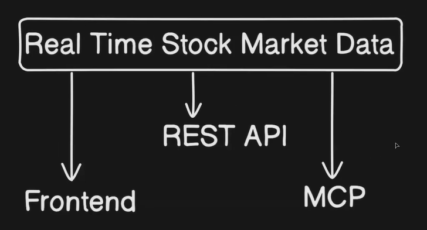

## MCP (Model Context Protocol)

**What is MCP**

MCP stands for Model Context Protocol. It is basically a set of rules that defines how tools should be built for AI models. Think of it like a standard agreement, so that every tool follows the same structure and can work with any AI that understands MCP.

Without such a standard, every developer would build tools in their own way, and those tools would not work for others. MCP solves this by giving everyone a common way to create and share tools.

**Why MCP Exists**

When developers build tools for AI, they each have their own style and format. If there is no common standard, a tool built by one person cannot be used by someone else without major changes. MCP fixes this by saying "here is the agreed way to build a tool, and if you follow it, anyone using MCP can use your tool."

A simple way to think about it: it is like how all chargers for USB-C devices follow the same port standard. You do not need a different charger for every device.

**How MCP Works (The HTTP Comparison)**

MCP works like an HTTP server in many ways. An HTTP server listens for requests and based on the route (like /users or /orders), it runs a specific function. MCP works the same way. It has a list of tools available, and based on what the user asks, the AI picks and runs the right tool.

Just like HTTP runs on TCP (which handles the actual data transfer), MCP runs on Stdio, which means Standard Input and Output. In simple terms, it communicates through the terminal, reading input and writing output.

**MCP Client and MCP Server**

MCP has two main parts:

**MCP Server** : This is where the tools live. It is a server that holds a collection of tools and waits for someone to call them.

**MCP Client** : This is what connects to the MCP server and uses the tools. Cursor (the code editor) is a good example of an MCP client. You create a file called mcp.json inside your project, give it the right config details, and Cursor will connect to the MCP server and load all the tools from it.

Once connected, the AI inside the client can now use all the tools from the server automatically.

**A Simple Real World Example**

Say you have an MCP server that has tools like: search the web, read a file, and send an email.

You ask the AI: "Search for the latest news about AI and send me a summary on email."

The AI connects to the MCP server, picks the right tools (search and email), runs them in order, and completes your task. You did not have to do anything manually.

**Flow Summary**

User asks a question, the MCP client sends it to the MCP server, the server looks at its available tools, runs the right one, and sends the result back to the client, which shows it to the user.

**Practical Example at: [./practical/main.py](./practical/main.py)**

