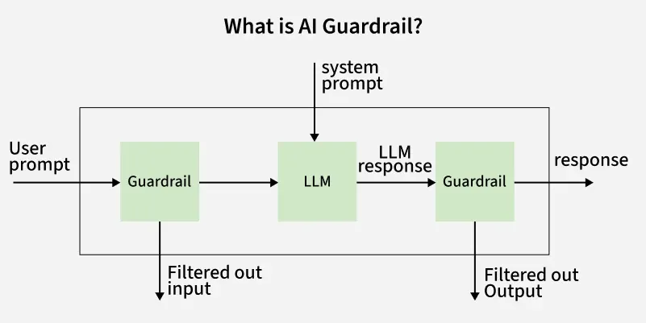
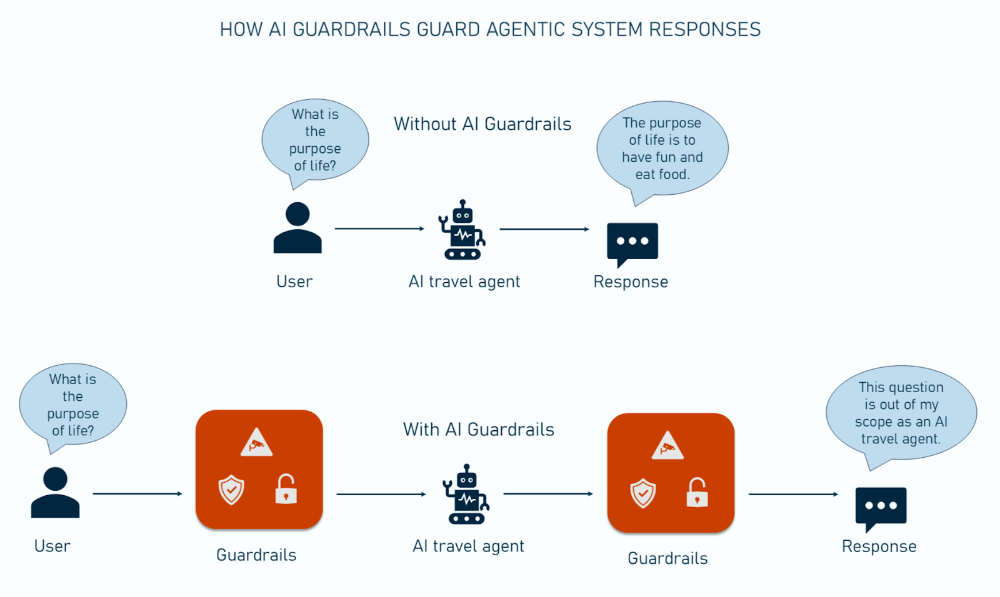

## Guardrails and Security In AI

When your application starts getting real users, security becomes one of the most important things to think about. There is a saying in the coding world: "Never trust user input (user input is always dangerous)" This means we should never blindly trust what a user sends to our application. This is even more true for AI applications, because users can literally ask the AI anything they want.

**A Real World Example**

Think about this scenario: you are building a RAG (Retrieval Augmented Generation) chatbot for a private company. Employees can use it to ask questions about company policies. Sounds simple, right? But if you skip security, a lot of things can go wrong.

Here are some problems that can happen:

An employee from the marketing team might ask questions about HR or finance documents they are not supposed to see. A user might accidentally (or on purpose) paste personal data, passwords, or sensitive business info into the chat prompt. Someone might try to "jailbreak" the AI by writing tricky prompts to make it behave in ways it should not.

**What Can We Do About It**

There are a few different ways to add security and guardrails to your AI application.

**Option 1 : Use a Third Party Guardrails Tool**

One popular option is to use an open source package like **Guardrails AI**. It gives you ready made rules and checks you can plug into your app. It also supports two setups:

Hosted on their servers (easier to set up, but your data might goes to their servers), or running on your own servers (called on premises, more private and secure).

This is a good choice if you want something working quickly without building everything from scratch.

**Option 2 : Use a Mini Model as a Judge**

Another approach is to host a small, lightweight AI model yourself. This model acts like a security guard or "judge" that checks every request before it goes to your main LLM.

Here is how it works:

User sends a message. The mini model checks if the message is safe, is it asking something it should not, does it contain sensitive data, does it look like a jailbreak attempt. If the check passes, the request goes to the main LLM. If not, the request gets blocked or flagged.

This judge model can sit in two places. Before the LLM call (input guard) to block bad prompts, and after the LLM response (output guard) to catch harmful or wrong outputs before they reach the user.

This approach gives you full control and keeps all data within your own infrastructure.

**Option 3 : Use OpenAI Built In Moderation**

OpenAI provides its own moderation and guardrail tools. The downside here is that your data, including sensitive prompts, will be sent to OpenAI's closed servers. If privacy is important for your use case (like a private company), this might not be the best option.

**Quick Comparison**

Guardrails AI gives you ready made rules, supports both hosted and on premises, and is easier to set up. The mini model judge gives you full control, keeps data private, and is more customizable but requires more setup effort. OpenAI moderation is built in and easy to use but your data goes to their servers and works only with OpenAI.

---

