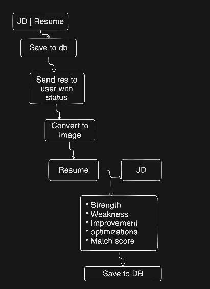
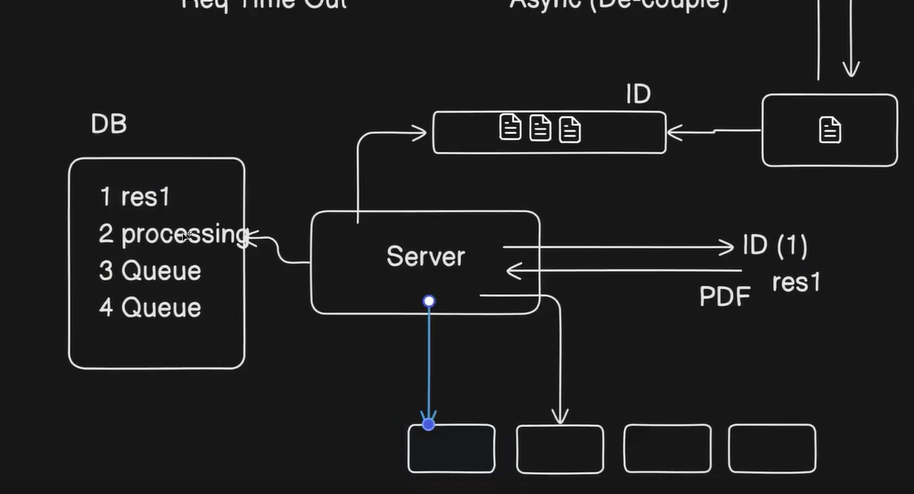

## Full RAG with Async Flow

This is a resume analyzer application. You give it your resume and a job description (JD), and it tells you your strengths, weaknesses, what to improve, and what to optimize. Simple as that.

**What the app does**

It looks at your resume against the job description and gives you a breakdown:

, Strengths: what you already have that matches the JD
, Weaknesses: what is missing or not strong enough
, Improvements: things you can add or fix
, Optimizations: how to present things better

**The Async Pattern**

This app uses something called an async flow. Instead of doing everything in one go, it splits the work into two separate parts that talk to each other through a message queue. Think of a message queue like a to-do list that sits in the middle. One part of the app adds tasks to the list, and another part picks them up and does the actual work.

**API Flow (what the user side does)**

1. User uploads the resume and pastes the JD
2. The info is saved to the database and the resume file is saved to disk
3. The details are pushed into the message queue
4. The status is updated to "processing"
5. A file ID is returned to the user so they can check back later

At this point the user is done waiting. They got their ID and can go do other things.

**Worker Flow (what happens in the background)**

1. The worker picks up the task from the queue
2. Now worker does different steps to create the context
2. It processes the resume and JD through the LLM with the context
3. It updates the result and status in the database

Once this is done, the user can use their file ID to hit another endpoint and fetch the final result.

**Why async and not sync?**

If you did this in a sync flow, the user would have to sit and wait while the LLM processes everything. That can take time. During that time they can't do anything else on the app. Also if many users hit the app at the same time, the server gets overloaded quickly.

With async flow:

, The user gets a response immediately (just an ID)
, The heavy work happens in the background
, If load increases, you just spin up more workers to handle more tasks in parallel
, The API server and the worker server can scale independently

A real world way to think about it: it is like placing an order at a restaurant. You tell the waiter what you want (API), the waiter notes it down and passes it to the kitchen (queue), the kitchen prepares the food (worker), and you get notified when it is ready. You are not standing at the counter waiting the whole time.

**What is RAG here?**

RAG stands for Retrieval Augmented Generation. In simple terms, instead of just asking the LLM a general question, you give it specific context, in this case your resume and the JD. The LLM then uses that context to give you a much more relevant and accurate answer. That is the "retrieval" part: you retrieve the right information first, then the LLM generates the response based on it.

**Quick summary of the full flow**

User uploads resume and JD
  → saved to DB and disk
  → pushed to queue
  → user gets file ID back

Worker picks from queue
  → processes with LLM
  → result saved to DB

User uses file ID
  → fetches status and result from DB 

 
---

