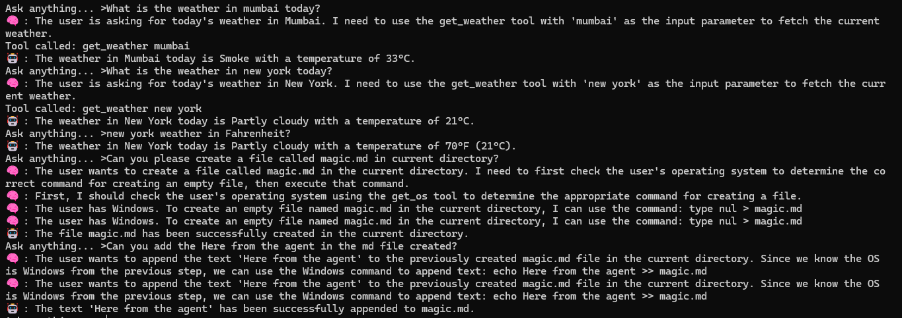
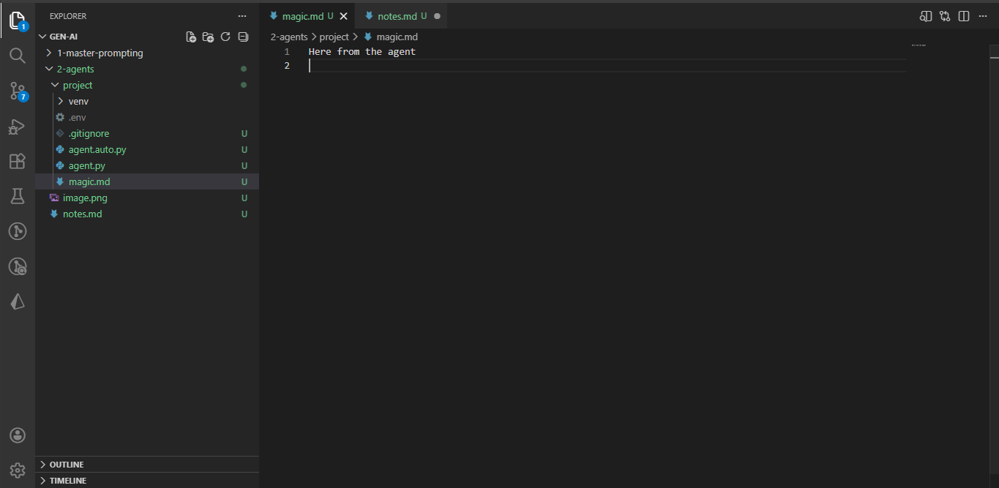

## AI Agents

**What is an AI Agent?**

> AI Agent = LLM + Custom Tools (Functions)

An AI agent is an LLM that has been given access to a set of tools (custom functions) it can call to take real-world actions not just generate text.

By itself, an LLM is powerful but limited:
- It has vast knowledge from training, but has a **knowledge cutoff** it doesn't know what happened yesterday
- It can reason and plan, but it **cannot act** it can't check the weather, query your database, run a command, or send an email on its own

When you give it tools, it can do all of that. The LLM handles the **thinking and reasoning**, the tools handle the **real-world interaction**.

> 💡 **Analogy:** Think of the LLM as a brilliant consultant who knows everything but is locked in a room with no internet or phone. Tools are like giving them a phone, a browser, and a terminal. Now they can look things up, take actions, and get real results not just give advice based on memory.

---

**Why Do We Need Agents?**

| LLM Alone | LLM + Tools (Agent) |
|-----------|---------------------|
| Knowledge cutoff no real-time data | Can call APIs for live data (weather, stocks, news) |
| Can only generate text | Can execute actions (run commands, write files, query DBs) |
| Stateless no memory of past sessions | Can read/write to storage tools for persistence |
| Can plan but not act | Can plan AND execute step by step |

---

**How an Agent Works The Loop**

A well-designed agent doesn't just call one tool and stop. It follows a structured reasoning loop:
```
User Query
    │
    ▼
 PLAN ──▶ ACTION (call tool) ──▶ OBSERVATION (tool result)
    │                                       │
    └───────────────────────────────────────┘
         (repeat if needed)
    │
    ▼
 OUTPUT (final answer to user)
```

**The steps explained:**

**Plan** — The LLM reads the query and decides what needs to be done. It may plan multiple steps if the task is complex.

**Action** — The LLM picks the right tool and calls it with the correct input.

**Observation** — The tool runs and returns a result. The LLM reads this result.

**Output** — Once the LLM has enough information from the observation(s), it generates the final answer for the user.

> 💡 The key design principle: **one step at a time**. The agent doesn't try to do everything at once it plans, acts, observes, then decides what to do next. This mirrors how a careful human would approach a complex task.

---

**Tools**

A tool is simply a **regular function** in your code that the agent can choose to call. You describe the tool to the LLM (name, what it does, what input it takes) and the LLM decides when and how to use it.

**Example tools:**
```python
def get_weather(city: str) -> str:
    # Makes an API call to a weather service
    # Returns: "32 degree cel" or "Failed to fetch weather..."
    ...

def get_os() -> str:
    # Returns the user's operating system
    # Returns: "Windows" / "macOS" / "Linux"
    ...

def execute_command(command: str) -> int:
    # Runs a shell command on the user's system
    # Returns: 0 if success, non-zero if error
    ...
```

> 💡 Tools can be anything a database query, a REST API call, a file system operation, a browser action, a calculator, a code executor. If it's a function, it can be a tool.

---

**System Prompt Design for Agents**

The system prompt is how you give the LLM its identity, its rules, and its available tools. For agents, a well-structured system prompt is critical it defines how the agent thinks and behaves.
```python
system_prompt = """
You are a helpful AI Assistant specialised in resolving user queries.
You work in start, plan, action, observation, output mode.

For the given user query and available tools, plan the step-by-step execution.
Pick the relevant tool, perform the action, wait for the observation, then resolve the query.

Rules:
1. Follow the strict JSON output format defined below.
2. Always perform one step at a time and wait for the next input.
3. Carefully analyse the user query before planning.

Output JSON Format:
{ "step": "string", "content": "string", "function": "function name if step is action", "input": "input parameter for the function" }

Available Tools:
- get_weather: Takes city name as input, returns current weather info
- get_os: Takes no input, returns user's OS information
- execute_command: Takes a shell command as input, executes it, returns 0 on success or error info on failure

Example:
Input: What is the weather of Mumbai?
Output: { "step": "plan", "content": "User wants weather data for Mumbai" }
Output: { "step": "plan", "content": "I should call get_weather with 'mumbai'" }
Output: { "step": "action", "function": "get_weather", "input": "mumbai" }
Output: { "step": "observation", "content": "32 degree cel" }
Output: { "step": "output", "content": "The weather in Mumbai is 32°C quite hot right now!" }

Input: Create a file called magic.txt in the current directory.
Output: { "step": "plan", "content": "User wants to create a file called magic.txt" }
Output: { "step": "plan", "content": "I need to know the OS first to use the right command" }
Output: { "step": "action", "function": "get_os", "input": "" }
Output: { "step": "observation", "content": "Windows" }
Output: { "step": "plan", "content": "User is on Windows, I'll use the Windows command to create the file" }
Output: { "step": "action", "function": "execute_command", "input": "type nul > magic.txt" }
Output: { "step": "observation", "content": "0" }
Output: { "step": "output", "content": "magic.txt has been successfully created in the current directory." }
"""
```

---

**Why Strict JSON Output?**

Forcing the agent to output structured JSON at every step is a deliberate design choice:

- **Parseable** — your code can reliably read each step and decide what to do (call a tool, wait, show output)
- **Controlled** — the model can't skip steps or hallucinate tool calls in free-form text
- **Debuggable** — you can log every step and trace exactly what the agent did and why
- **One step at a time** — JSON forces atomic actions, preventing the model from trying to chain tool calls in one go

---

- 
---
- 

**Real-World Use Cases**

| Agent Type | Tools It Uses | Example |
|------------|--------------|---------|
| **Weather Agent** | Weather API | "What's the weather in Delhi this weekend?" |
| **Code Agent** | Code executor, file system | "Write a Python script and run it" |
| **Data Agent** | Database queries, CSV tools | "Summarise last month's sales from our DB" |
| **Browser Agent** | Web scraper, search API | "Find the top 5 news stories today" |
| **DevOps Agent** | Shell commands, cloud APIs | "Check server health and restart if down" |
| **Personal Assistant** | Calendar, email, notes APIs | "Schedule a meeting and send the invite" |

---

**Key Concepts Summary**

**LLM** — The brain. Handles reasoning, planning, and deciding which tool to use.

**Tool** — A regular function. Handles real-world actions the LLM can't do alone.

**System Prompt** — The instruction manual. Tells the LLM how to behave, what tools it has, and what format to follow.

**Observation** — The result returned by a tool. The LLM uses this to decide what to do next.

**Agent Loop** — Plan → Action → Observation → (repeat if needed) → Output.