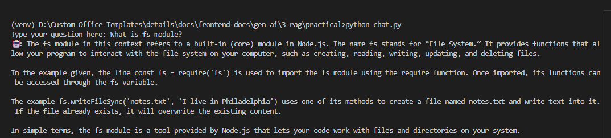
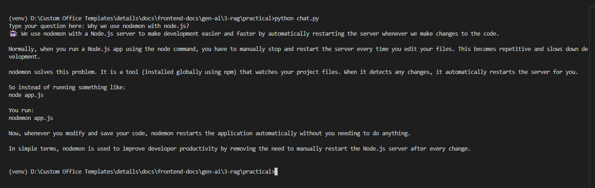

## RAG (Retrieval Augmented Generation)

RAG is a technique where you provide the LLM with relevant context alongside the user's query, so it can answer questions about data it was never trained on.

By default, LLMs have two major limitations:
- **Knowledge cutoff** — they don't know anything that happened after their training date
- **No access to private data** — they can't answer questions about your company's internal docs, your personal notes, or your database

RAG solves both of these. Instead of retraining the model (which is expensive), you retrieve the relevant pieces of information at query time and pass them to the LLM as context. The LLM uses that context to answer accurately.

> 💡 **Analogy:** Imagine asking an open-book exam question. Without RAG, the LLM only has what it memorised. With RAG, you hand it the relevant pages from the textbook before it answers. It still does the reasoning it just has the right information in front of it.

---

**Why Not Just Put Everything in the Prompt?**

LLMs have a **context window limit** there's only so much text you can fit in a single prompt. You can't dump an entire documentation site or a 500-page PDF into every request. RAG solves this by retrieving only the most relevant chunks, not the entire dataset.

---

**The Two Processes in RAG**

RAG has two distinct phases **Indexing** (done once, or updated periodically) and **Retrieval + Generation** (done on every user query).

---

**Process 1: Indexing (Preparing Your Data)**

This is how you take your raw documents and store them in a way that makes semantic search possible.
```
Raw Document
     │
     ▼
Load the Document
     │
     ▼
Split into Chunks
     │
     ▼
Create Vector Embeddings
     │
     ▼
Store in Vector DB
```

**Step 1 — Load the Document**
Read the raw source a PDF, a markdown file, a webpage, a database export, anything. This gives you the raw text to work with.

**Step 2 — Split into Chunks**
You can't embed an entire document as one unit it would lose granularity. Instead, you split it into smaller chunks (e.g. 200–500 tokens each, with some overlap so context isn't cut off mid-sentence).

> 💡 **Why overlap?** If a key piece of information sits at the boundary between two chunks, overlap ensures it appears in at least one of them fully intact.

**Step 3 — Create Vector Embeddings**
Each chunk is passed through an **embedding model** (like OpenAI's `text-embedding-ada-002` or open-source alternatives). The embedding model converts text into a **vector** a list of numbers that represents the semantic meaning of that text.

> 💡 **What is a vector?** Think of it as coordinates in a high-dimensional space. Text with similar meaning ends up close together in that space. "What is the capital of France?" and "Paris is the capital city of France" would have vectors very close to each other, even though the words are different.

**Step 4 — Store in a Vector Database**
The chunks and their vectors are stored in a vector database, which is optimised for fast similarity search. Popular options:

| Vector DB | Notes |
|-----------|-------|
| **Pinecone** | Fully managed cloud, easy to start |
| **Qdrant** | Open source, can self-host |
| **ChromaDB** | Lightweight, great for local/dev use |
| **Weaviate** | Open source, good for production |

---

**Process 2 — Retrieval + Generation (Answering a Query)**

This happens every time a user asks a question.
```
User Question
     │
     ▼
Create Vector Embedding of the Question
     │
     ▼
Semantic Search Against Vector DB
     │
     ▼
Retrieve Top-K Most Relevant Chunks
     │
     ▼
Build Prompt (System + Retrieved Context + User Query)
     │
     ▼
LLM Generates the Answer
     │
     ▼
Return Response to User
```

**Step 1 — Embed the Query**
The user's question is converted into a vector using the same embedding model used during indexing. This puts the question into the same vector space as your stored chunks.

**Step 2 — Semantic Search**
The vector DB compares the query vector against all stored chunk vectors and returns the **top-K most similar chunks** (e.g. top 5). This is called a **nearest neighbour search**. Crucially, this is semantic it finds chunks that mean the same thing, not just chunks that contain the exact same words.

> 💡 **Example:** If your doc contains "The system requires authentication via OAuth 2.0" and the user asks "how do I log in?", semantic search will still find it even though none of the words match.

**Step 3 — Build the Prompt**
The retrieved chunks are injected into the prompt as context, alongside the user's question:
```python
system_prompt = """
You are a helpful assistant. Answer the user's question using ONLY the context provided below.
If the answer is not in the context, say "I don't have enough information to answer that."

Context:
{retrieved_chunks}
"""

messages = [
    {"role": "system", "content": system_prompt},
    {"role": "user", "content": user_question}
]
```

**Step 4 — LLM Generates the Answer**
The LLM reads the retrieved context and uses it to answer the question. It's doing what it does best reasoning and language but now it has the right information in front of it.

---

**What Makes a Good RAG System?**

**Chunk size matters** — Too large and the embedding loses specificity. Too small and you lose context. 200–500 tokens with 10–20% overlap is a common starting point.

**Embedding model matters** — Use the same embedding model for indexing and querying. Mixing models will break semantic similarity entirely.

**Top-K is a tradeoff** — Retrieve too few chunks and you might miss the answer. Retrieve too many and you dilute the context with irrelevant information.

**Instruct the LLM to stay grounded** — Tell it to only answer from the provided context, and to say "I don't know" rather than hallucinate when the answer isn't there.

---

**Full RAG Flow (Combined)**
```
INDEXING (once)
Doc → Load → Split → Embed → Store in Vector DB

QUERYING (every request)
User Query → Embed → Semantic Search → Retrieve Chunks → Prompt LLM → Response
```

---

**Practical Example At: ./practical**

---

**Real-World Use Cases**

| Use Case | What You Index |
|----------|---------------|
| Internal knowledge base chatbot | Company docs, Notion pages, Confluence |
| Customer support bot | Product manuals, FAQs, ticket history |
| Codebase assistant | Source code, READMEs, internal wikis |
| Legal/medical assistant | Private documents, case files, research papers |
| Personal second brain | Your own notes, highlights, bookmarks |

**Example Usage**



---

