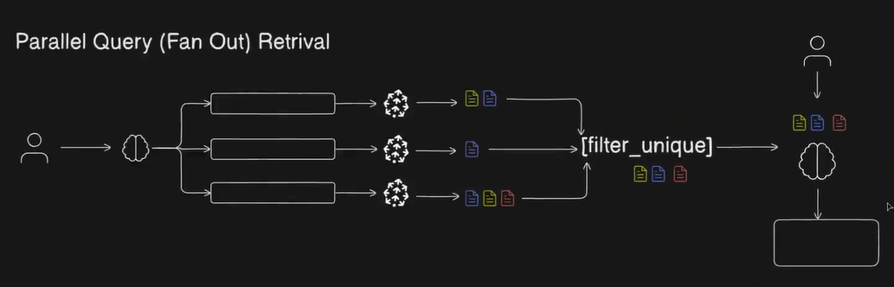
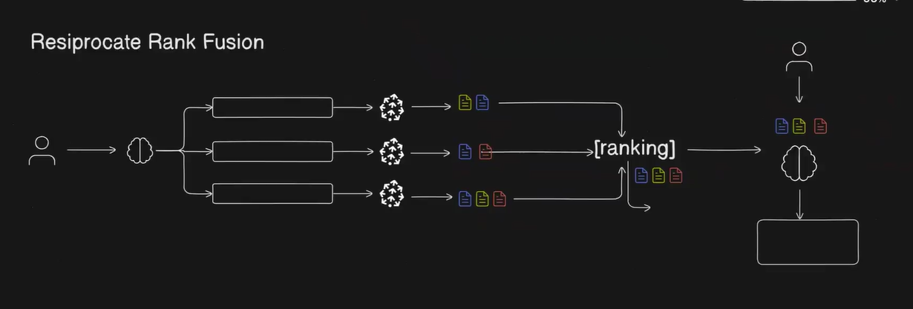
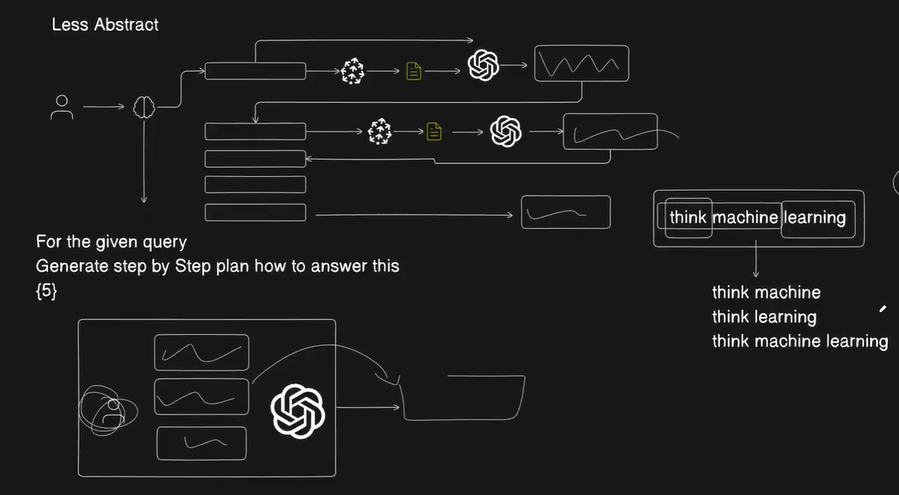

## Query Transformation — Advanced RAG Techniques

**Recap: Basic RAG**

In the previous doc we covered basic RAG, which follows three steps:
```
Indexing → Retrieval → Generation
```

This works well for clean, well-formed queries. But in real-world usage, users rarely ask perfect questions. They might be vague, use the wrong words, have typos, or phrase things in a way that doesn't match how the content was written. That's where the basic approach breaks down.

---

**Advanced RAG Pipeline**

Advanced RAG adds three new steps before the original three:
```
Query Transformation → Routing → Query Construction → Indexing → Retrieval → Generation
```

The last three steps (Indexing, Retrieval, Generation) are the same as basic RAG. The first three are new additions that make the system smarter and more robust. Now focuses on the first step: **Query Transformation**.

---

### Why Query Transformation?

In a RAG system, the user's query drives everything. If the query is poor, the vector search returns irrelevant chunks, and the LLM generates a bad or incomplete answer. The problem is you can't control what the user types.
```
Garbage In → Garbage Out
```

Users might:
- Ask something too vague ("tell me about the system")
- Misspell words ("authenication" instead of "authentication")
- Use different terminology than what's in the documents ("log in" vs "OAuth flow")
- Ask a multi-part question that would be better split into separate searches

Query Transformation is the step where you **improve the user's query before retrieval**, so the semantic search has the best possible input to work with.

> 💡 **Analogy:** Just how google does it for the bad queries. Even if we ask too vague or misspell queries to the google search it get's us the correct or relevant search results.

---

#### **Technique 1 — Parallel Query (Fan Out) Retrieval**

**The core idea:** Instead of searching with just the user's original query, generate multiple alternative versions of the query using an LLM, then search with all of them simultaneously.

**Why this works:**
The user's query might not use the same words as your indexed documents. By generating 3–5 variations, you increase the chance that at least one of them closely matches the language used in the relevant chunks.

**The flow:**
```
User Query
     │
     ▼
LLM generates N alternative queries (e.g. 3 variations)
     │
     ▼
Embed all queries (original + generated)
     │
     ▼
Run semantic search for each query in parallel
     │
     ▼
Merge and deduplicate retrieved chunks
     │
     ▼
Pass combined context to LLM for final answer
```

**Concrete example:**

User asks: "how do i get into the system"

The LLM generates alternative queries:
1. "user authentication and login process"
2. "how to access the platform with credentials"
3. "sign in flow and OAuth setup"

Now all four queries (original + 3 generated) are embedded and searched. Even if the original query wouldn't have matched the relevant docs, one of the generated ones almost certainly will.

**Simple code structure:**
```python
def generate_parallel_queries(user_query: str, n: int = 3) -> list[str]:
    prompt = f"""
    Generate {n} different version of the following query.
    Each version should have a slightly different phrasing or perspective, but it should be related to the original query and preserve the original intent.
    
    Original query: {user_query}  
    
    Output: Return only the queries, one per line, without numbering or bullets. 
    """
    response = llm.generate(prompt)
    return [user_query] + response.split("\n")  # original + generated
```

**What it fixes:**
- Vague queries: generates more specific versions
- Spelling mistakes: LLM corrects them in generated queries
- Terminology mismatch: generated queries use alternative vocabulary
- Narrow queries: fan-out covers more angles of the same topic
---

**Practical Example at - ./query-transformation-fanout-practical**

---



---

**When to Use Query Transformation**

Query Transformation adds an extra LLM call per query, which means latency and cost. It's worth it when:

- Your users are non-technical and ask vague or informal questions
- Your documents use technical or domain-specific language users might not know
- The quality of retrieval is more important than response speed
- You're getting poor results from basic RAG on certain types of queries 

#### Technique 2: Reciprocal Rank Fusion (RRF)

**Overview:**
Reciprocal Rank Fusion is an advanced retrieval technique that builds upon the Parallel Query (Fan Out) Retrieval method. Instead of simply combining unique chunks from multiple queries, RRF intelligently ranks and prioritizes chunks based on their relevance scores and frequency of appearance across different search results.

**How It Works:**

**Step 1: Query Generation (Same as Parallel Query)**
* Start with the user's original question
* Use an LLM to generate alternative phrasings or reformulations of the same question
* This creates multiple query variations that capture different aspects of the user's intent

**Step 2: Parallel Retrieval**
* Execute vector searches using both the original query and LLM-generated variations
* Each query retrieves its own set of relevant chunks from the vector database
* Retrieve chunks based on semantic similarity scores

**Step 3: Reciprocal Rank Fusion (The Key Difference)**
Instead of just taking unique chunks, RRF applies a sophisticated ranking algorithm:

* **Frequency-based scoring:** Chunks appearing in multiple search results get higher priority
* **Position-based scoring:** Chunks ranked higher in individual results get bonus points
* **Combined scoring:** The algorithm considers both how many times a chunk appears AND where it appears

**Ranking Logic:**
1. **First priority:** Chunks appearing in ALL search results (e.g., if you have 3 queries and 1 chunk appears in all 3 results)
2. **Second priority:** Chunks appearing in multiple results (e.g., appears in 2 out of 3 results)
3. **Tie-breaking:** When chunks appear in the same number of results, prioritize based on their original position/rank in those results

**Step 4: Context Assembly and LLM Query**
* Pass the ranked chunks to the LLM in order of their RRF scores
* Include the user's original query
* LLM generates response using the most relevant context first

**Example Scenario:**

Let's say you ask: "How do I optimize database queries?"

**Query 1 (Original):** "How do I optimize database queries?"
**Query 2 (LLM-generated):** "What are best practices for database performance?"
**Query 3 (LLM-generated):** "How to improve SQL query speed?"

**Retrieved Chunks:**

Query 1 results:
1. Chunk A (about indexing)
2. Chunk B (about query planning)
3. Chunk C (about caching)

Query 2 results:
1. Chunk A (about indexing)
2. Chunk D (about connection pooling)
3. Chunk B (about query planning)

Query 3 results:
1. Chunk A (about indexing)
2. Chunk E (about query optimization)
3. Chunk B (about query planning)

**Practical Example at - ./reciprocal-rank-fusion-practical**

**RRF Ranking:**
1. **Chunk A** (appears in all 3 results, position 1 in all)
2. **Chunk B** (appears in all 3 results, but at positions 2, 3, 3)
3. **Chunk C** (appears in 1 result, position 3)
4. **Chunk D** (appears in 1 result, position 2)
5. **Chunk E** (appears in 1 result, position 2)



---

**Why This Works Better:**

* **Reduces noise:** Less relevant chunks that only appear once get lower priority
* **Identifies consensus:** Chunks appearing across multiple queries are likely more relevant
* **Maintains quality:** Position information ensures high-quality matches aren't overlooked
* **More accurate responses:** LLM receives context in order of actual relevance

**Key Advantages:**
* Better than simple deduplication (which treats all unique chunks equally)
* Captures semantic similarity across different query phrasings
* Provides weighted context to the LLM rather than random or arbitrary ordering
* Improves answer quality by prioritizing most relevant information

#### Technique 3: Query Decomposition

**Overview:**
Query Decomposition is a technique that breaks down complex user queries into smaller, more manageable sub-queries to improve retrieval accuracy. This technique can be implemented in two ways: less abstract (Chain of Thought) and more abstract approaches. By decomposing queries, we can generate richer context and retrieve more relevant information from the vector database.

**Approach 1: Less Abstract Way (Chain of Thought)**

**Core Concept:**
Instead of treating the user's query as a single monolithic question, we break it down into meaningful components. Each component is processed separately through the LLM, generating intermediate responses that help create better vector embeddings for retrieval.

**How It Works:**

**Step 1: Query Breakdown**
* Analyze the user's original query
* Decompose it into logical sub-queries or components
* Each sub-query focuses on a specific aspect or part of the original question

**Step 2: Sequential LLM Processing**
* For each sub-query:
  * Send it to the LLM
  * Get a response/reasoning for that specific part
  * Generate vector embeddings from the LLM's response

**Step 3: Enriched Vector Search**
* Use the generated responses and their embeddings for semantic search
* The LLM-generated intermediate responses often contain domain-specific terminology and context
* This leads to better matches with relevant chunks in the vector database

**Step 4: Final Response Generation**
* Combine all retrieved chunks from the various searches
* Include the original user query
* Send everything to the LLM for final answer generation

**Detailed Example:**

**User Query:** "Explain machine learning"

**Breakdown Process:**
Instead of searching directly, we decompose:

1. **Sub-query 1:** "Explain machine"
   * LLM generates response about machines, computing devices, algorithms
   * Create vector embeddings from this response
   * Perform semantic search using these embeddings

2. **Sub-query 2:** "Explain learning"
   * LLM generates response about learning processes, pattern recognition, training
   * Create vector embeddings from this response
   * Perform semantic search using these embeddings

3. **Sub-query 3:** "Explain machine learning"
   * LLM generates response about ML concepts, algorithms, applications
   * Create vector embeddings from this response
   * Perform semantic search using these embeddings

 **Practical Example at - ./query-decomposition-less-abstract-cot**  

**Why This Works:**

Each LLM response enriches the search context:
* **"machine" query** → might retrieve chunks about computational systems, algorithms, processing
* **"learning" query** → might retrieve chunks about pattern recognition, training data, models
* **"machine learning" query** → retrieves chunks specifically about ML

**Final Assembly:**
* Collected chunks from all three searches
* Original query: "Explain machine learning"
* LLM synthesizes everything into a comprehensive answer

**Flow Diagram:**
```
User Query → Break into parts → For each part:
                                  ↓
                            LLM Response
                                  ↓
                          Vector Embeddings
                                  ↓
                          Semantic Search
                                  ↓
                        Retrieved Chunks
                                  
All Retrieved Chunks + Original Query → Final LLM → Response
```

**Key Advantages:**

1. **Richer Context:** LLM-generated responses contain domain-specific terminology and concepts
2. **Better Embeddings:** Intermediate responses create more relevant vector representations
3. **Comprehensive Coverage:** Different aspects of the query are explored separately
4. **Reduced Ambiguity:** Breaking down complex queries makes each search more focused
5. **Higher Relevance:** Retrieved chunks are more likely to match the actual information needed

**When to Use:**
* Complex, multi-faceted questions
* Queries that can be naturally decomposed into logical parts
* When you need comprehensive coverage of a topic
* Situations where direct search might miss relevant context

**Potential Considerations:**
* More LLM calls means higher latency and cost
* Need to determine optimal decomposition strategy
* Balancing between too granular and too broad breakdowns
* Managing the combination of multiple result sets

**Example Use Cases:**
* "Compare supervised and unsupervised learning algorithms" → Break into "supervised learning" + "unsupervised learning" + "algorithms comparison"
* "How does photosynthesis affect climate change?" → Break into "photosynthesis process" + "climate change mechanisms" + "relationship between both"
* "Explain the history and impact of blockchain technology" → Break into "blockchain history" + "blockchain technology" + "blockchain impact"


