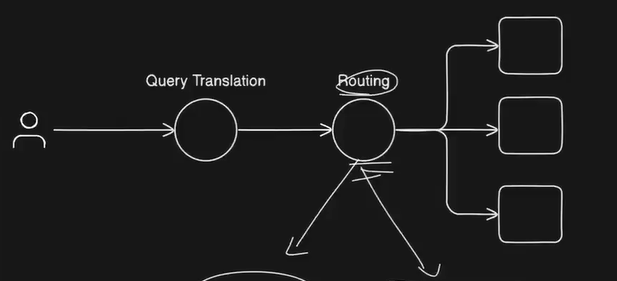
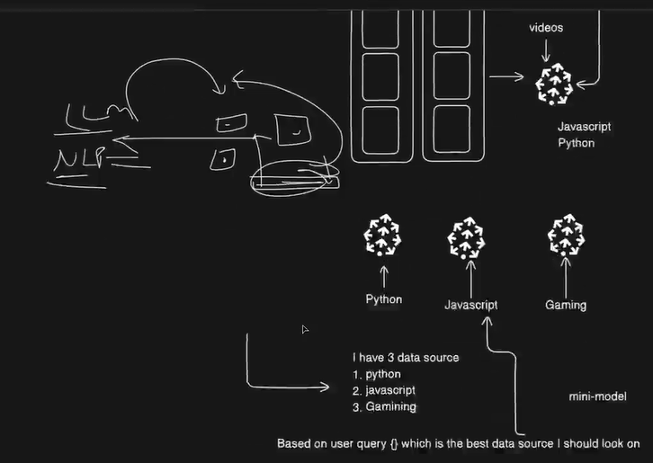

## Routing in Advanced RAG

Routing in rag means intelligently direct queries to the right data source, collection, or model based on query content and complexity

**When:** After query transformation/translation step

**Why Needed:**
* Large orgs have diverse datasets (finance, HR, tech, etc.)
* Searching everything is slow and expensive
* Different queries need different handling

**Types of Routing:**

### **1. Data Source Routing (Collection-Based)**

**Problem:** Don't search all data for every query

**Solution:** Separate collections by domain

```
Vector DB:
├── finance_collection
├── hr_collection
├── tech_collection
└── operations_collection
```

**Example:**
* "Travel reimbursement policy?" → hr_collection
* "Q4 revenue?" → finance_collection
* "Configure authentication?" → tech_collection

**Benefit:** Search 10K docs instead of 1M docs = 100x faster!

### **2. Model Routing (Complexity-Based)**

**Problem:** Don't use expensive models for simple queries

**Solution:** Route by complexity
* **Simple queries** → Small models (GPT-4o-mini, Haiku)
* **Medium queries** → Mid models (Sonnet, GPT-4o)
* **Complex queries** → Large models (Opus, GPT-4)

**Example (Like GitHub Copilot Auto mode):**
* "What does this function do?" → Small model
* "Refactor for performance" → Medium model
* "Design distributed system" → Large model

**Benefit:** 60-80% cost reduction!

### **3. Strategy Routing**
* Semantic search → Conceptual queries
* Keyword search → Specific IDs, error codes
* SQL queries → Structured data requests
* Hybrid → Complex needs

**Benefits:**
* ⚡ **Speed:** 5-10x faster (smaller search space)
* 💰 **Cost:** 60-80% reduction
* 🎯 **Accuracy:** Domain-focused = less noise
* 📈 **Scalability:** Easy to add new domains

**Real Numbers:**
* Without routing: Search 1M docs, 3-5 sec
* With routing: Search 10K docs, 0.3-0.8 sec

**Best Practices:**
* ✅ Start simple, optimize later
* ✅ Monitor routing accuracy
* ✅ Provide fallbacks for uncertainty
* ✅ Balance speed vs accuracy

**When to Use:**
* ✅ Multiple data domains
* ✅ Large datasets (100K+ docs)
* ✅ Need cost/performance optimization

**Remember:** Routing = Smart dispatcher that sends queries to the right place!

**Data source routing example at: ./practical/data-source-routing.py**




---

