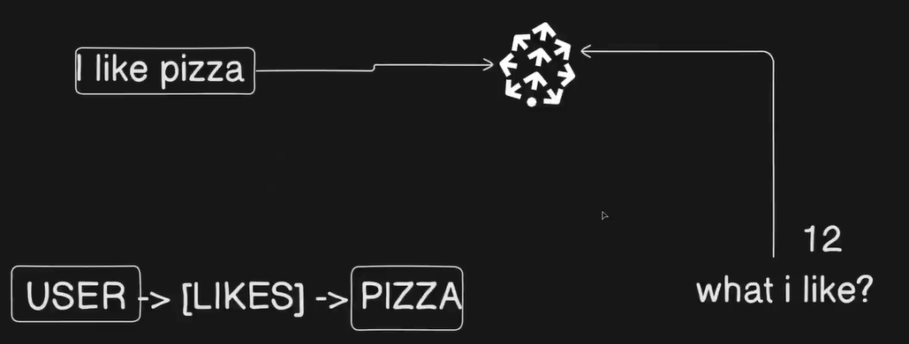

## Knowledge Graph : Advanced RAG

Knowledge graphs are used to make RAG pipelines smarter by keeping track of how different pieces of information are connected to each other.

**Why do we even need this?**

Vector databases are great at finding semantically similar chunks of text, but they do not preserve relationships between entities. For example, if you search for "Harry" in a story, the vector DB gives you the most relevant chunks about Harry, but it won't automatically tell you how Harry is connected to Dumbledore, or what happened between them three chapters ago. That context gets lost.

This is where knowledge graphs come in. They store not just the data, but also the relationships between entities.

**When should you use it?**

Use knowledge graphs in RAG when your documents have a lot of interconnected entities, and understanding those connections matters for getting a good answer. Good examples are:

Stories and novels : Characters, events, and places are all linked together. Legal documents : Clauses refer to other clauses, parties are linked to obligations. Medical records : Symptoms relate to diagnoses, drugs relate to side effects.

**How the pipeline actually works**

At indexing time, you do not just create chunks and throw them into a vector DB. You also extract the entities and relationships from each chunk, store those in a graph database, and then link each chunk in the vector DB back to its relevant graph nodes via metadata.

At retrieval time, when a user asks a question, you pull the relevant chunk from the vector DB, and then also fetch the related graph nodes to get the full relationship context. This gives much richer results than just a plain chunk.

**Step by step pipeline**

Load the document, then split it into chunks, then for each chunk generate the entities and relationships (this can be done using an LLM to write Cypher queries or extract triplets), then store those entities and relationships in a graph database, then store the chunk in a vector DB with a reference to the relevant graph nodes in the metadata, then at query time fetch the chunk from the vector DB and also fetch the connected nodes from the graph DB to build a richer context.

**What is Neo4J?**

Neo4J is a database that natively stores data as graphs. Instead of tables and rows, everything is stored as nodes and edges (relationships between nodes). You talk to it using a query language called Cypher, which is a bit like SQL but designed for graph traversal.

Example Cypher query to find all characters connected to Harry:

MATCH (h:Character {name: "Harry"})-[r]->(connected) RETURN h, r, connected

You can also use relational databases like PostgreSQL or document stores like MongoDB to store graph-like data, but Neo4J is the most natural fit for this use case because relationships are first-class citizens in its data model.

**A small correction from your original notes**

You mentioned storing the "relevant nodes for that chunk in the vector DB in metadata," which is correct. Just to be more precise, what you store in the metadata is typically the node IDs or identifiers from the graph DB, so that at retrieval time you know exactly which nodes to go fetch. The actual relationship data lives in the graph DB, not the vector DB.

**Quick example to make it concrete**

Say you have a legal contract. You chunk it into paragraphs. Chunk 5 talks about "Party A's payment obligations." When indexing, you extract entities like "Party A," "payment," "30 days," and relationships like "Party A owes payment within 30 days." These go into Neo4J. Chunk 5 in the vector DB gets metadata pointing to those Neo4J nodes.

When a user asks "What happens if Party A doesn't pay on time?", the vector DB finds chunk 5 as relevant. But then you also fetch the related nodes from Neo4J, which might include clauses about penalties, termination rights, or dispute resolution, even if those clauses are in completely different parts of the document. That is the power of the knowledge graph layer.

**Example Pipeline:** 
Load the doc -> Create it's chunks -> Generate the Cypher query for nodes and entities for that chunk -> Store those in knowledge graph db (Neo4J DB) -> Store the chunk in the vector db with the relevant graph nodes.

```python


Your Question: "What is photosynthesis?"
         |
         v
    [PARALLEL EXECUTION]
         |
    +----|----+
    |         |
    v         v
Vector DB   Graph DB
(Qdrant)    (Neo4j)
    |         |
    v         v
Doc chunks  Relationships
    |         |
    +----+----+
         |
         v
   Fill Prompt Template
         |
         v
    Send to GPT-4
         |
         v
   Parse Response
         |
         v
   Print Answer

```

**Practical Example at: [./practical](./practical/)**


