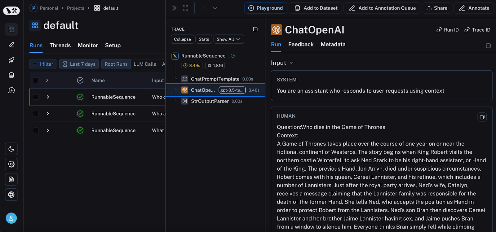

## Tracing AI Apps

When we push any application to production and it starts getting real users, one of the most important things we need to set up is **tracing**. Tracing basically means tracking what is happening inside the app so we can understand how it is performing for users.

**Why do we need tracing?**

Once an app is live, we need to keep an eye on things like:

- How fast is the app responding (latency)
- Is it performing well under load
- What errors are users hitting
- What path did a user take before something broke

**How tracing generally works**

We add logs at different points in the user journey. Think of it like leaving breadcrumbs across the app. These breadcrumbs tell us how users are moving through the app and where things break. You can either use a third-party service or build your own in-house logger to store these logs.

**Common third-party tracing tools (for regular apps)**

There are many popular tools teams use for this:

- **Sentry** : for tracking errors and exceptions
- **Datadog** : for monitoring performance and infrastructure
- **Microsoft Clarity** : for understanding user behavior
- **Google Analytics** : for tracking user events and flows

**The problem with these tools for AI apps**

Here is the catch: all the tools mentioned above work great for regular applications but they do **not** support AI-specific tracing. When you are working with LLMs (large language models), you need to track things like:

- What prompt was sent to the model
- What was the response
- How many tokens were used
- How long did the model call take
- Which part of the pipeline failed

Regular tracing tools do not understand any of this. So we need tools built specifically for AI apps.

**LangSmith**

The most popular tracing tool for AI applications right now is **LangSmith**. It is made by the same team that built LangChain and LangGraph, so it integrates really well with those frameworks.

A few things to keep in mind about LangSmith:

- It is **not open source**
- The free plan only supports **one user**, so if you want your team to access it, you need to pay
- It does **not allow self-hosting**, which means your prompt data and model responses are going to their servers

That last point is a concern for many companies especially if you are dealing with sensitive or private data.

**LangFuse**

LangFuse is the main alternative to LangSmith and it solves most of the problems above:

- It is **open source**
- It supports both **cloud hosting** (their servers) and **self-hosting** (your own server)
- Team members can be invited even on the free plan

So if you are building something where data privacy matters or you just want more control, LangFuse is usually the better pick.

---

**LangSmith code example**

```python
from langsmith import traceable
from langsmith.wrappers import wrap_openai
import openai

# This wraps the OpenAI client so all API calls get traced automatically
client = wrap_openai(openai.Client())

# This decorator tells LangSmith to trace this function
@traceable
def format_prompt(subject):
    return f"Tell me something interesting about {subject}"

# Now when you call format_prompt(), LangSmith records it
result = format_prompt("black holes")
```

What is happening here: `wrap_openai` wraps the OpenAI client so every model call is tracked. The `@traceable` decorator does the same for your own functions. So you get full visibility into both.

---

**LangFuse code example**

```python
from langfuse.openai import openai
from langfuse.decorators import langfuse_context, observe

# This single import replaces the standard openai import
# All model calls are now traced automatically
completion = openai.chat.completions.create(
    name="test-chat",
    model="gpt-4o",
    messages=[
        {"role": "system", "content": "You are a calculator. Output only the result."},
        {"role": "user", "content": "1 + 1 = "}
    ],
    metadata={"someMetadataKey": "someValue"},
)

# The @observe decorator is LangFuse's version of @traceable
@observe()
def my_function():
    # You can attach extra info to the trace like user ID
    langfuse_context.update_current_trace(user_id="user_123")
    return "result"
```

What is happening here: Just replacing the openai import with langfuse's version is enough to start tracing. The `@observe` decorator is similar to LangSmith's `@traceable`. And `update_current_trace` lets you attach extra context like which user triggered this request.

---

**Quick comparison: LangSmith vs LangFuse**

| | LangSmith | LangFuse |
|---|---|---|
| Open Source | No | Yes |
| Self-hosting | No | Yes |
| Free multi-user | No | Yes |
| Best for | LangChain projects | Any AI app, privacy-first teams |

