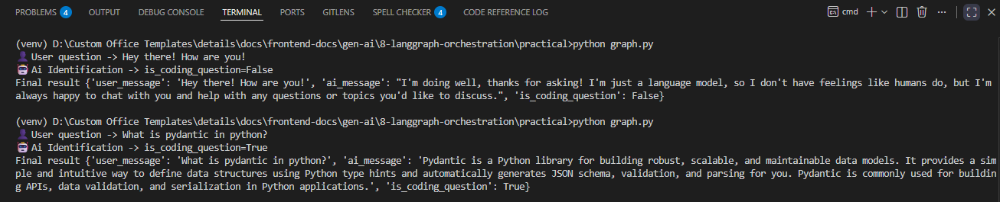

## LangGraph Orchestration

LangGraph is a framework built on top of LangChain that helps you write AI agent workflows in a clean, modular way. Think of it like a flowchart builder for your code, where each box in the flowchart is a function (called a node), and the arrows between them are the edges that define the order of execution.

**What is LangGraph?**

LangGraph is an orchestrator. An orchestrator is basically something that manages and coordinates different parts of your code, deciding what runs, when it runs, and in what order.

In LangGraph, you define:

**Nodes** : These are individual functions. Each node does one specific job, like "fetch data", "run the LLM", "check output", etc.

**Edges** : These are the connections between nodes. They define which node runs next. You can have conditional edges too, meaning the next node depends on some logic (like "if the answer is unclear, go back and retry").

**State (Global Memory)** : LangGraph maintains a shared state object that flows through all the nodes. Every node can read from it and write to it. This is how nodes "talk" to each other without directly calling one another.

**Real world example:** Imagine you are building a customer support bot. You can have nodes like: "understand the query", then "search the knowledge base", then "generate a reply", then "check if reply makes sense". LangGraph connects all these steps and passes the conversation state through each one.

**Why use LangGraph over plain code?**

In plain code, if you have 10 steps in an AI pipeline, they all get tangled together. With LangGraph, each step is its own clean function. This makes it easy to read the code and understand the flow at a glance, test one node independently without running the whole pipeline, swap out one node without breaking others, and debug exactly where something went wrong.

**Debugging and Observability**

LangGraph makes debugging much easier because you can see exactly which node ran, what state went in, and what state came out. On top of that, you can plug in tools like **LangSmith** or **Langfuse** to get a detailed visual trace of your entire flow. These tools show you a timeline of every node execution, how long each took, what the inputs and outputs were, and where errors happened. This is especially useful in large codebases where a bug could be hiding in any one of many nodes.

**Practical Example at: [./practical/graph.py](./practical/graph.py)**

- 