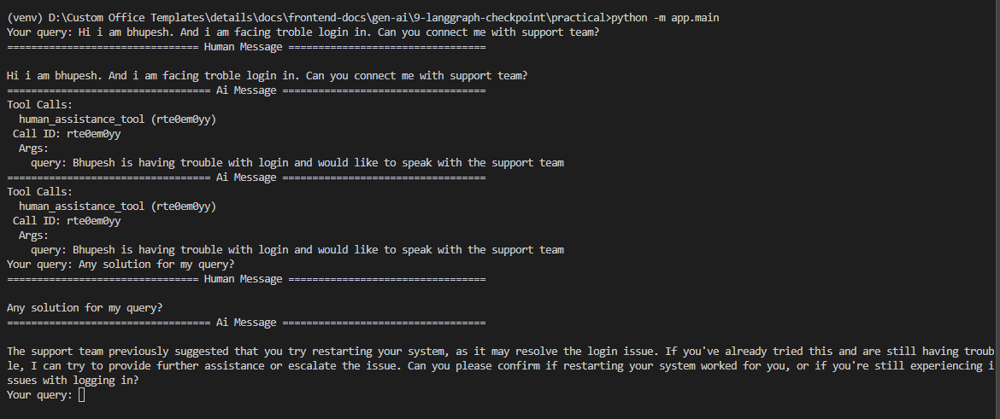
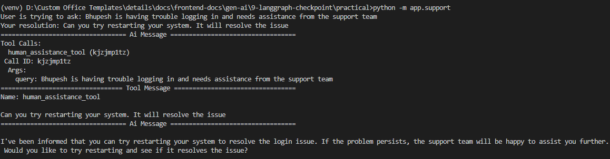

## LangGraph Checkpointing

LangGraph Checkpointing is a way to give memory to an LLM by storing past conversation history in a database, linked to a specific thread ID (this can be a user ID or a conversation ID).

By default, LLMs have no memory. Every time you send a message, the model starts fresh and has zero idea what you talked about before. Checkpointing is the fix for that.

**How it works**

Every time a conversation happens, LangGraph saves the state of that conversation (basically the messages exchanged) into a database. This saved state is tied to a thread ID, so the system knows which conversation belongs to which user or session.

When the user comes back and asks something like "what did we discuss earlier?" or references something from a previous chat, LangGraph fetches the stored messages for that thread ID and passes them as context to the LLM. The LLM can now "remember" because it has the old messages in front of it.

**Simple example**

Imagine you are chatting with an AI assistant:

Day 1: You say "My name is Raj and I am building a food delivery app."
Day 2: You come back and ask "Can you suggest a database for my project?"

Without checkpointing, the LLM has no idea what your project is. It will ask you to explain again.

With checkpointing, LangGraph loads your Day 1 conversation and passes it to the LLM. Now the LLM knows you are building a food delivery app and can give a relevant answer right away.

**Practical Example at: [./practical](./practical)**

**What does "state" mean here**

State is just the current snapshot of your conversation. It includes things like:
- Messages exchanged so far
- Any variables or data the agent is tracking
- Steps completed in a workflow

Checkpointing means saving this snapshot so it can be restored later. This is what people mean when they say "persisting the state."

**Where is it stored**

The checkpoints can be stored in different places depending on your setup:
- In memory (temporary, good for testing)
- In a database like SQLite, PostgreSQL, or Redis (permanent, good for production)

**Why it matters**

Without this, every conversation is stateless. The LLM forgets everything the moment the session ends. Checkpointing is what makes it possible to build things like multi-step agents, long running workflows, and chatbots that actually feel like they know you.

Example:


---

## Human in the Loop

Human in the Loop is a technique where you pause the AI agent's flow at a certain point, wait for a human to review or provide input, and then continue the flow from exactly where it was paused.

Think of it like a manager approval step in a workflow. The agent does some work, stops and says "hey, do you want me to proceed?", the human says yes (or gives more info), and then the agent continues.

**Why do we need this?**

Sometimes an AI agent is doing something important like sending an email, deleting data, or making a payment. You don't want it to just do that automatically. You want a human to look at what the agent is about to do and approve it first. That is where Human in the Loop comes in.

**How does LangGraph support this?**

LangGraph allows you to intercept the graph flow at any node or edge using a concept called "breakpoints." You can pause the graph before or after a specific node runs. Once paused, the graph state is saved exactly as it is. You can then take user input, inject it into the saved state, and resume the graph from where it was paused.

This is possible because LangGraph uses a "checkpointer" which saves the state of the graph at every step. So even if you pause and come back hours later, the graph knows exactly where it left off.

**The basic flow looks like this:**

1. Graph starts running
2. It hits a breakpoint you defined
3. Graph pauses and saves its current state
4. You show the human what the agent was about to do
5. Human reviews and gives input or approval
6. You inject the human's input into the state
7. Graph resumes from the same point and continues

**Practical Example at: [./practical](./practical)**

**Another Example: Email Drafting Agent**

An agent drafts an email based on your instructions but waits for you to review before sending.

```python
graph = builder.compile(
    checkpointer=checkpointer,
    interrupt_after=["draft_email"],
    interrupt_before=["send_email"]
)
```

You read the draft, maybe edit it, inject the updated draft back into state, and then the agent sends it.

**Key things to remember:**

The "checkpointer" is what makes pausing and resuming possible. Without it, the graph has no memory and cannot be resumed. Each run needs a unique "thread_id" so the checkpointer knows which saved state to load when resuming. You can interrupt before a node runs or after it runs depending on your use case.

**Examples:**

**User Flow:**


---

**Human Support Flow:**
