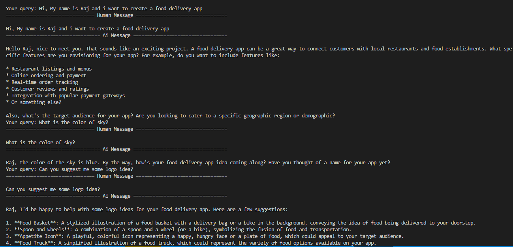

## LangGraph Checkpointing

LangGraph Checkpointing is a way to give memory to an LLM by storing past conversation history in a database, linked to a specific thread ID (this can be a user ID or a conversation ID).

By default, LLMs have no memory. Every time you send a message, the model starts fresh and has zero idea what you talked about before. Checkpointing is the fix for that.

**How it works**

Every time a conversation happens, LangGraph saves the state of that conversation (basically the messages exchanged) into a database. This saved state is tied to a thread ID, so the system knows which conversation belongs to which user or session.

When the user comes back and asks something like "what did we discuss earlier?" or references something from a previous chat, LangGraph fetches the stored messages for that thread ID and passes them as context to the LLM. The LLM can now "remember" because it has the old messages in front of it.

**Simple example**

Imagine you are chatting with an AI assistant:

Day 1: You say "My name is Raj and I am building a food delivery app."
Day 2: You come back and ask "Can you suggest a database for my project?"

Without checkpointing, the LLM has no idea what your project is. It will ask you to explain again.

With checkpointing, LangGraph loads your Day 1 conversation and passes it to the LLM. Now the LLM knows you are building a food delivery app and can give a relevant answer right away.

**Practical Example at: [./practical](./practical)**

**What does "state" mean here**

State is just the current snapshot of your conversation. It includes things like:
- Messages exchanged so far
- Any variables or data the agent is tracking
- Steps completed in a workflow

Checkpointing means saving this snapshot so it can be restored later. This is what people mean when they say "persisting the state."

**Where is it stored**

The checkpoints can be stored in different places depending on your setup:
- In memory (temporary, good for testing)
- In a database like SQLite, PostgreSQL, or Redis (permanent, good for production)

**Why it matters**

Without this, every conversation is stateless. The LLM forgets everything the moment the session ends. Checkpointing is what makes it possible to build things like multi-step agents, long running workflows, and chatbots that actually feel like they know you.

Example:
