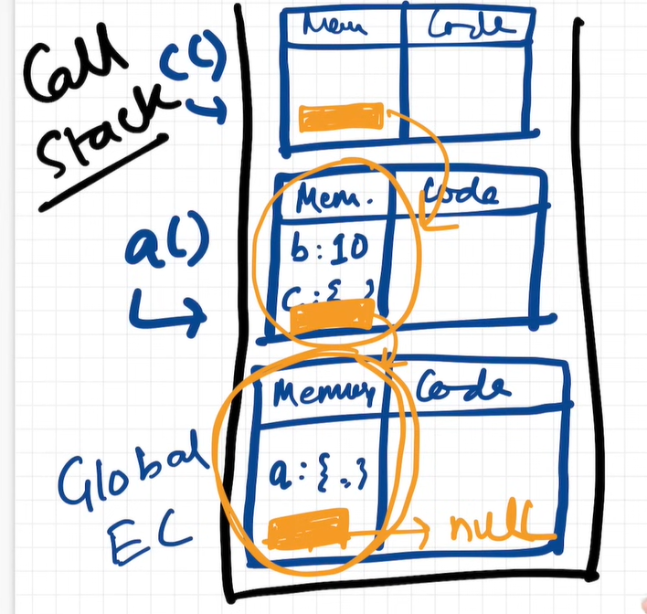

## How JavaScript works

- JavaScript is a single-threaded language and executes code synchronously by default.

- This means it can execute only one line of code at a time, in a specific order.

- Everything in JavaScript happens inside an Execution Context.

- An Execution Context has two parts:

  1. Memory Component (Variable Environment)

     - Stores variables and their values
     - Stores function declarations with their complete code

  2. Code Component (Thread of Execution)
     - Executes the code line by line

---

## How JavaScript Code Is Executed

Everything in JavaScript is executed inside an **execution context**.

**Global Execution Context (GEC)**

- When a JavaScript program starts, a **Global Execution Context (GEC)** is created.
- The GEC is pushed onto the **call stack**.
- All JavaScript code runs inside an execution context.

**Phases of Execution Context**

Each execution context goes through **two phases**:

1. **Memory Creation Phase**
2. **Code Execution Phase**

**Memory Creation Phase**

- JavaScript scans the entire code before execution.
- Memory is allocated for variables and functions.
- During this phase:
  - Variables are assigned a placeholder value of `undefined`.
  - Functions are stored in memory with their complete code.
- No code is executed in this phase.

**Code Execution Phase**

- JavaScript executes the code **line by line**.
- Values are assigned to variables.
- Calculations and operations are performed.
- The actual execution of the program happens in this phase.

**Function Execution**

- When JavaScript encounters a **function call**, it creates a new execution context for that function.
- This new execution context is pushed onto the **call stack**.
- The function execution context also goes through:
  - Memory Creation Phase
  - Code Execution Phase
- If JavaScript encounters a `return` statement:
  - The function’s execution context is removed (popped) from the call stack.
  - Control returns to the place where the function was called, along with the returned value.

**Call Stack**

- The **call stack** manages the order of execution of execution contexts.
- It follows the **Last In, First Out (LIFO)** principle.
- When a function finishes execution, its execution context is popped from the stack.
- After the entire program finishes execution:
  - The Global Execution Context is popped off the call stack.
- This marks the end of JavaScript program execution.

---

## Hoisting in JavaScript

**What is Hoisting?**  
Hoisting refers to JavaScript’s ability to access variables and functions **even before they are declared**.  
This happens because JavaScript allocates memory for them before execution starts.

**How JavaScript Executes Code**  
JavaScript runs code in two phases inside an Execution Context:

- **Memory Creation Phase:**

  - The entire file is scanned.
  - Memory is reserved for variables and functions.
  - Variables are initialized with `undefined`.
  - Function declarations are stored with their full function body.

- **Execution Phase:**
  - Code runs line by line.
  - Variables get assigned with actual values.
  - Functions are invoked.

Because memory is set up in advance, identifiers can be accessed earlier — that behavior is known as **hoisting**.

**Variables vs Functions**

- Function declarations are fully hoisted — you can call them before defining them.
- Variables are hoisted but set to `undefined`.
- Arrow functions and function expressions behave like variables, so they also start off as `undefined`.

**Example**

```js
console.log(x); // undefined
printHelloWorld(); // Hello world

function printHelloWorld() {
  console.log("Hello world");
}

console.log(myFunc); // undefined
myFunc(); // TypeError: myFunc is not a function

var myFunc = function () {
  console.log("Hi there");
};
```

---

## How Functions Work in JavaScript

Functions are the heart of JavaScript. We can think of them as **mini programs** that run inside the main program and have their own execution flow.

**Execution Context and Call Stack**  
When a JavaScript program starts running, a **Global Execution Context (GEC)** is created and pushed onto the **call stack**.  
Just like any execution context, it goes through two phases:

- Memory Creation Phase
- Code Execution Phase

**What Happens When a Function Is Called**  
During the code execution phase, when JavaScript encounters a function call:

- A **new execution context** is created for that function.
- This execution context is pushed on top of the call stack.
- Execution control moves to the **first line of the function body**.

Inside this function execution context:

- Memory is allocated for the function’s variables and parameters.
- The function has access to its **own memory** and also to its **parent (outer) scope**.

**Function Completion**  
Once the function finishes executing:

- Its execution context is removed (popped) from the call stack.
- Control returns back to the execution context below it.

This push-and-pop behavior of execution contexts is what allows JavaScript to manage multiple function calls efficiently.

---

## Shortest Program in JavaScript

**What is the Shortest Program?**  
In JavaScript, the shortest program is an **empty file**. Even when there is nothing to execute, JavaScript still performs its internal setup.

**What JavaScript Does Internally**  
When an empty file runs:

- A **Global Execution Context (GEC)** is created.
- It is pushed into the **call stack**.
- The **global object (`window` in browsers)** is created.
- The `this` keyword is set to refer to the global object.

**Execution Completion**  
Since there is no code to execute:

- The execution phase completes immediately.
- The global execution context is popped out of the call stack.

**Global Scope**

- Any variables or functions declared in the global scope are attached to the global object.
- The global scope includes everything that is **not inside any function**.
- The variables and functions can be accessed using window.a or directly as a as it is in global scope.

**Example**

```js
var x = 10;
console.log(x); // 10
console.log(window.x); // 10
console.log(this.x); // 10
```

---

## Undefined vs Not Defined in JavaScript

**What does `undefined` mean?**  
In JavaScript, `undefined` is a **special value**. It acts as a placeholder for variables that have been **declared but not yet assigned a value**.

When JavaScript allocates memory during the memory creation phase, variables are initialized with `undefined` until a value is assigned during execution.

**What does `not defined` mean?**  
`not defined` means that a variable or function **does not exist in the program at all**.  
It was never declared, so no memory was allocated for it.

**Key Difference**

- `undefined` → variable is declared and has memory, but no value yet
- `not defined` → variable is not declared and has no memory

Although you _can_ manually assign `undefined` as a value, its main purpose is to indicate that a variable exists but hasn’t been assigned yet.

**Example**

```js
console.log(a); // undefined
var a = 10;
console.log(a); // 10

console.log(x); // ReferenceError: x is not defined
```

---

## The Scope Chain in JavaScript

**What is Scope?**  
Scope defines what variables and functions can be accessed at a particular place in the code.

**Execution Context and Lexical Environment**  
Whenever an execution context is created in JavaScript, it contains:

- Its own **local memory**
- A **lexical environment**

The lexical environment is a reference to the local memory + lexical environment of it's **parent scope** — the place where the function is physically available in the code.

**What is the Scope Chain?**  
The whole chain of:

- Execution context local memory + lexical environment forms a scope chain
  forms the **scope chain**.

This chain determines what variables and functions are accessible in the current scope.

**How JavaScript Resolves Variables**  
When JavaScript tries to access a variable or function:

1. It first looks in the current local scope.
2. If not found, it looks in it's lexical environment.
3. This process continues up the chain until the **global scope** is reached.
4. If JavaScript cannot find the variable or function anywhere in the scope chain, it throws a `ReferenceError` saying the identifier is not defined.

The global execution context’s lexical environment points to `null`, which marks the end of the scope chain.

**Example**

```js
function a() {
  function b() {
    console.log(b); // 10
  }
  b();
}
let b = 10;
a();
```

- 

---

## let, const vs var in JavaScript

**Overview**  
`let`, `const`, and `var` differ mainly in three areas:

- Hoisting
- Strictness (redeclaration & initialization)
- Scope

**Hoisting Behavior**  
All three keywords are hoisted, meaning memory is allocated before code execution starts.

- Variables declared with `var` are initialized with `undefined` and attached to the global object.
- `let` and `const` are also hoisted and initialized with `undefined`, but they are stored in a separate memory space (script scope).
- Accessing `let` or `const` before initialization results in a `ReferenceError`. As they are in `Temporal dead zone` till they are initialized. They can be accessed only after initialized some value in it.

**Temporal Dead Zone (TDZ)**  
The time between hoisting and initialization of `let` and `const` variables is called the **Temporal Dead Zone**.

During this period:

- Variables exist in memory
- But cannot be accessed

Moving variable declarations to the top of the scope helps reduce the TDZ.

**Example**

```js
console.log(b); // Reference error

console.log(a); // undefined

var a = 10;

let b = 10;

console.log(a); // 10
console.log(b); // 10
```

**Strictness Rules**

- `var` allows redeclaration in the same scope.
- `let` and `const` do not allow redeclaration in the same scope and will throw an error.

`const` is stricter than `let`:

- It must be declared and initialized in the same statement.
- Reassignment is not allowed.
- `let` allows declaration first and initialization later.

**Example**

```js

var a = 10;

var a = "Hello world"; // allowed

let x;

x =  10;  // allowed: Can be declared first and initialized letter.

let x = "Hello world"; // Error: cannot redeclare the let variables


const b = 20; // allowed

const b;

b = 10;  // Syntax error: variable declared with const should be declared and initialized in the same statement.

```

**Scope Differences**

- `var` is **function-scoped**.
- `let` and `const` are **block-scoped**.

This means:

- `let` and `const` variables are accessible only within the block `{}` they are declared in.
- `var` variables can be accessed outside blocks (if not inside a function).

**Example**

```js
if (true) {
  var a = 10;
  let b = 20;
  const c = 30;

  console.log(a); // 10
  console.log(b); // 20
  console.log(c); // 30
}

console.log(a); // 10
console.log(b); // Error: Cannot access variables with let keyword outside of the block as they are block scope
console.log(c); // Error: Cannot access variables with const keyword outside of the block as they are block scope
```

---

## Block Scope & Shadowing in JavaScript

**What is a Block?**  
A block is defined using curly braces `{}` and is also known as a **compound statement**.

JavaScript uses blocks to group multiple statements in places where it expects a single statement, for example in `if`, `else`, `for`, etc.

**Why Blocks Are Needed**  
Statements like `if` do not require `{}` by syntax, but blocks are used when we want to execute **multiple statements** instead of just one.

**Block Scope vs Function Scope**

- Variables declared with `let` and `const` inside `{}` are **block-scoped**.
- They cannot be accessed outside the block.
- `var` is **function-scoped**, not block-scoped.

This means:

- `var` declared inside a block still belongs to the enclosing function or global scope.
- `let` and `const` declared in the global scope are stored in the **script scope**, not on the global object.

**Shadowing**  
Shadowing occurs when a variable declared in an inner scope has the same name as a variable in an outer scope.

In such cases:

- The inner variable **shadows** the outer one inside that block.
- Outside the block, the original variable remains unchanged for let and const in block scope.

**Illegal Shadowing**  
Shadowing must respect scope rules.

For example:

- A `let` variable declared in an outer scope **cannot** be shadowed by a `var` in an inner scope.
- This is called **illegal shadowing** and results in an error.

**Scope Rules Still Apply**  
Blocks follow the same rules of:

- Scope
- Lexical environment
- Scope chain

Arrow functions follow the same scoping rules as regular functions.

**Example**

```js
// Block example
if (true) console.log("Hello world"); // Hello world

if (true) {
  // Compound statement
  let a = 10;
  console.log(a); // 10
}

// Shadowing
var a = 10;
let b = 20;
const c = 30;

{
  var a = 40;
  let b = 50;
  const c = 60;

  console.log(a); // 40
  console.log(b); // 50
  console.log(c); // 60
}

console.log(a); // 40 (var is function/global scoped)
console.log(b); // 20
console.log(c); // 30
```

---

## Closures in JavaScript

**What is a Closure?**  
A function bundled together with its **surrounding state (lexical environment)** forms a closure.

**How Closures Work**  
In JavaScript, every function has access to its **lexical environment** (outer scope).  
Even if a function is returned and executed in a different scope, it still remembers the variables and functions from the scope where it was originally created.

A function along with the reference to its outer scope forms a **closure**.

**Why Closures Are Powerful**  
Closures become more interesting when a function is returned or passed around and executed elsewhere.  
Even then, the function continues to hold references to variables in its lexical environment.

These referenced values are **not garbage collected**, because they may be needed later.

**Common Use Cases of Closures**  
Closures are commonly used in:

- Functions like `once`
- Memoization
- Data hiding and encapsulation
- Asynchronous code (callbacks, timers, promises)

**Examples**

```js
// Basic example
function x() {
  var a = 10;
  function y() {
    console.log(a);
  }
  y();
}
x(); // 10

// Return example
function x() {
  var a = 10;
  function y() {
    console.log(a);
  }
  return y;
}

const z = x();
console.log(z); // function y() {...}
z(); // 10
```

---

## setTimeout + Closures in JavaScript

A common interview question that tricks up a lot of developers. Let's understand why and how to fix it.

**The Problem**

**Question:** Print numbers 1 to 5, where each number appears 1 second after the previous one.

So we want:

- 1 (after 1 second)
- 2 (after 2 seconds)
- 3 (after 3 seconds)
- 4 (after 4 seconds)
- 5 (after 5 seconds)

**First Attempt (This Won't Work!)**

```js
function printNumber() {
  for (var i = 1; i <= 5; i++) {
    setTimeout(() => {
      console.log(i);
    }, i * 1000);
  }
}

printNumber();
```

**What we expect:** 1, 2, 3, 4, 5

**What we actually get:** 6, 6, 6, 6, 6

But, Why is it printing 6 five times?

**Understanding Why This Happens**

Let's break it down:

**Step 1: The loop runs really fast**

- JavaScript doesn't wait for setTimeout to finish
- It just registers the callback and moves on to the next iteration
- So the loop completes almost instantly

**Step 2: Loop finishes, i becomes 6**

- The loop runs from i=1 to i=5
- When i becomes 6, the condition `i <= 5` fails and loop stops
- So now i = 6

**Step 3: Callbacks start executing**

- After 1 second, first callback runs and logs `i`
- But i is now 6 (from step 2)
- After 2 seconds, second callback runs and logs `i`
- Still 6!
- Same thing happens for all callbacks

**The real problem:**

- `var` is function-scoped, not block-scoped
- There's only ONE variable `i` in the entire function
- All 5 callbacks are looking at the same `i`
- By the time they run, that `i` has the value 6

Think of it like this: You write down the address of a house (variable i), not the value inside the house. When you go back to check the house later, someone has changed what's inside to 6.

** Solution 1: Just Use `let` (Easiest Fix)**

```js
function printNumber() {
  for (let i = 1; i <= 5; i++) {
    setTimeout(() => {
      console.log(i);
    }, i * 1000);
  }
}

printNumber();
// Output: 1, 2, 3, 4, 5 ✓
```

**Why does this work?**

`let` is block-scoped. This means:

- Each loop iteration gets its own separate `i`
- It's like having 5 different variables: i1, i2, i3, i4, i5
- Each callback remembers its own `i`

This is the simplest solution. If you're writing new code, just use `let`.

**Solution 2: Using Closures (The Old Way with `var`)**

But what if the interviewer specifically asks you to solve it with `var`?

```js
function printNumber() {
  for (var i = 1; i <= 5; i++) {
    function enclosed(x) {
      setTimeout(() => {
        console.log(x);
      }, x * 1000);
    }
    enclosed(i);
  }
}

printNumber();
// Output: 1, 2, 3, 4, 5 ✓
```

**How does this work?**

- We create a new function `enclosed` that takes a parameter `x`
- Each time we call `enclosed(i)`, we pass the current value of i
- This creates a new scope for each iteration
- Each setTimeout callback now remembers its own `x` value

We can think of it like taking a snapshot of `i` and storing it in `x` before moving to the next iteration.

**Here's what happens:**

- Loop iteration 1: enclosed(1) creates a scope with x=1
- Loop iteration 2: enclosed(2) creates a scope with x=2
- And so on...

Each callback now has its own separate x to look at.

---

## Closures: Examples, Advantages & Disadvantages

Understanding closures through practical examples:

**Example 1: Nested Closures**

```javascript
function outest() {
  var b = 20;

  function outer(c) {
    return function inner() {
      console.log(a, b, c);
    };
  }

  let a = 10;

  return outer;
}

outest()("Hello world")(); // 10 20 Hello world
```

**What's happening here?**

**Key point:** The `inner` function has access to variables from THREE different scopes:

- Its own scope (none in this case)
- The `outer` function's scope (variable `c`)
- The `outest` function's scope (variables `a` and `b`)

This is closure in action - the function remembers where it came from.

**Example 2: Data Hiding & Encapsulation**

This is one of the most practical uses of closures.

```javascript
function Counter() {
  let count = 0;

  this.increment = function () {
    count++;
    console.log(count);
  };

  this.decrement = function () {
    count--;
    console.log(count);
  };
}

let counter1 = new Counter();
counter1.increment(); // 1
counter1.increment(); // 2
counter1.increment(); // 3
counter1.decrement(); // 2

let counter2 = new Counter();
counter2.increment(); // 1
counter2.increment(); // 2
counter2.decrement(); // 1
```

**Why is this useful?**

The `count` variable is private. You can't do this:

```javascript
console.log(counter1.count); // undefined
counter1.count = 100; // doesn't work!
```

The only way to change `count` is through the `increment` and `decrement` methods. This is called **data encapsulation** or **data hiding**.

**Important observations:**

1. Each counter instance has its own separate `count`
2. `counter1` and `counter2` don't interfere with each other
3. The `count` variable is completely protected from outside access
4. Only the methods we provide can modify `count`

This pattern is super useful when you want to protect data from being accidentally changed.

**Advantages of Closures**

Closures are powerful because they let us access variables from outer scopes even when those outer functions have finished executing. Here's where we use them:

**1. Maintaining State in Async Operations**

```javascript
function fetchUserData(userId) {
  const timestamp = Date.now();

  setTimeout(() => {
    console.log(`User ${userId} fetched at ${timestamp}`);
    // closure remembers both userId and timestamp
  }, 1000);
}

fetchUserData(123);
```

**2. Creating Functions Like `once`**

```javascript
function once(func) {
  let ran = false;
  let result;

  return function () {
    if (!ran) {
      result = func.apply(this, arguments);
      ran = true;
    }
    return result;
  };
}

const initialize = once(() => console.log("Initialized!"));
initialize(); // Initialized!
initialize(); // (nothing happens)
```

**3. Data Hiding & Encapsulation**

As we saw in the Counter example - keeping variables private.

**4. Module Pattern**

```javascript
const calculator = (function () {
  let result = 0;

  return {
    add: (x) => (result += x),
    subtract: (x) => (result -= x),
    getResult: () => result,
  };
})();

calculator.add(5);
calculator.add(3);
console.log(calculator.getResult()); // 8
```

**Disadvantages of Closures**

Everything has a cost. Here's what you need to watch out for:

**Memory Issues**

When you create a closure, JavaScript can't clean up (garbage collect) the variables that closure is holding onto. They stay in memory because they might be used later.

**Example of potential memory leak:**

```javascript
function heavyOperation() {
  const bigArray = new Array(1000000).fill("data");

  return function () {
    console.log("I still hold reference to bigArray!");
    // bigArray can't be garbage collected
  };
}

const func = heavyOperation();
// bigArray is stuck in memory even if we never use it
```

**What's garbage collection?**

The garbage collector is like a cleanup crew in JavaScript. It removes variables and functions that are no longer needed to free up memory. But with closures, it can't clean up because those variables might be used later.

**Good News: Modern JavaScript Engines Are Smart**

Modern browsers have smart garbage collectors. They can figure out which variables in a closure are actually being used.

**Example:**

```javascript
function outer() {
  let a = 10;
  let b = 20; // This won't stay in memory!
  let c = 30; // This won't stay in memory either!

  return function inner() {
    console.log(a);
    // Only using 'a', not 'b' or 'c'
  };
}

const myFunc = outer();
myFunc(); // 10
```

**When to Be Careful**

Even though modern engines are smart, you should still be careful when:

1. Creating lots of closures in loops
2. Holding references to large objects or arrays
3. Creating closures that will live for a long time (like event listeners)

---

## First Class Functions in JavaScript

Functions in JavaScript are beautiful and flexible. Let's explore the different ways to declare and use them.

**Function Statement (aka Function Declaration)**

```javascript
function a() {
  console.log("a called");
}

a(); // a called
```

This is the most straightforward way to create a function. You give it a name and define what it does.

**Function Expression**

Function expression is when you use a function as a value and assign it to a variable.

```javascript
var b = function () {
  console.log("b called");
};

b(); // b called
```

**Difference between Function Statement and Function Expression:**

The main difference shows up during hoisting:

```javascript
// Function Statement - This works!
a(); // a called
function a() {
  console.log("a called");
}

// Function Expression - This breaks!
b(); // Error: b is not a function
var b = function () {
  console.log("b called");
};
```

**Why does this happen?**

- Function declarations get fully hoisted - you can call them before they're declared
- Function expressions act like variables - they get `undefined` during hoisting
- So when you try calling `b()` before its line, JavaScript sees `undefined()` which gives an error

**Anonymous Function**

Anonymous functions are functions without a name. They don't have their own identity.

```javascript
function() {
  console.log("Anonymous function called");
}
```

**But wait, if you try this directly, you'll get an error!**

```javascript
function() {
  console.log("Anonymous function called");
}
// SyntaxError: Function statements require a function name
```

This happens because the syntax looks like a function statement without a name. And according to ECMAScript specification, function statements require a name.

**So where do we use anonymous functions?**

We use anonymous functions where we want to use functions as values:

```javascript
// As a callback in setTimeout
setTimeout(function () {
  console.log("This runs after 1 second");
}, 1000);
```

Basically, anywhere you're passing a function as a value, you can use an anonymous function.

**Named Function Expression**

Named function expression is a function expression, but instead of an anonymous function, it's a named function.

```javascript
var c = function xyz() {
  console.log("c called");
};

c(); // c called
```

**Important thing to note:**

The name `xyz` is local to the function and not globally accessible. You can only access it within the function itself.

```javascript
var c = function xyz() {
  console.log("c called");
  console.log(xyz); // This works - accessible inside
};

c(); // c called
xyz(); // Error: xyz is not defined - not accessible outside
```

This is useful for recursion or when you want the function to reference itself:

```javascript
var factorial = function fact(n) {
  if (n <= 1) return 1;
  return n * fact(n - 1); // Can call itself using 'fact'
};

console.log(factorial(5)); // 120
```

**First Class Functions**

The ability to use functions as values is known as **first class functions** (or first class citizens) in JavaScript.

This means you can:

- Use functions as values in variables
- Pass functions as arguments to other functions
- Return functions from other functions

This ability is what makes functions "first class" in JavaScript.

**Example 1: Passing a function as an argument**

```javascript
function outer(param) {
  console.log(param); // logs the function
  param(); // calls the function
}

outer(function () {
  console.log("I'm being passed as an argument!");
});
```

**Example 2: Returning a function from another function**

```javascript
function outer() {
  return function () {
    console.log("I'm being returned!");
  };
}

const returnedFunc = outer();
returnedFunc(); // I'm being returned!
```

**Example 3: Storing functions in variables**

```javascript
var greet = function () {
  console.log("Hello!");
};

var sayHi = greet; // assigning function to another variable
sayHi(); // Hello!
```

**Why is this powerful?**

First class functions enable:

- Callbacks (like in setTimeout, event handlers)
- Higher-order functions (functions that take or return functions)
- Functional programming patterns
- Closures and much more

**Real example combining everything:**

```javascript
function createMultiplier(multiplier) {
  return function (number) {
    return number * multiplier;
  };
}

const double = createMultiplier(2);
const triple = createMultiplier(3);

console.log(double(5)); // 10
console.log(triple(5)); // 15
```

Here we're:

- Returning a function from `createMultiplier`
- Storing that returned function in variables (`double`, `triple`)
- Using those functions as values

**Arrow Functions**

Arrow functions are a shorter syntax for writing functions, introduced in ES6.

```javascript
var sum = (a, b) => a + b;

console.log(sum(2, 3)); // 5
```

---

## Callback Functions in JS ft. Event Listeners

- As function acts as first class functions javascript means it can be used like a value. It can be assigned to the variables and passed down as a argument to the functions and can be also return from another function. This makes function in js really powerful.

- And with this ability the function we pass to the other function or event listeners known as the callback function. And the function which takes the function as argument is known as higher order function in javascript.

- And with this callback functions we can access the whole async world in synchronous single threaded language.

- The callback functions will be passed to another function and now the responsibility of calling this function is on the other function. And this function will be called sometime else in the program.

- So with callback functions we can do things in async way means so javascript can be register the function and execute sometime else in the code, So we don't block the main thread. And js starts executing the next line of code. And once the condition satisfy the function is bring back to the call stack and then executed quickly.

- So if there is some code which takes sometime so instead of blocking our main thread for that time. We can use callbacks.

**Examples of callbacks**

```js
// Here with power of web apis (setTimeout) and callback function. We can execute the code in async way
setTimeout(() => {
  console.log("Set timeout called");
}, 1000);

console.log("Hello");
console.log("World");

// Hello | world | Set timeout called
```

```js
// Example with event listener

// How this executed is when the code executed the code first register the event listener callback and executes the next lines defined in the code.
//  So the Hello and world will be printed in the console and when user clicks the button the callback function will get in the call stack and gets executed
// With this behavior we don't get blocked and the code can be executed as expected.

document.getElementIdById("btn-click").addEventListener("click", () => {
  console.log("btn clicked");
});

console.log("Hello");
console.log("World");
```

## Async JavaScript and Event Loop

Understanding how JavaScript handles asynchronous operations behind the scenes.

**What is Event Loop?**

Event loop is like a gatekeeper that constantly monitors two things:

1. The callback queue (where async callbacks wait)
2. The call stack (where code executes)

Its job is simple: when the call stack is empty, pick callbacks from the queue and put them in the call stack so they can be executed.

**JavaScript is Synchronous and Single-Threaded**

Let's start with the basics:

JavaScript executes whatever comes into the call stack quickly. It doesn't wait for anything.

**The Problem: What About Timers?**

```javascript
console.log("Start");
// Wait for 2 seconds somehow?
console.log("End");
```

How do we make JavaScript wait? The call stack and JavaScript engine don't have access to timers!

**The answer:** JavaScript gets help from the browser.

**Browser Superpowers (Web APIs)**

Browsers provide superpowers to JavaScript through **Web APIs**:

- `setTimeout` and `setInterval` (timers)
- `fetch` (network requests)
- `console` (logging)
- DOM APIs (document, getElementById, etc.)
- `localStorage` (storage)
- And many more...

The browser attaches these to the global `window` object, so we can access them:

```javascript
window.setTimeout(() => {}, 1000);
window.console.log("Hello");

// Or just use them directly (they're global)
setTimeout(() => {}, 1000);
console.log("Hello");
```

**How Async Operations Work: Step by Step**

Let's walk through an example to understand the complete flow:

```javascript
console.log("Start");

setTimeout(() => {
  console.log("Timer callback");
}, 2000);

console.log("End");
```

**Step 1: Code starts executing**

- `console.log("Start")` goes to call stack → executes → "Start" is printed
- Call stack is now empty

**Step 2: setTimeout is encountered**

- JavaScript sees `setTimeout` (a Web API)
- It passes the callback function to the Web API environment
- The browser starts a 2-second timer
- JavaScript doesn't wait! It moves to the next line immediately

**Step 3: Continue execution**

- `console.log("End")` goes to call stack → executes → "End" is printed
- Call stack is empty
- Main code execution is complete

**Step 4: Timer expires (after 2 seconds)**

- Browser timer completes
- The callback function is pushed to the **callback queue**
- It waits there until the call stack is empty

**Step 5: Event loop does its job**

- Event loop constantly checks: "Is call stack empty?"
- Call stack is empty (main code finished)
- Event loop picks the callback from the queue
- Puts it in the call stack

**Step 6: Callback executes**

- `console.log("Timer callback")` executes → "Timer callback" is printed

**Final Output:**

```
Start
End
Timer callback
```

**Visual Flow**

```
Code Execution:
┌─────────────────────────────────────────────────────────┐
│ 1. console.log("Start") → Call Stack → Execute         │
│ 2. setTimeout → Web API (timer starts)                 │
│ 3. console.log("End") → Call Stack → Execute           │
│ 4. Main code done, Call Stack empty                    │
│ 5. Timer expires → Callback → Callback Queue           │
│ 6. Event Loop → Move callback to Call Stack            │
│ 7. console.log("Timer callback") → Execute             │
└─────────────────────────────────────────────────────────┘
```

**Another Example: fetch**

```javascript
console.log("Start");

fetch("https://api.example.com/data").then((response) =>
  console.log("Got response")
);

console.log("End");
```

**What happens:**

1. "Start" prints immediately
2. `fetch` is called → request goes to Web API environment
3. "End" prints immediately (JavaScript doesn't wait)
4. When response arrives → callback goes to micro task queue as it is a callback from promises
5. Event loop moves it to call stack when empty
6. "Got response" prints

**Output:**

```
Start
End
Got response
```

**Two Types of Queues**

JavaScript actually has TWO queues for callbacks:

**1. Microtask Queue (High Priority)**

Callbacks from:

- Promises (`.then`, `.catch`, `.finally`)
- Mutation Observer
- `queueMicrotask()`

**2. Callback Queue / Task Queue (Normal Priority)**

Callbacks from:

- `setTimeout`
- `setInterval`
- `setImmediate`
- DOM events (click, scroll, etc.)
- Other async operations

**Important:** Microtask queue has higher priority! Event loop always checks microtask queue first.

**Priority Example**

```javascript
console.log("Start");

setTimeout(() => {
  console.log("setTimeout callback");
}, 0);

Promise.resolve().then(() => {
  console.log("Promise callback");
});

console.log("End");
```

**What's the output?**

```
Start
End
Promise callback
setTimeout callback
```

**Why this order?**

1. "Start" → synchronous, executes immediately
2. `setTimeout` → callback goes to **Callback Queue**
3. Promise → callback goes to **Microtask Queue**
4. "End" → synchronous, executes immediately
5. Call stack empty, event loop checks queues
6. **Microtask Queue has priority** → "Promise callback" executes first
7. Then Callback Queue → "setTimeout callback" executes

**"Starvation of the Callback Queue"** - when microtasks keep creating more microtasks, callbacks in the callback queue never get executed.

**Real-world scenario:**

```javascript
setTimeout(() => {
  console.log("Timeout");
}, 0);

function recursivePromise(count) {
  if (count > 0) {
    Promise.resolve().then(() => {
      console.log(`Promise ${count}`);
      recursivePromise(count - 1);
    });
  }
}

recursivePromise(1000); // Creates 1000 microtasks!
// "Timeout" will only print after ALL 1000 promises complete
```

**Complete Flow Diagram**

```
JavaScript Code
     ↓
Call Stack (executes synchronously)
     ↓
Encounters async operation (setTimeout, fetch, etc.)
     ↓
Web API Environment (browser handles it)
     ↓
Operation completes
     ↓
  ┌─────────────────────────────┐
  │                             │
  ↓                             ↓
Microtask Queue          Callback Queue
(Promises)               (setTimeout, events)
  │                             │
  └──────────┬──────────────────┘
             ↓
       Event Loop
    (checks if call stack empty)
             ↓
       Call Stack
     (callback executes)
```

**Web Apis**

- 

**Async SetTimeout example with event loop**

- 

**Async DOM API's example with event loop**

- 

**Async Promise Event Loop example with event loop**

- 

---

## JS Engine Architecture

Understanding how JavaScript code gets executed under the hood.

**What is a JS Engine?**

JS engine is the heart of the JavaScript Runtime Environment (JRE). This is where your entire JavaScript code gets executed.

**Where Can JavaScript Run?**

JavaScript can run in different places nowadays. To run JavaScript code, you need a JRE (JavaScript Runtime Environment). A JRE consists of:

- JS Engine (the core)
- Web APIs
- Callback Queue
- Microtask Queue
- Event Loop
- And more...

**Examples of JRE:**

**Browsers** - Browsers can run JavaScript because they have a JRE built in. Different browsers have different JS engines:

- Chrome uses V8
- Firefox uses SpiderMonkey
- Safari uses JavaScriptCore

**Node.js** - Also has a JRE which allows JavaScript to run on servers. It uses the V8 engine (same as Chrome).

**Hypothetical Example:**

If we wanted to run JavaScript in a water cooler, we would need to create a JRE for it! The Web APIs would be different - maybe something like `getWaterLevel()` or `adjustTemperature()`. But some APIs would be the same, like `console` and `setTimeout` which are present in both browser and Node.js JRE.

This shows that the JS engine can remain the same, but the environment and Web APIs can be different based on where JavaScript is running.

**Three Main Phases of JS Execution**

When the JS engine receives your high-level JavaScript code, it executes it in three main phases:

1. Parsing
2. Compilation
3. Execution

Let's understand each phase in detail.

**Phase 1: Parsing**

In the parsing phase, your JavaScript code gets converted into something the engine can understand.

**Step 1: Tokenization**

First, the code gets broken down into tokens. Think of tokens as the smallest meaningful pieces of code.

Example:

```javascript
let x = 10;
```

Gets broken into tokens:

```
'let', 'x', '=', '10', ';'
```

**Step 2: Syntax Parser & AST**

These tokens are then passed to the Syntax Parser, which checks if your code follows JavaScript's grammar rules and creates an **Abstract Syntax Tree (AST)**.

Think of AST like a tree structure that represents your code:

```javascript
function add(a, b) {
  return a + b;
}
```

This AST is then passed to the next phase.

**Phase 2: Compilation**

Now comes the interesting part - how does the code actually run?

**Two Types of Code Execution:**

**1. Interpreter**

- Runs code line by line
- Translates and executes immediately
- Produces bytecode (low-level code)
- Fast to start but slower execution

```javascript
console.log("Line 1"); // Execute immediately
console.log("Line 2"); // Then this
console.log("Line 3"); // Then this
```

**2. Compiler**

- Reads the entire code first
- Optimizes and compiles it all
- Produces highly optimized machine code
- Slower to start but faster execution

**Comparison:**

```javascript
// Large loop
for (let i = 0; i < 1000000; i++) {
  console.log(i);
}
```

- **Interpreter**: Starts immediately, but slower overall
- **Compiler**: Takes time to compile first, but runs much faster

**Interpreter is fast**, **Compiler is efficient**.

**JIT (Just In Time) Compilation - Best of Both Worlds**

Most modern JS engines (like V8 in Chrome) use **JIT compilation** which combines both interpreter and compiler!

**How JIT Works:**

1. Start with interpreter for quick execution
2. While running, identify "hot" code (code that runs frequently)
3. Send hot code to compiler for optimization
4. Replace interpreted code with optimized compiled code

```javascript
// This function gets called 10,000 times
function calculate(x) {
  return x * 2 + 5;
}

// First few calls: Interpreter handles it
// After detecting it's "hot": Compiler optimizes it
// Future calls: Use optimized version
```

**Popular Optimization Techniques:**

1. **Inlining** - Replace function calls with actual function code

```javascript
// Before optimization
function double(x) {
  return x * 2;
}
let result = double(5);

// After inlining
let result = 5 * 2; // Direct calculation
```

2. **Copy Elision** - Avoid unnecessary copying of data

3. **Inline Caching** - Remember property lookup results

```javascript
// First time: Look up obj.name
// Next times: Use cached location
obj.name;
```

**What Happens in This Phase:**

The JS engine takes the AST and:

1. Starts interpreting the code line by line
2. Works with the compiler to identify hot code
3. Compiles frequently used parts
4. Produces optimized bytecode

**Phase 3: Execution**

Now the bytecode is ready to run!

The JS engine executes the bytecode using three main components:

**1. Call Stack**

- Keeps track of function calls
- Manages execution context
- Works in LIFO (Last In First Out) manner

**2. Memory Heap**

- Stores variables and objects
- Unstructured memory storage
- Where all your data lives

**3. Garbage Collector**

- Automatically frees up unused memory
- Removes variables/objects that are no longer needed
- Prevents memory leaks

```javascript
function createUser() {
  let user = { name: "John" }; // Created in heap
  return user.name;
} // After function ends, 'user' object is garbage collected

let result = createUser();
```

**Complete Flow Summary**

```
Your JavaScript Code
       ↓
┌──────────────────┐
│   1. PARSING     │
├──────────────────┤
│ • Tokenization   │
│ • Syntax Parser  │
│ • Create AST     │
└────────┬─────────┘
         ↓
┌──────────────────┐
│  2. COMPILATION  │
├──────────────────┤
│ • JIT Compiler   │
│ • Interpreter +  │
│   Compiler       │
│ • Optimization   │
│ • Bytecode       │
└────────┬─────────┘
         ↓
┌──────────────────┐
│  3. EXECUTION    │
├──────────────────┤
│ • Call Stack     │
│ • Memory Heap    │
│ • Garbage        │
│   Collector      │
└──────────────────┘
         ↓
    Output/Result
```

**Generic JS Engine Architecture**

- 

**Google V8 Engine Architecture**

- 

## Understanding setTimeout and Async Timing Issues

Async programming in JavaScript can be confusing at first because of how JavaScript's concurrency model works and how it executes synchronous and asynchronous code differently.

The most common confusion happens when people expect async operations to work like they do in other languages. Let's understand why things don't always work as expected.

**The setTimeout Guarantee Problem**

One of the most common misconceptions about `setTimeout`:
```javascript
setTimeout(() => {
  console.log("This runs after 5 seconds... right?");
}, 5000);
```

**Important:** `setTimeout` with 5000 milliseconds doesn't GUARANTEE that it will run exactly after 5 seconds!

**Why not?**

Let's break down what actually happens when you use `setTimeout`:

**Step 1:** JavaScript encounters `setTimeout`
- The callback function is registered in the Web API environment
- A timer starts counting (5000ms in this case)
- JavaScript immediately moves to the next line (doesn't wait)

**Step 2:** Timer completes after 5 seconds
- The callback is pushed to the callback queue
- It waits there

**Step 3:** Event loop checks
- Event loop asks: "Is the call stack empty?"
- **If YES** → callback moves to call stack and executes
- **If NO** → callback has to wait in the queue

**The problem:** If the call stack is busy executing something else, the callback has to wait even if 5 seconds have already passed!

**setTimeout is a MINIMUM delay, not an exact delay.**

**Example 1: Blocking Code Delays setTimeout**
```javascript
console.log("Start");

setTimeout(() => {
  console.log("setTimeout called");
}, 5000);

const startDate = new Date().getTime();
let endDate = startDate;

// This loop blocks for 10 seconds!
while (endDate < startDate + 10000) {
  endDate = new Date().getTime();
}

console.log("While loop finished");

// Output:
// Start (immediately)
// While loop finished (after 10 seconds)
// setTimeout called (after 10 seconds, not 5!)
```

**Example 2: setTimeout with 0 Milliseconds**

This is another tricky one:
```javascript
console.log("Hello");

setTimeout(() => {
  console.log("setTimeout called");
}, 0);

console.log("World");

// Output:
// Hello
// World
// setTimeout called
```

**Important:** Even `setTimeout(fn, 0)` is asynchronous! It doesn't execute immediately in line. It goes through the whole async process.


**Key Takeaways**
 
- we should avoid blocking the call stack. And if there is something which can take time then we should do that task in async way. So the thread is not blocked and all the code can get to execute. 

---

## Higher Order Functions

Understanding one of JavaScript's most powerful features for writing clean, reusable code.

**What are Higher Order Functions?**

Higher order functions are functions that either:
1. Take another function as a parameter, OR
2. Return a function from itself

Simple examples you already know:
- `map()`
- `filter()`
- `reduce()`
- `setTimeout()`
- `addEventListener()`

All of these take a function as a parameter!

**What is a Callback Function?**

The function that you pass as a parameter to a higher order function is called a **callback function**.
```javascript
function greet(name, callback) {
  console.log("Hello " + name);
  callback(); // This is the callback function being executed
}

greet("John", function() {
  console.log("Callback executed!");
});
```

The callback function will be executed somewhere else in the program (not immediately where it's defined).

**Why are Higher Order Functions Useful?**

They allow us to write:
- More modular code
- Reusable code
- Cleaner code
- Less repetitive code

This is the foundation of **functional programming**.

**What is Functional Programming?**

Functional programming means thinking from the function point of view. The key principles are:

1. Write modular code (small, focused functions)
2. Write reusable code (functions that can be used in different contexts)
3. Don't repeat yourself (DRY principle)
4. Use pure functions when possible

**Example: The Problem with Repetitive Code**

Let's say we have an array of radius values and we want to calculate different things:
```javascript
const radius = [3, 1, 4, 10];
```

**Approach 1: Writing separate functions (repetitive)**
```javascript
function calculateArea(radius) {
  const output = [];

  for (let i = 0; i < radius.length; i++) {
    output.push(Math.PI * radius[i] * radius[i]);
  }

  return output;
}

console.log(calculateArea(radius));

function calculateCircumference(radius) {
  const output = [];

  for (let i = 0; i < radius.length; i++) {
    output.push(2 * Math.PI * radius[i]);
  }

  return output;
}

console.log(calculateCircumference(radius));

function calculateDiameter(radius) {
  const output = [];

  for (let i = 0; i < radius.length; i++) {
    output.push(2 * radius[i]);
  }

  return output;
}

console.log(calculateDiameter(radius));
```

**What's wrong with this code?**

Look closely at all three functions. Notice the pattern?
```javascript
// Same in all three functions:
const output = [];           // ✓ Creating array
for (let i = 0; i < radius.length; i++) {  // ✓ Looping
  output.push(/* LOGIC */);  // ✓ Pushing to array
}
return output;               // ✓ Returning array
```

The only thing that changes is the LOGIC part:
- Area: `Math.PI * radius[i] * radius[i]`
- Circumference: `2 * Math.PI * radius[i]`
- Diameter: `2 * radius[i]`

We're repeating ourselves a lot! The structure is the same, only the calculation logic is different.

**Approach 2: Using Functional Programming (better)**

Let's separate the "what to do" (logic) from the "how to do it" (iteration):

**Step 1: Extract the logic into separate functions**
```javascript
function area(radius) {
  return Math.PI * radius * radius;
}

function circumference(radius) {
  return 2 * Math.PI * radius;
}

function diameter(radius) {
  return 2 * radius;
}
```

These functions are simple and focused. Each does ONE thing.

**Step 2: Create a reusable calculate function**
```javascript
function calculate(radiusArray, logic) {
  const output = [];

  for (let i = 0; i < radiusArray.length; i++) {
    output.push(logic(radiusArray[i]));
  }

  return output;
}
```

This function handles the iteration and array building. It doesn't care about WHAT calculation you do, it just applies whatever function (logic) you give it.

**Step 3: Use it!**
```javascript
const radius = [3, 1, 4, 10];

console.log(calculate(radius, area));
// [28.27, 3.14, 50.26, 314.15]

console.log(calculate(radius, circumference));
// [18.84, 6.28, 25.13, 62.83]

console.log(calculate(radius, diameter));
// [6, 2, 8, 20]
```

**Benefits:**

1. **Less code** - We wrote the loop logic once
2. **More reusable** - `calculate` can work with ANY logic function
3. **More readable** - Clear separation of concerns
4. **Easy to test** - Each function is small and focused

**Making it Even Better: Array.prototype**

Notice how our `calculate` function is similar to `map`? Let's make it work exactly like `map`:
```javascript
Array.prototype.calculate = function(logic) {
  const output = [];

  for (let i = 0; i < this.length; i++) {
    output.push(logic(this[i]));
  }

  return output;
};
```

Now we can use it just like `map`:
```javascript
const radius = [3, 1, 4, 10];

console.log(radius.map(area));
// [28.27, 3.14, 50.26, 314.15]

console.log(radius.calculate(area));
// [28.27, 3.14, 50.26, 314.15]
```

**More Examples of Higher Order Functions**

**Example 1: Function returning a function**
```javascript
function multiplyBy(factor) {
  return function(number) {
    return number * factor;
  };
}

const double = multiplyBy(2);
const triple = multiplyBy(3);

console.log(double(5)); // 10
console.log(triple(5)); // 15
```

`multiplyBy` is a higher order function because it returns a function.

**Example 2: Custom filter function like implementation**
```javascript
function customFilter(array, testFunction) {
  const result = [];
  
  for (let i = 0; i < array.length; i++) {
    if (testFunction(array[i])) {
      result.push(array[i]);
    }
  }
  
  return result;
}

const numbers = [1, 2, 3, 4, 5, 6];

const evenNumbers = customFilter(numbers, function(num) {
  return num % 2 === 0;
});

console.log(evenNumbers); // [2, 4, 6]
```

**Example 3: Custom forEach**
```javascript
function customForEach(array, callback) {
  for (let i = 0; i < array.length; i++) {
    callback(array[i], i, array);
  }
}

const fruits = ["apple", "banana", "orange"];

customForEach(fruits, function(fruit, index) {
  console.log(`${index}: ${fruit}`);
});
// 0: apple
// 1: banana
// 2: orange
```

---

## Map, Filter and Reduce

Understanding the three most powerful array methods in JavaScript.

**What are Map, Filter, and Reduce?**

Map, filter, and reduce are higher order functions in JavaScript that are used for array transformation. They help you loop through arrays and transform them based on the logic you provide in a callback function.

Instead of writing traditional for loops every time, these functions give you a cleaner, more readable way to work with arrays.

**Map Function**

Map is used when you want to transform each element in an array and get a new array back.

**What it does:**
- Loops through each element in the array
- Applies the transformation logic from your callback function
- Returns a NEW transformed array
- Original array stays unchanged

**Syntax:**
```javascript
array.map((element) => {
  // return transformed element
});
```

**Examples:**
```javascript
let array = [1, 2, 3, 6];

// Double each number
let double = array.map((item) => item * 2);
console.log(double); // [2, 4, 6, 12]

// Triple each number
let triple = array.map((item) => item * 3);
console.log(triple); // [3, 6, 9, 18]

console.log(array); // [1, 2, 3, 6] - original unchanged
```

**Real-world example with objects:**
```javascript
let users = [
  { name: "sachin", age: 29, place: "mumbai" },
  { name: "virat", age: 21, place: "delhi" },
  { name: "dhoni", age: 27, place: "rachi" }
];

// Get array of user names with their places
let userNames = users.map((user) => user.name + " from " + user.place);
console.log(userNames);
// ["sachin from mumbai", "virat from delhi", "dhoni from rachi"]

// Get array of just ages
let ages = users.map((user) => user.age);
console.log(ages); // [29, 21, 27]
```

**When to use map:**
- When you need to transform every element
- When you need the same number of elements in output as input
- When you want to extract specific properties from objects

**Filter Function**

Filter is used when you want to select only certain elements from an array based on a condition.

**What it does:**
- Loops through each element in the array
- Tests each element with your condition (callback function)
- If condition returns `true`, element is included in new array
- If condition returns `false`, element is skipped
- Returns a NEW filtered array

**Syntax:**
```javascript
array.filter((element) => {
  // return true to keep, false to remove
});
```

**Examples:**
```javascript
let array = [1, 2, 3, 6];

// Get only even numbers
let evenNumbers = array.filter((item) => item % 2 === 0);
console.log(evenNumbers); // [2, 6]

// Get numbers greater than 2
let greaterThanTwo = array.filter((item) => item > 2);
console.log(greaterThanTwo); // [3, 6]
```

**Real-world example with objects:**
```javascript
let users = [
  { name: "sachin", age: 29, place: "mumbai" },
  { name: "virat", age: 21, place: "delhi" },
  { name: "dhoni", age: 27, place: "rachi" }
];

// Get users older than 21
let filteredUsers = users.filter((user) => user.age > 21);
console.log(filteredUsers);
// [
//   { name: "sachin", age: 29, place: "mumbai" },
//   { name: "dhoni", age: 27, place: "rachi" }
// ]

// Get users from rachi
let filteredUsersByPlace = users.filter((user) => user.place === "rachi");
console.log(filteredUsersByPlace);
// [{ name: "dhoni", age: 27, place: "rachi" }]

// Get users whose name starts with 's'
let usersStartingWithS = users.filter((user) => user.name.startsWith('s'));
console.log(usersStartingWithS);
// [{ name: "sachin", age: 29, place: "mumbai" }]
```

**When to use filter:**
- When you need to select elements based on a condition
- When output array might have fewer elements than input
- When you want to remove unwanted elements

**Reduce Function**

Reduce is the most powerful and flexible of the three. It's used when you want to reduce an array to a single value.

**What it does:**
- Loops through each element in the array
- Maintains an accumulator (the result you're building)
- Updates the accumulator based on your logic
- Returns a SINGLE value (can be number, string, object, or even array)

**Syntax:**
```javascript
array.reduce((accumulator, currentElement) => {
  // update and return accumulator
}, initialValue);
```

**Important parameters:**
- `accumulator` (acc): The result you're building up
- `currentElement` (curr): The current array element being processed
- `initialValue`: Starting value for the accumulator

**Example 1: Sum of numbers**
```javascript
let array = [1, 2, 3, 6];

let sum = array.reduce((acc, curr) => {
  acc += curr;
  return acc;
}, 0);

console.log(sum); // 12
```

**How it works step by step:**
```
Initial: acc = 0 (the initial value we provided)

Step 1: curr = 1, acc = 0 + 1 = 1
Step 2: curr = 2, acc = 1 + 2 = 3
Step 3: curr = 3, acc = 3 + 3 = 6
Step 4: curr = 6, acc = 6 + 6 = 12

Final result: 12
```

**Shorter version:**
```javascript
let sum = array.reduce((acc, curr) => acc + curr, 0);
```

**Example 2: Find maximum number**
```javascript
let array = [1, 2, 3, 6];

let max = array.reduce((acc, curr) => {
  if (curr > acc) {
    return curr;
  }
  return acc;
}, array[0]);

console.log(max); // 6
```

**Example 3: Transform array to object**
```javascript
let users = [
  { name: "sachin", age: 29, place: "mumbai" },
  { name: "virat", age: 21, place: "delhi" },
  { name: "dhoni", age: 27, place: "rachi" },
];

// Group users by place
let usersByPlace = users.reduce((acc, curr) => {
  acc[curr.place] = curr;
  return acc;
}, {});

console.log(usersByPlace);
// {
//   mumbai: { name: 'sachin', age: 29, place: 'mumbai' },
//   delhi: { name: 'virat', age: 21, place: 'delhi' },
//   rachi: { name: 'dhoni', age: 27, place: 'rachi' }
// }
```

**How this works:**
```
Initial: acc = {} (empty object)

Step 1: curr = {name: "sachin", ...}
  acc["mumbai"] = {name: "sachin", ...}
  acc = { mumbai: {...} }

Step 2: curr = {name: "virat", ...}
  acc["delhi"] = {name: "virat", ...}
  acc = { mumbai: {...}, delhi: {...} }

Step 3: curr = {name: "dhoni", ...}
  acc["rachi"] = {name: "dhoni", ...}
  acc = { mumbai: {...}, delhi: {...}, rachi: {...} }

Final result: object with all three users grouped by place
```

**Example 4: Count occurrences**
```javascript
let fruits = ["apple", "banana", "apple", "orange", "banana", "apple"];

let count = fruits.reduce((acc, curr) => {
  if (acc[curr]) {
    acc[curr]++;
  } else {
    acc[curr] = 1;
  }
  return acc;
}, {});

console.log(count);
// { apple: 3, banana: 2, orange: 1 }
```

**When to use reduce:**
- When you need a single value from an array
- When you're calculating a sum, average, max, min
- When you're transforming an array into an object
- When you're flattening nested arrays
- When you're grouping or counting data

**Combining Map, Filter, and Reduce**

The real power comes when you chain these methods together!
```javascript
let users = [
  { name: "sachin", age: 29, place: "mumbai" },
  { name: "virat", age: 21, place: "delhi" },
  { name: "dhoni", age: 27, place: "rachi" },
  { name: "rohit", age: 19, place: "mumbai" }
];

// Get total age of users older than 20
let totalAge = users
  .filter((user) => user.age > 20)           // Keep only age > 20
  .map((user) => user.age)                   // Extract just the ages
  .reduce((acc, age) => acc + age, 0);       // Sum them up

console.log(totalAge); // 77 (29 + 21 + 27)
```

**Step by step:**
```
Step 1 (filter): Get users with age > 20
  Result: [
    { name: "sachin", age: 29, place: "mumbai" },
    { name: "virat", age: 21, place: "delhi" },
    { name: "dhoni", age: 27, place: "rachi" }
  ]

Step 2 (map): Extract just ages
  Result: [29, 21, 27]

Step 3 (reduce): Sum all ages
  Result: 77
```

---

## Callbacks and Callback Hell

Understanding the foundation of async JavaScript and its problems with callbacks.

**What are Callbacks?**

Callbacks are the most important thing in JavaScript when it comes to async programming. In fact, async programming in JavaScript exists because of callback functions.

**Why do we need callbacks?**

Remember, JavaScript is a synchronous single-threaded language. It can do one task at a time in a particular order. Whatever you give to JavaScript, it executes immediately.

But what if we need to wait for something? What if we want to execute a piece of code later, not right now?

This is where callbacks help us!

**Simple Callback Example**
```javascript
console.log("Hello world");

setTimeout(() => {
  console.log("callback called");
}, 3000);

console.log("End of the code");

// Output:
// Hello world
// End of the code
// callback called (after 3 seconds)
```

**Real-World Example: API Calls**

Let's say you're building an e-commerce site. When a user clicks "Buy Now", you need to:

1. Create an order
2. Process payment
3. Show order summary
4. Update wallet balance

Each step depends on the previous one completing. Here's how you might write it with callbacks:
```javascript
let cart = ["shirt", "pant", "kurta"];

api.createOrder(cart, function() {
  api.proceedToPayment(function() {
    api.orderSummary(function() {
      api.updateWalletBalance();
    });
  });
});
```

This works, but notice how the code keeps going deeper and deeper? This leads to two major problems.

**Problem 1: Callback Hell**

Callback hell happens when you have multiple callbacks nested inside each other. The code starts to grow horizontally instead of vertically, making it extremely hard to read and maintain.

**Example of Callback Hell:**
```javascript
let cart = ["shirt", "pant", "kurta"];

api.createOrder(cart, function(orderId) {
  
  api.proceedToPayment(orderId, function(paymentInfo) {
    
    api.orderSummary(paymentInfo, function(summary) {
      
      api.updateWalletBalance(summary, function(balance) {
        
        console.log("Order completed! New balance: " + balance);
        
      });
    });
  });
});
```

See how it keeps going deeper? This is called the **"Pyramid of Doom"** or **"Callback Hell"**.

**Even worse with conditions:**

This is a nightmare to:
- Read
- Understand
- Debug
- Maintain
- Modify

**Why is Callback Hell bad?**

1. **Hard to read** - Code grows horizontally, not vertically
2. **Hard to maintain** - Making changes becomes risky
3. **Hard to debug** - Finding errors is difficult
4. **Hard to understand flow** - Logic is buried in nested functions
5. **Error handling is messy** - Need to handle errors at each level

**Problem 2: Inversion of Control**

This is an even bigger problem than callback hell!

**What is Inversion of Control?**

When you pass your callback function to another function, you're giving away control of your code.
```javascript
api.createOrder(cart, function() {
  // This is YOUR code
  // But YOU don't control when it runs
  // api.createOrder controls it!
});
```

You're trusting that `api.createOrder` will:
- Call your callback exactly once
- Call it at the right time
- Pass the correct data
- Not call it if there's an error

But what if the API has bugs?

**What could go wrong:**

**Issue 1: Callback never called**
```javascript
api.createOrder(cart, function() {
  console.log("This might never run!");
});
// API has a bug and never calls the callback
// Your code just waits forever
```

**Issue 2: Callback called multiple times**
```javascript
api.proceedToPayment(orderId, function(paymentInfo) {
  chargeCustomer(paymentInfo.amount);
  // What if this API calls the callback twice?
  // Customer gets charged twice!
});
```

**Issue 3: Callback called too early**
```javascript
api.fetchUserData(userId, function(userData) {
  // API calls this before data is ready
  // userData is undefined or incomplete
});
```

**Issue 4: Callback called with wrong data**
```javascript
api.getOrderDetails(orderId, function(orderDetails) {
  // API passes null or incorrect data
  // Your code breaks
});
```

**Real-world disaster scenario:**
```javascript
let cart = ["iPhone", "MacBook"];

api.createOrder(cart, function(orderId) {
  
  // What if createOrder calls this twice?
  api.proceedToPayment(orderId, function(paymentInfo) {
    
    // Payment happens twice!
    // Customer charged $3000 instead of $1500
    
    api.sendConfirmationEmail(paymentInfo, function() {
      // Customer gets two emails
    });
    
  });
  
});
```

You have no control over:
- Whether the callback is called
- How many times it's called
- When it's called
- What data is passed to it

This is **Inversion of Control** - you've inverted (given away) the control of your code execution to someone else's code.

You wrote good code, but the API you're using has a bug. Your users get duplicate emails, and you have no way to prevent it without changing the API itself.

## Promises

A Promise is a JavaScript object that represents the eventual completion or failure of an asynchronous operation.

**Promise Object Structure**

A Promise is a special object in JavaScript that has two main properties:

1. **PromiseState** - The current status of the promise
2. **PromiseResult** - The data or error from the async operation

**When a Promise is created:**
```javascript
const promise = fetch("https://api.example.com/data");

// Initial state:
// PromiseState: "pending"
// PromiseResult: undefined
```

**When the async operation completes successfully:**
```javascript
// After successful completion:
// PromiseState: "fulfilled"
// PromiseResult: {the data returned}
```

**When the async operation fails:**
```javascript
// After failure:
// PromiseState: "rejected"
// PromiseResult: {error object}
```

**The Three States of a Promise**
```
                    ┌──────────┐
                    │ PENDING  │ ← Initial state
                    └─────┬────┘
                          │
                ┌─────────┴──────────┐
                │                    │
           ┌────▼────┐          ┌───▼────┐
           │FULFILLED│          │REJECTED│
           └─────────┘          └────────┘
         (success)              (failure)
```

**Using Promises**

You can attach callback functions to a promise using `.then()` for success and `.catch()` for errors:
```javascript
const promise = fetch("https://api.example.com/data");

promise
  .then((data) => {
    // This runs when promise is fulfilled
    console.log("Success!", data);
  })
  .catch((error) => {
    // This runs when promise is rejected
    console.log("Error!", error);
  });
```

The callback attached to `.then()` or `.catch()` will be executed automatically once the promise state becomes 'fulfilled' or 'rejected'.

**Important:** The callback is called automatically by JavaScript when the promise resolves - you don't control when it runs, but you're guaranteed it will run by javascript.

**Advantages of Promises**

Promises help us solve the two main problems we faced when handling async operations with just callback functions:

1. Callback Hell
2. Inversion of Control

Let's understand how promises solve each problem.

**Advantage 1: Solving Inversion of Control**

Remember the problem with callbacks? When we pass our callback function to some API, we lose control:
```javascript
// With callbacks - WE LOST CONTROL
api.createOrder(cart, function(orderId) {
  // This is OUR code
  // But the API controls when/if it runs
  // What if API never calls this?
  // What if it calls it twice?
});
```

We're trusting that the API will:
- Call our callback
- Call it only once
- Call it with correct data

But we have no guarantees!

**How Promises solve this:**
```javascript
// With promises - WE HAVE CONTROL AS THE API'S ONLY JOB IS TO RETURN THE PROMISE
const promise = api.createOrder(cart);

promise.then((orderId) => {
  // JavaScript GUARANTEES:
  // 1. This will be called definitely when data arrives
  // 2. This will be called ONLY ONCE
  // 3. Promise object is immutable
});
```

**Advantage 2: Solving Callback Hell with Promise Chaining**

Remember callback hell? The pyramid of doom?

**With Callbacks (Callback Hell):**
```javascript
let cart = ["shirt", "pants", "kurta"];

api.createOrder(cart, function(orderId) {
  
  api.proceedToPayment(orderId, function(paymentInfo) {
    
    api.orderSummary(paymentInfo, function(summary) {
      
      api.updateWalletBalance(summary, function() {
        console.log("Order complete!");
      });
      
    });
  });
});
```

Code grows horizontally → hard to read and maintain.

**With Promises (Promise Chaining):**
```javascript
let cart = ["shirt", "pants", "kurta"];

api.createOrder(cart)
  .then((orderId) => api.proceedToPayment(orderId))
  .then((paymentInfo) => api.orderSummary(paymentInfo))
  .then((summary) => api.updateWalletBalance(summary))
  .then(() => console.log("Order complete!"));
```

Code grows vertically → much easier to read!

**How Promise Chaining Works**

Each `.then()` can return a new promise, which allows you to chain them:
```javascript
api.createOrder(cart)           // Returns Promise<orderId>
  .then((orderId) => {
    console.log("Order created:", orderId);
    return api.proceedToPayment(orderId);  // Returns Promise<paymentInfo>
  })
  .then((paymentInfo) => {
    console.log("Payment done:", paymentInfo);
    return api.orderSummary(paymentInfo);  // Returns Promise<summary>
  })
  .then((summary) => {
    console.log("Summary:", summary);
    return api.updateWalletBalance(summary);  // Returns Promise<balance>
  })
  .then((balance) => {
    console.log("New balance:", balance);
  });
```

**Flow of Promise Chain:**
```
Step 1: createOrder runs
   ↓
Returns promise with orderId
   ↓
Step 2: First .then() receives orderId
   ↓
Calls proceedToPayment
   ↓
Returns promise with paymentInfo
   ↓
Step 3: Second .then() receives paymentInfo
   ↓
Calls orderSummary
   ↓
Returns promise with summary
   ↓
Step 4: Third .then() receives summary
   ↓
Calls updateWalletBalance
   ↓
Done!
```

**Advantage 3: Promise Immutability**

Once a promise is resolved (fulfilled or rejected), its value cannot be changed:
```javascript
const promise = api.getData();

promise.then((data) => {
  console.log(data); // "Hello"
});

// Later, somewhere else in code
promise.then((data) => {
  console.log(data); // Still "Hello" - same value!
});

// You cannot modify the promise result
// It's safe to pass around
```

This means you can:
- Pass promises to different parts of your code
- Attach multiple `.then()` handlers
- Be confident the value won't change

---

**Key differences/Summary:**

1. **We're not passing our code to the API** - We're attaching our callback to the promise object that the API returns

2. **JavaScript gives us guarantees:**
   - Callback will be called when promise resolves
   - Callback will be called exactly once
   - Promise state can only change once (pending → fulfilled or pending → rejected)

3. **Promise object is immutable** - Once a promise is resolved, its value cannot be changed. You can pass it around safely.
```javascript
const orderPromise = api.createOrder(cart);

// You can pass this promise around
handleOrder(orderPromise);
logOrder(orderPromise);
trackOrder(orderPromise);

// No one can change the promise result. orderResponse.data = "something" is not allowed
// Everyone gets the same data when promise resolves
```

## Promise Chaining and Creating Promises

Understanding how to create your own promises and chain them together.

**Real-World Example: E-commerce Order Flow**

Let's build a complete order processing system with promises. When a user places an order, we need to:

1. Create the order
2. Process payment
3. Generate order summary
4. Update wallet balance

Each step depends on the previous one, so we'll use promise chaining.

Now let's understand each part step by step.

**Creating a Promise**

To create a promise, use the `new Promise()` constructor:
```javascript
const myPromise = new Promise((resolve, reject) => {
  // Your async code here
});
```

The Promise constructor takes a function with two parameters:
- `resolve` - Call this when operation succeeds
- `reject` - Call this when operation fails

```javascript
const cart = ["kurta", "pants", "shoes"];
let walletBalance = 500;
```

**Example 1: Creating the Order**
```javascript
function createOrder() {
  return new Promise((resolve, reject) => {
    // Step 1: Validate the cart
    if (!validateCart(cart)) {
      const error = new Error("Cart is not valid");
      reject(error);  // Reject if cart is invalid
      return;
    }

    // Step 2: Create order ID
    let orderId = "12345";
    
    // Step 3: Simulate async operation (like API call)
    setTimeout(() => {
      resolve(orderId);  // Resolve with order ID after 3 seconds
    }, 3000);
  });
}

function validateCart(cart) {
  if (!cart?.length) return false;
  return true;
}
```

**Understanding resolve and reject:**
```javascript
new Promise((resolve, reject) => {
  
  // If everything is good:
  resolve(data);  // Promise becomes "fulfilled"
  
  // If something goes wrong:
  reject(error);  // Promise becomes "rejected"
  
});
```

**Example 2: Processing Payment**
```javascript
function proceedToPayment(orderId) {
  return new Promise((resolve, reject) => {
    // Validate order ID
    if (!orderId) {
      const error = new Error("Order ID is not valid");
      reject(error);
      return;
    }

    // Process payment
    let paymentInfo = { 
      paymentStatus: "success", 
      paymentAmount: 100 
    };
    
    // Simulate payment processing (2 seconds)
    setTimeout(() => {
      resolve(paymentInfo);
    }, 2000);
  });
}
```

**Example 3: Generating Order Summary**
```javascript
function orderSummary(paymentInfo) {
  return new Promise((resolve, reject) => {
    // Check if payment was successful
    if (paymentInfo?.paymentStatus !== "success") {
      const error = new Error("Invalid payment status");
      reject(error);
      return;
    }

    // Create summary
    let summary = { cart, paymentInfo };
    
    // Simulate summary generation (3 seconds)
    setTimeout(() => {
      resolve(summary);
    }, 3000);
  });
}
```

**Example 4: Updating Wallet Balance**
```javascript
function updateWalletBalance(summary) {
  return new Promise((resolve, reject) => {
    // Validate summary data
    if (!summary?.cart || !summary?.paymentInfo) {
      const error = new Error("Invalid data");
      reject(error);
      return;
    }

    // Calculate new balance
    let remainingBalance = walletBalance - summary?.paymentInfo?.paymentAmount;
    
    // Simulate wallet update (1 second)
    setTimeout(() => {
      resolve(remainingBalance);
    }, 1000);
  });
}
```

**Understanding the Promise Chain**

Now let's trace through the entire flow:
```javascript
createOrder()                           // Step 1: Start here
  .then((orderId) => {                  // Step 2: Receives orderId
    console.log("Order ID:", orderId);  // Logs: "12345"
    return orderId;                     // Pass to next .then()
  })
  .then((orderId) => {                  // Step 3: Receives orderId
    return proceedToPayment(orderId);   // Returns a promise
  })
  .then((paymentInfo) => {              // Step 4: Receives paymentInfo
    console.log("Payment Info:", paymentInfo);
    return paymentInfo;                 // Pass to next .then()
  })
  .then((paymentInfo) => {              // Step 5: Receives paymentInfo
    return orderSummary(paymentInfo);   // Returns a promise
  })
  .then((summary) => {                  // Step 6: Receives summary
    console.log("Order Summary:", summary);
    return summary;                     // Pass to next .then()
  })
  .then((summary) => {                  // Step 7: Receives summary
    return updateWalletBalance(summary);// Returns a promise
  })
  .then((remainingBalance) => {         // Step 8: Receives balance
    console.log("Remaining Balance:", remainingBalance);
  })
  .catch((error) => {                   // Catches ANY error above
    console.error("Error:", error?.message);
  });
```

**Important Rule: Always Return**

In promise chains, you need to return values to pass them to the next `.then()`:
```javascript
// ✓ Correct - returning the value
.then((orderId) => {
  return proceedToPayment(orderId);
})

// ✗ Wrong - not returning
.then((orderId) => {
  proceedToPayment(orderId);  // Next .then() gets undefined!
})
```

**Error Handling in Promise Chains**

What happens if the cart is empty?
```javascript
const cart = [];  // Empty cart!

createOrder()
  .then((orderId) => {
    console.log("Order ID:", orderId);  // Never runs
    return orderId;
  })
  .then((orderId) => {
    return proceedToPayment(orderId);   // Never runs
  })
  // ... all other .then() are skipped
  .catch((error) => {
    console.error("Error:", error?.message);  // Runs here!
    // Logs: "Error: Cart is not valid"
  });
```

**Important:** When any promise rejects, it skips all `.then()` blocks and jumps directly to `.catch()`! And .catch covers all the .then above it.

**Visual Flow with Error:**
```
createOrder()
   ↓
Cart invalid!
   ↓
reject(error)
   ↓
Skip all .then()
   ↓
.catch() receives error
   ↓
Log error message
```

**Handling Errors at Different Levels**

You can have multiple `.catch()` blocks:
```javascript
createOrder()
  .then((orderId) => proceedToPayment(orderId))
  .catch((error) => {
    console.log("Order creation failed:", error.message);
    throw error;  // Re-throw to continue error chain
  })
  .then((paymentInfo) => orderSummary(paymentInfo))
  .catch((error) => {
    console.log("Payment failed:", error.message);
    throw error;
  })
  .then((summary) => updateWalletBalance(summary))
  .catch((error) => {
    console.log("Final error handler:", error.message);
  });
```

**Key Points About Promise Chains**

**1. Each .then() returns a new promise:**
```javascript
const promise1 = createOrder();           // Promise
const promise2 = promise1.then(...);      // New Promise
const promise3 = promise2.then(...);      // Another new Promise
```

**2. Data flows down the chain:**
```javascript
createOrder()          // Returns orderId
  .then((orderId) => { // Receives orderId
    return "modified";  // Returns "modified"
  })
  .then((data) => {     // Receives "modified", not orderId
    console.log(data);  // "modified"
  });
```

**3. Errors propagate down until caught:**
```javascript
step1()
  .then(step2)
  .then(step3)  // Error happens here
  .then(step4)  // Skipped
  .then(step5)  // Skipped
  .catch(handleError);  // Catches error from step3
```

**Best Practices**

1. **Always return** in `.then()` if you need the value in next step
2. **Add `.catch()`** at the end to handle errors
3. **Keep chains readable** - one operation per `.then()`
4. **Validate inputs** before doing async operations
5. **Create descriptive error messages**

## Async/Await in JavaScript

Async/await is a modern way to handle promises in JavaScript. It makes async code easier to read and understand.

**The `async` Keyword**

`async` is a keyword used before a function to make it an async function.
```javascript
async function fetchData() {
  // This is an async function
}
```

**Key difference from normal functions:**

An async function ALWAYS returns a promise, even if you return a regular value.
```javascript
// Normal function
function regularFunction() {
  return "Hello";
}

console.log(regularFunction()); // "Hello"

// Async function
async function asyncFunction() {
  return "Hello";
}

console.log(asyncFunction()); // Promise {<fulfilled>: "Hello"}
```

Even though we returned a string, the async function automatically wraps it in a promise! And if we return a promise directly then that promise will be the returned value.

**Using the returned promise:**
```javascript
async function greet() {
  return "Hello World";
}

greet().then((message) => {
  console.log(message); // "Hello World"
});
```

**The `await` Keyword**

`await` is used before a promise to wait for it to resolve.

**Important rules:**
1. `await` can ONLY be used inside an `async` function
2. `await` pauses the function execution until the promise resolves
3. `await` returns the resolved value of the promise
```javascript
async function fetchData() {
  const result = await somePromise;
  console.log(result); // The resolved value
}
```

**Simple Example:**
```javascript
function getData() {
  return new Promise((resolve) => {
    setTimeout(() => {
      resolve("Data received!");
    }, 2000);
  });
}

async function fetchData() {
  console.log("Fetching data...");
  
  const data = await getData(); // Wait for promise to resolve
  
  console.log(data); // "Data received!" (after 2 seconds)
}

fetchData();
// Output:
// Fetching data...
// (wait 2 seconds)
// Data received!
```

**Async/Await is Syntactic Sugar**

Behind the scenes, async/await is just a cleaner way to write `.then()` and `.catch()`. JavaScript still uses promises underneath.
```javascript
// Using .then()
function fetchData() {
  getData()
    .then((data) => {
      console.log(data);
    });
}

// Using async/await (same thing, cleaner syntax)
async function fetchData() {
  const data = await getData();
  console.log(data);
}
```

Both do the same thing, but async/await is more readable!

**Key Difference: Function Suspension**

This is where async/await behaves differently from `.then()`.

**With `.then()` - code below executes immediately:**
```javascript
function fetchData() {
  p1.then((res) => {
    console.log(res); // Printed after 5s
  });
  
  console.log("Hello world"); // Printed IMMEDIATELY
}

// Output:
// Hello world (immediately)
// (promise result after 5s)
```

**With `await` - function gets suspended:**
```javascript
async function fetchData() {
  const res = await p1; // Function PAUSES here
  
  console.log(res); // Printed after 5s
  console.log("Hello world"); // Also printed after 5s
}

// Output:
// (wait 5 seconds)
// (promise result)
// Hello world
```

**What happens when function is suspended?**

1. When `await` is encountered, the function is paused
2. The function is removed from the call stack
3. Other code continues to execute
4. When promise resolves, event loop puts the function back in call stack
5. Function resumes from where it left off

**Important:** Only the FUNCTION is suspended, not the entire JavaScript execution!
```javascript
async function fetchData() {
  console.log("Start");
  
  const data = await getData(); // Function pauses HERE
  
  console.log("Data:", data);
  console.log("End");
}

fetchData();
console.log("Outside function"); // This runs while fetchData is waiting!

// Output:
// Start
// Outside function (runs while fetchData is paused!)
// Data: ... (after promise resolves)
// End
```

**Real-World Example: E-commerce Order**

Let's rewrite our order flow using async/await:

**With Promises (.then chain):**
```javascript
createOrder(cart)
  .then((orderId) => {
    console.log("Order ID:", orderId);
    return proceedToPayment(orderId);
  })
  .then((paymentInfo) => {
    console.log("Payment Info:", paymentInfo);
    return orderSummary(paymentInfo);
  })
  .then((summary) => {
    console.log("Order Summary:", summary);
    return updateWalletBalance(summary);
  })
  .then((balance) => {
    console.log("Remaining Balance:", balance);
  })
  .catch((error) => {
    console.error("Error:", error.message);
  });
```

**With Async/Await (cleaner!):**
```javascript
async function processOrder() {
  try {
    const orderId = await createOrder(cart);
    console.log("Order ID:", orderId);
    
    const paymentInfo = await proceedToPayment(orderId);
    console.log("Payment Info:", paymentInfo);
    
    const summary = await orderSummary(paymentInfo);
    console.log("Order Summary:", summary);
    
    const balance = await updateWalletBalance(summary);
    console.log("Remaining Balance:", balance);
    
  } catch (error) {
    console.error("Error:", error.message);
  }
}

processOrder();
```

Much cleaner and easier to read! It looks like synchronous code.

**Error Handling with Try/Catch**

With async/await, we use `try/catch` to handle errors instead of `.catch()`.
```javascript
async function fetchUserData() {
  try {
    const user = await getUser();
    const orders = await getOrders(user.id);
    console.log(orders);
  } catch (error) {
    console.error("Something went wrong:", error.message);
  }
}
```

If ANY await inside the `try` block rejects, it jumps to the `catch` block.

**Multiple Awaits - Sequential Execution**

When you have multiple `await` statements, they execute one after another (sequentially).

**Example 1: p1 takes longest (5 seconds)**
```javascript
// p1 - 5s, p2 - 3s, p3 - 1s

async function getData() {
  const result1 = await p1;
  console.log("P1 result", result1); // After 5 seconds
  
  const result2 = await p2;
  console.log("P2 result", result2); // After 5 seconds (not 8!)
  
  const result3 = await p3;
  console.log("P3 result", result3); // After 5 seconds (not 9!)
}
```

**Why all after 5 seconds?**

**Timeline:**
```
Time 0s:
  - await p1 encountered
  - p1 starts (5s timer)
  - p2 starts in background (3s timer)
  - p3 starts in background (1s timer)
  - Function suspended

Time 1s:
  - p3 completes (but we're not awaiting it yet)

Time 3s:
  - p2 completes (but we're not awaiting it yet)

Time 5s:
  - p1 completes
  - Function resumes
  - Logs "P1 result"
  - Encounters await p2
  - p2 ALREADY resolved! (at 3s)
  - Immediately gets p2 result
  - Logs "P2 result"
  - Encounters await p3
  - p3 ALREADY resolved! (at 1s)
  - Immediately gets p3 result
  - Logs "P3 result"
```

All three are logged at 5 seconds because p2 and p3 finished earlier while waiting for p1!

**Example 2: p3 takes longest (6 seconds)**
```javascript
// p1 - 1s, p2 - 4s, p3 - 6s

async function getData() {
  const result1 = await p1;
  console.log("P1 result", result1); // After 1 second
  
  const result2 = await p2;
  console.log("P2 result", result2); // After 4 seconds
  
  const result3 = await p3;
  console.log("P3 result", result3); // After 6 seconds
}
```

**Timeline:**
```
Time 0s:
  - await p1 encountered
  - All promises start because they are directly called
  - Function suspended

Time 1s:
  - p1 completes
  - Function resumes
  - Logs "P1 result"
  - Encounters await p2
  - p2 still running (needs 3 more seconds)
  - Function suspended again

Time 4s:
  - p2 completes
  - Function resumes
  - Logs "P2 result"
  - Encounters await p3
  - p3 still running (needs 2 more seconds)
  - Function suspended again

Time 6s:
  - p3 completes
  - Function resumes
  - Logs "P3 result"
```

**Understanding Promise Registration**

Important concept: When you create a promise or call a function that returns a promise, it starts executing IMMEDIATELY, even before you `await` it.
```javascript
async function example() {
  // These promises START executing immediately
  const p1 = slowOperation1(); // Starts now!
  const p2 = slowOperation2(); // Starts now!
  const p3 = slowOperation3(); // Starts now!
  
  // Now we wait for them
  const result1 = await p1;
  const result2 = await p2;
  const result3 = await p3;
}
```

All three operations run concurrently! But we wait for them sequentially.

**Parallel vs Sequential Execution**

**Sequential (slower):**
```javascript
async function sequential() {
  const result1 = await slowOperation1(); // Wait 3s
  const result2 = await slowOperation2(); // Wait 3s
  const result3 = await slowOperation3(); // Wait 3s
  // Total: 9 seconds
}
```

**Parallel (faster):**
```javascript
async function parallel() {
  // Start all at once
  const p1 = slowOperation1();
  const p2 = slowOperation2();
  const p3 = slowOperation3();
  
  // Wait for all
  const result1 = await p1;
  const result2 = await p2;
  const result3 = await p3;
  // Total: 3 seconds (they run together!)
}
```

**Or use Promise.all:**
```javascript
async function parallel() {
  const results = await Promise.all([
    slowOperation1(),
    slowOperation2(),
    slowOperation3()
  ]);
  // Total: 3 seconds
}
```

**How Function Suspension Works**

Let's trace through execution step by step:
```javascript
const p1 = new Promise((resolve) => {
  setTimeout(() => resolve("P1 done"), 5000);
});

async function handleData() {
  console.log("Before await");
  
  const result = await p1; // Function pauses here
  
  console.log("After await:", result);
  console.log("Function complete");
}

console.log("Start");
handleData();
console.log("End");
```

**Execution flow:**
```
1. "Start" prints
2. handleData() called
3. "Before await" prints
4. await p1 encountered
5. Function SUSPENDED and removed from call stack
6. "End" prints (code outside continues!)
7. ... wait 5 seconds ...
8. p1 resolves
9. handleData() back to call stack via microtask queue
10. "After await: P1 done" prints
11. "Function complete" prints
```

**Output:**
```
Start
Before await
End
(wait 5 seconds)
After await: P1 done
Function complete
```

**Common Mistakes**

**Mistake 1: Forgetting `async` keyword**
```javascript
// ✗ Wrong
function getData() {
  const data = await fetchData(); // Error! await only in async
}

// ✓ Correct
async function getData() {
  const data = await fetchData();
}
```

**Mistake 2: Not using `await`**
```javascript
// ✗ Wrong
async function getData() {
  const data = fetchData(); // Returns promise, not data!
  console.log(data); // Promise object
}

// ✓ Correct
async function getData() {
  const data = await fetchData(); // Returns actual data
  console.log(data); // The data
}
```

**Mistake 3: Sequential when parallel would be better**
```javascript
// ✗ Slower (6 seconds total)
async function getUsers() {
  const user1 = await fetchUser(1); // 3s
  const user2 = await fetchUser(2); // 3s
}

// ✓ Faster (3 seconds total)
async function getUsers() {
  const [user1, user2] = await Promise.all([
    fetchUser(1),
    fetchUser(2)
  ]);
}
```

**When to Use What?**

**Use async/await when:**
- You want cleaner, more readable code
- You have sequential operations
- You need to use values from previous operations
- You want easier debugging

**Use .then() when:**
- You need code below to execute immediately
- You're working with older codebases
- You have simple promise chains

**Key Takeaways**

1. **`async` makes function always return a promise**

2. **`await` pauses function until promise resolves**

3. **Only function is suspended**, not entire JavaScript execution

4. **Async/await is syntactic sugar** over promises

5. **Use try/catch** for error handling

6. **Multiple awaits execute sequentially** but promises can resolve in parallel

7. **Function suspension:**
   - Function removed from call stack
   - Goes to microtask queue when promise resolves
   - Event loop brings it back to call stack

8. **Code after await doesn't execute** until promise resolves (unlike .then)

## Promise APIs

JavaScript provides several built-in methods to work with multiple promises at once. Let's understand each one.

**Overview**

All these methods:
- Take an iterable (usually an array) of promises
- Make concurrent requests (all promises run together)
- Return different results based on their behavior

The four main Promise APIs are:
1. `Promise.all()`
2. `Promise.allSettled()`
3. `Promise.race()`
4. `Promise.any()`

**Promise.all()**

`Promise.all()` waits for ALL promises to succeed. If any promise fails, it immediately returns that error.

**Use case:** When you need ALL operations to succeed.

**Syntax:**
```javascript
const result = await Promise.all([p1, p2, p3]);
```

**Success Case: All promises succeed**
```javascript
const p1 = new Promise((resolve) => setTimeout(() => resolve("P1 success"), 2000));
const p2 = new Promise((resolve) => setTimeout(() => resolve("P2 success"), 3000));
const p3 = new Promise((resolve) => setTimeout(() => resolve("P3 success"), 1000));

const result = await Promise.all([p1, p2, p3]);
console.log(result);
// ["P1 success", "P2 success", "P3 success"]
// After 3 seconds (waits for slowest promise)
```

**Timeline:**
```
Time 0s:  All promises start
Time 1s:  p3 completes ✓
Time 2s:  p1 completes ✓
Time 3s:  p2 completes ✓ → Promise.all resolves
Result: ["P1 success", "P2 success", "P3 success"]
```

**Error Case: Any promise fails**
```javascript
const p1 = new Promise((resolve, reject) => setTimeout(() => reject("P1 error"), 2000));
const p2 = new Promise((resolve) => setTimeout(() => resolve("P2 success"), 3000));
const p3 = new Promise((resolve) => setTimeout(() => resolve("P3 success"), 1000));

try {
  const result = await Promise.all([p1, p2, p3]);
} catch (error) {
  console.log(error);
  // "P1 error"
  // After 2 seconds (fails immediately when first promise rejects)
}
```

**Timeline:**
```
Time 0s:  All promises start
Time 1s:  p3 completes ✓
Time 2s:  p1 FAILS ✗ → Promise.all immediately rejects
Time 3s:  p2 completes ✓ (but Promise.all already failed)
Result: "P1 error" (after 2 seconds)
```

**Key points about Promise.all():**

1. **Waits for ALL** promises to resolve
2. **Fails fast** - returns error as soon as ANY promise rejects
3. **Returns array** of results in same order as input
4. **Total time** = time of slowest promise
5. **Use when** you need all operations to succeed

**Real-world example:**
```javascript
async function loadUserDashboard(userId) {
  try {
    // Need ALL data before showing dashboard
    const [user, orders, notifications] = await Promise.all([
      fetchUser(userId),
      fetchOrders(userId),
      fetchNotifications(userId)
    ]);
    
    displayDashboard(user, orders, notifications);
  } catch (error) {
    console.error("Failed to load dashboard:", error);
  }
}
```

**Promise.allSettled()**

`Promise.allSettled()` waits for ALL promises to complete (either resolve or reject). It never fails - it always returns results for all promises.

**Use case:** When you want to know the outcome of ALL promises, regardless of success or failure.

**Syntax:**
```javascript
const result = await Promise.allSettled([p1, p2, p3]);
```

**Success Case: All promises succeed**
```javascript
const p1 = new Promise((resolve) => setTimeout(() => resolve("P1 success"), 2000));
const p2 = new Promise((resolve) => setTimeout(() => resolve("P2 success"), 3000));
const p3 = new Promise((resolve) => setTimeout(() => resolve("P3 success"), 1000));

const result = await Promise.allSettled([p1, p2, p3]);
console.log(result);
// [
//   { status: "fulfilled", value: "P1 success" },
//   { status: "fulfilled", value: "P2 success" },
//   { status: "fulfilled", value: "P3 success" }
// ]
// After 3 seconds (waits for all to complete)
```

**Mixed Case: Some succeed, some fail**
```javascript
const p1 = new Promise((resolve, reject) => setTimeout(() => reject("P1 error"), 2000));
const p2 = new Promise((resolve) => setTimeout(() => resolve("P2 success"), 3000));
const p3 = new Promise((resolve) => setTimeout(() => resolve("P3 success"), 1000));

const result = await Promise.allSettled([p1, p2, p3]);
console.log(result);
// [
//   { status: "rejected", reason: "P1 error" },
//   { status: "fulfilled", value: "P2 success" },
//   { status: "fulfilled", value: "P3 success" }
// ]
// After 3 seconds (waits for ALL to complete)
```

**Timeline:**
```
Time 0s:  All promises start
Time 1s:  p3 completes ✓
Time 2s:  p1 FAILS ✗ (but continues waiting)
Time 3s:  p2 completes ✓ → Promise.allSettled resolves
Result: Array with all outcomes (after 3 seconds)
```

**Key points about Promise.allSettled():**

1. **Waits for ALL** promises to complete (success or failure)
2. **Never rejects** - always returns an array of results
3. **Returns objects** with `status` and `value`/`reason`
4. **Total time** = time of slowest promise
5. **Use when** you want results from all promises regardless of failures

**Real-world example:**
```javascript
async function uploadMultipleFiles(files) {
  const uploadPromises = files.map(file => uploadFile(file));
  
  const results = await Promise.allSettled(uploadPromises);
  
  const successful = results.filter(r => r.status === "fulfilled");
  const failed = results.filter(r => r.status === "rejected");
  
  console.log(`${successful.length} uploaded, ${failed.length} failed`);
  
  // Show which files failed
  failed.forEach((result, index) => {
    console.log(`File ${index} failed:`, result.reason);
  });
}
```

**Promise.race()**

`Promise.race()` returns the result of the FIRST promise that settles (either resolves or rejects).

**Use case:** When you only care about the fastest response, or want to set timeouts.

**Syntax:**
```javascript
const result = await Promise.race([p1, p2, p3]);
```

**Success Case: Fastest promise succeeds**
```javascript
const p1 = new Promise((resolve) => setTimeout(() => resolve("P1 success"), 2000));
const p2 = new Promise((resolve) => setTimeout(() => resolve("P2 success"), 3000));
const p3 = new Promise((resolve) => setTimeout(() => resolve("P3 success"), 1000));

const result = await Promise.race([p1, p2, p3]);
console.log(result);
// "P3 success"
// After 1 second (first to complete)
```

**Timeline:**
```
Time 0s:  All promises start
Time 1s:  p3 completes ✓ → Promise.race resolves immediately
Time 2s:  p1 completes ✓ (ignored)
Time 3s:  p2 completes ✓ (ignored)
Result: "P3 success" (after 1 second)
```

**Error Case: Fastest promise fails**
```javascript
const p1 = new Promise((resolve) => setTimeout(() => resolve("P1 success"), 2000));
const p2 = new Promise((resolve) => setTimeout(() => resolve("P2 success"), 3000));
const p3 = new Promise((resolve, reject) => setTimeout(() => reject("P3 error"), 1000));

try {
  const result = await Promise.race([p1, p2, p3]);
} catch (error) {
  console.log(error);
  // "P3 error"
  // After 1 second (first to settle, even though it failed)
}
```

**Timeline:**
```
Time 0s:  All promises start
Time 1s:  p3 FAILS ✗ → Promise.race rejects immediately
Time 2s:  p1 completes ✓ (ignored)
Time 3s:  p2 completes ✓ (ignored)
Result: "P3 error" (after 1 second)
```

**Key points about Promise.race():**

1. **Returns FIRST** settled promise (success or failure)
2. **Can succeed or fail** depending on which finishes first
3. **Ignores** all other promises after first one settles
4. **Total time** = time of fastest promise
5. **Use when** you want the fastest result or need timeouts

**Real-world example: Multiple API servers**
```javascript
async function fetchFromFastestServer(data) {
  // Try multiple servers, use whichever responds first
  const result = await Promise.race([
    fetch("https://server1.com/api", { body: data }),
    fetch("https://server2.com/api", { body: data }),
    fetch("https://server3.com/api", { body: data })
  ]);
  return result;
}
```

**Promise.any()**

`Promise.any()` returns the FIRST promise that successfully resolves. It ignores rejections until all promises fail.

**Use case:** When you need at least one successful result, and don't care which one.

**Syntax:**
```javascript
const result = await Promise.any([p1, p2, p3]);
```

**Success Case: At least one promise succeeds**
```javascript
const p1 = new Promise((resolve) => setTimeout(() => resolve("P1 success"), 2000));
const p2 = new Promise((resolve) => setTimeout(() => resolve("P2 success"), 3000));
const p3 = new Promise((resolve) => setTimeout(() => resolve("P3 success"), 1000));

const result = await Promise.any([p1, p2, p3]);
console.log(result);
// "P3 success"
// After 1 second (first successful promise)
```

**Timeline:**
```
Time 0s:  All promises start
Time 1s:  p3 succeeds ✓ → Promise.any resolves immediately
Time 2s:  p1 succeeds ✓ (ignored)
Time 3s:  p2 succeeds ✓ (ignored)
Result: "P3 success" (after 1 second)
```

**Mixed Case: Some fail, but at least one succeeds**
```javascript
const p1 = new Promise((resolve) => setTimeout(() => resolve("P1 success"), 2000));
const p2 = new Promise((resolve) => setTimeout(() => resolve("P2 success"), 3000));
const p3 = new Promise((resolve, reject) => setTimeout(() => reject("P3 error"), 1000));

const result = await Promise.any([p1, p2, p3]);
console.log(result);
// "P1 success"
// After 2 seconds (first successful promise, ignores p3 failure)
```

**Timeline:**
```
Time 0s:  All promises start
Time 1s:  p3 FAILS ✗ (ignored, waiting for success)
Time 2s:  p1 succeeds ✓ → Promise.any resolves
Time 3s:  p2 succeeds ✓ (ignored)
Result: "P1 success" (after 2 seconds)
```

**All Fail Case: Every promise rejects**
```javascript
const p1 = new Promise((resolve, reject) => setTimeout(() => reject("P1 error"), 2000));
const p2 = new Promise((resolve, reject) => setTimeout(() => reject("P2 error"), 3000));
const p3 = new Promise((resolve, reject) => setTimeout(() => reject("P3 error"), 1000));

try {
  const result = await Promise.any([p1, p2, p3]);
} catch (error) {
  console.log(error.errors);
  // ["P1 error", "P2 error", "P3 error"]
  // After 3 seconds (waits for all to fail)
  console.log(error.constructor.name);
  // "AggregateError"
}
```

**Timeline:**
```
Time 0s:  All promises start
Time 1s:  p3 FAILS ✗ (ignored, still hoping for success)
Time 2s:  p1 FAILS ✗ (ignored, still hoping for success)
Time 3s:  p2 FAILS ✗ → All failed, Promise.any rejects with AggregateError
Result: AggregateError with all errors (after 3 seconds)
```

**Key points about Promise.any():**

1. **Returns FIRST** successful promise
2. **Ignores failures** until all promises fail
3. **Only rejects** if ALL promises fail (AggregateError)
4. **Total time** = time of first success (or all failures)
5. **Use when** you need at least one success

**Real-world example:**
```javascript
async function loadImage(urls) {
  try {
    // Try to load image from multiple CDNs
    // Use whichever succeeds first
    const imageData = await Promise.any([
      fetch(urls.cdn1),
      fetch(urls.cdn2),
      fetch(urls.cdn3)
    ]);
    return imageData;
  } catch (error) {
    console.error("All CDNs failed:", error.errors);
  }
}
```

**Comparison Table**

| Method | Resolves When | Rejects When | Use Case |
|--------|---------------|--------------|----------|
| `Promise.all()` | ALL succeed | ANY fails (immediately) | Need all results |
| `Promise.allSettled()` | ALL complete | Never (always returns results) | Want all outcomes |
| `Promise.race()` | FIRST settles | FIRST settles (if it's a rejection) | Need fastest response |
| `Promise.any()` | FIRST succeeds | ALL fail | Need at least one success |

**Quick Reference with Examples**
```javascript
// Promise.all - Need ALL to succeed
const all = await Promise.all([p1, p2, p3]);
// Result: ["result1", "result2", "result3"]
// Fails: If any promise fails

// Promise.allSettled - Want ALL outcomes
const settled = await Promise.allSettled([p1, p2, p3]);
// Result: [
//   { status: "fulfilled", value: "result1" },
//   { status: "rejected", reason: "error2" },
//   { status: "fulfilled", value: "result3" }
// ]
// Never fails

// Promise.race - Need FASTEST (success or failure)
const race = await Promise.race([p1, p2, p3]);
// Result: "fastest result" or Error (whichever comes first)

// Promise.any - Need FIRST SUCCESS
const any = await Promise.any([p1, p2, p3]);
// Result: "first successful result"
// Fails: Only if ALL promises fail (AggregateError)
```

**Practical Decision Guide**

**Use `Promise.all()` when:**
- All operations are critical
- You can't proceed if any fails
- Example: Loading all required data for a page

**Use `Promise.allSettled()` when:**
- You want to attempt all operations
- Some failures are acceptable
- Example: Batch operations where you want to know which succeeded

**Use `Promise.race()` when:**
- You want the fastest result
- First response wins
- Example: Timeouts, racing multiple servers

**Use `Promise.any()` when:**
- You need at least one success
- Don't care which one succeeds
- Example: Multiple fallback options

**Key Takeaways**

1. **All methods run promises concurrently** - promises execute in parallel

2. **Promise.all()** - "All or nothing" approach

3. **Promise.allSettled()** - "I want to know everything"

4. **Promise.race()** - "First one wins (success or failure)"

5. **Promise.any()** - "First success wins, ignore failures"

6. **Timing depends on use case:**
   - Promise.all/allSettled: Wait for all
   - Promise.race: Wait for first to settle
   - Promise.any: Wait for first success (or all failures)

## The `this` Keyword in JavaScript

The `this` keyword in JavaScript refers to an object. But WHICH object it refers to depends on HOW and WHERE it's used.

Think of `this` as a special variable that points to different objects in different situations. It's context-dependent.

**The Golden Rule:**

The value of `this` is determined by **how a function is called**, not where it's defined (except for arrow functions).

**1. `this` in Global Scope**

When you use `this` in the global scope (outside any function), it refers to the global object.
```javascript
console.log(this); // window (in browser) or global (in Node.js)
```

**What's the global object?**

It depends on where JavaScript is running:
- **Browser**: `window`
- **Node.js**: `global`
```javascript
// In browser
console.log(this === window); // true

// In Node.js
console.log(this === global); // true
```

**2. `this` in Regular Functions**

This is where it gets tricky. The value depends on whether you're in strict mode or not.

**Non-Strict Mode:**
```javascript
function printThis() {
  console.log(this);
}

printThis(); // window (in browser)
```

**Why `window`?**

In non-strict mode, JavaScript does something called **"this substitution"**. When `this` would be `undefined`, JavaScript automatically replaces it with the global object.
```
Function called without reference
→ this should be undefined
→ JavaScript substitutes it with window
→ Result: this = window
```

**Strict Mode:**
```javascript
"use strict";

function printThis() {
  console.log(this);
}

printThis(); // undefined
```

In strict mode, there's no "this substitution". If `this` has no value, it remains `undefined`.

**Which is better?**

Strict mode is better because it makes errors more obvious. Use `"use strict"` at the top of your files or functions.

**3. `this` with Function Reference**

When you call a function using a reference (like `object.method()`), `this` refers to that object.
```javascript
function printThis() {
  console.log(this);
}

// Called without reference
printThis(); // undefined (strict mode) or window (non-strict)

// Called with reference
window.printThis(); // window (the reference used)
```

The reference before the dot (`.`) becomes the value of `this`.

**4. `this` in Object Methods**

When a function is a method of an object (function inside an object), `this` refers to that object.
```javascript
let student = {
  name: "Bhupesh",
  age: 24,
  printName: function() {
    console.log(this.name);
  }
};

student.printName(); // "Bhupesh"
```

**Why?**

Because we called the method using `student.printName()`. The object before the dot (`student`) becomes `this`.
```
student.printName()
   ↑
   └─ this
```

**Important:** It's about HOW you call it, not WHERE it's defined!
```javascript
let student = {
  name: "Bhupesh",
  printName: function() {
    console.log(this.name);
  }
};

let printFunc = student.printName;
printFunc(); // undefined (this is not student anymore!)
```

When we store the method in a variable and call it without the object reference, `this` loses its context.

**5. Changing `this` with call, apply, bind**

JavaScript provides three methods to explicitly set the value of `this`:

**Using `call()`:**
```javascript
let student = {
  name: "John",
  printName: function() {
    console.log(this.name);
  }
};

let student2 = {
  name: "Matt"
};

// Call printName but set this to student2
student.printName.call(student2); // "Matt"
```

**How it works:**
```
student.printName.call(student2)
                       ↑
                       └─ this will be student2
```

**Using `apply()`:**

Similar to `call()`, but arguments are passed as an array:
```javascript
function introduce(age, city) {
  console.log(`I'm ${this.name}, ${age} years old, from ${city}`);
}

let person = { name: "John" };

introduce.call(person, 25, "Mumbai");
// I'm John, 25 years old, from Mumbai

introduce.apply(person, [25, "Mumbai"]); // Same result
// apply takes arguments as array
```

**Using `bind()`:**

Creates a new function with `this` permanently set:
```javascript
let student = {
  name: "Bhupesh",
  printName: function() {
    console.log(this.name);
  }
};

let student2 = { name: "Mohit" };

// Create a new function with this bound to student2
let boundFunction = student.printName.bind(student2);
boundFunction(); // "Mohit"
```

**Difference between call/apply and bind:**

- `call()` and `apply()` - Execute the function immediately
- `bind()` - Returns a new function with `this` set

**Real-world example:**
```javascript
let user = {
  name: "Alice",
  greet: function() {
    console.log(`Hello, ${this.name}`);
  }
};

// Problem: setTimeout loses context
setTimeout(user.greet, 1000); // Hello, undefined

// Solution 1: Use bind
setTimeout(user.greet.bind(user), 1000); // Hello, Alice

// Solution 2: Use arrow function
setTimeout(() => user.greet(), 1000); // Hello, Alice
```

**6. `this` in Arrow Functions**

Arrow functions are special - they DON'T have their own `this` binding!

Instead, they inherit `this` from their surrounding (lexical) scope - where the code is physically written in your file.
```javascript
const arrowFunction = () => {
  console.log(this);
};

arrowFunction(); // window (in global scope)
```

Even if you try to change it with `call()`, it won't work:
```javascript
const arrowFunction = () => {
  console.log(this);
};

let obj = { name: "Test" };
arrowFunction.call(obj); // Still window! (can't change arrow function's this)
```

**Arrow Functions in Objects:**
```javascript
let obj = {
  name: "Bhupesh",
  print: () => {
    console.log(this); // window (NOT obj!)
  }
};

obj.print(); // window
```

**Why `window` and not `obj`?**

Because arrow functions look at where they're physically written (lexical scope). The arrow function is written in the global scope (inside the object literal, but not inside another function), so it takes `this` from the global scope.

Think of it like this:
```javascript
// The arrow function "sees" this scope
const obj = {  // ← We're in global scope here
  name: "John",
  print: () => {
    console.log(this); // Inherits from global scope
  }
};
```

**Arrow Function Inside a Method:**
```javascript
let obj = {
  name: "John",
  print: function() {
    // Regular function - this = obj
    
    let innerArrow = () => {
      // Arrow function - inherits this from print method
      console.log(this.name); // "John"
    };
    
    innerArrow();
  }
};

obj.print(); // "John"
```

**Why does this work?**
```
obj.print() is called
  ↓
Regular function - this = obj
  ↓
Arrow function inherits this from parent scope
  ↓
this = obj (same as parent function)
```

**Visual comparison:**
```javascript
let obj = {
  a: 1,
  
  // Regular function - this = obj
  regularMethod: function() {
    console.log(this); // obj
  },
  
  // Arrow function - this = window (global scope)
  arrowMethod: () => {
    console.log(this); // window
  },
  
  // Regular function with arrow inside
  methodWithArrow: function() {
    // this = obj (regular function)
    
    let arrow = () => {
      console.log(this); // obj (inherited from parent)
    };
    
    arrow();
  }
};

obj.regularMethod();    // obj
obj.arrowMethod();      // window
obj.methodWithArrow();  // obj
```

**When to use arrow functions:**

✅ **Use arrow functions:**
- For callbacks where you want to preserve `this`
- Inside methods when you need to inherit parent's `this`

❌ **Don't use arrow functions:**
- As object methods (you'll lose the object reference)
- When you need `this` to be dynamic

**7. `this` in Event Listeners (DOM Elements)**

When `this` is used inside an event handler, it refers to the HTML element that triggered the event.
```html
<button id="myButton" onclick="onButtonClick(this)">Click Me</button>
```
```javascript
function onButtonClick(element) {
  console.log("Button clicked!");
  console.log(element);        // <button id="myButton">...
  console.log(element.id);     // "myButton"
  console.log(element.tagName);// "BUTTON"
}
```

**Or using addEventListener:**
```javascript
document.getElementById("myButton").addEventListener("click", function() {
  console.log(this);        // <button id="myButton">...
  console.log(this.id);     // "myButton"
  console.log(this.tagName);// "BUTTON"
});
```

**Important:** This only works with regular functions, not arrow functions!
```javascript
// Regular function - this = button element
button.addEventListener("click", function() {
  console.log(this); // <button>
});

// Arrow function - this = window (or surrounding scope)
button.addEventListener("click", () => {
  console.log(this); // window (NOT the button!)
});
```

**Summary Table**

| Context | Value of `this` | Example |
|---------|----------------|---------|
| Global scope | Global object (window/global) | `console.log(this)` |
| Regular function (non-strict) | Global object | `function f() { this }` |
| Regular function (strict) | undefined | `"use strict"; function f() { this }` |
| Object method | The object | `obj.method()` |
| Arrow function | Lexical (inherited from parent) | `() => { this }` |
| Event listener | DOM element | `button.onclick = function() { this }` |
| call/apply/bind | The specified object | `func.call(obj)` |

**Quick Decision Guide**

**To determine `this` value, ask:**

1. **Is it an arrow function?**
   - YES → Inherited from surrounding scope
   - NO → Continue...

2. **Is it called with call/apply/bind?**
   - YES → `this` is what you specified
   - NO → Continue...

3. **Is it called as a method (obj.method())?**
   - YES → `this` is the object before the dot
   - NO → Continue...

4. **Is it a regular function call?**
   - Strict mode → `undefined`
   - Non-strict → Global object

**Common Mistakes**

**Mistake 1: Losing context when passing methods**
```javascript
let user = {
  name: "Alice",
  greet() {
    console.log(`Hello, ${this.name}`);
  }
};

let greetFunc = user.greet;
greetFunc(); // Hello, undefined (lost context!)

// Fix: Use bind
let boundGreet = user.greet.bind(user);
boundGreet(); // Hello, Alice
```

**Mistake 2: Using arrow functions as methods**
```javascript
// ✗ Wrong
let obj = {
  name: "Bob",
  greet: () => {
    console.log(this.name); // undefined (this = window)
  }
};

// ✓ Correct
let obj = {
  name: "Bob",
  greet: function() {
    console.log(this.name); // "Bob"
  }
};
```

**Mistake 3: Not understanding arrow function inheritance**
```javascript
function Timer() {
  this.seconds = 0;
  
  // ✗ Wrong - regular function loses context
  setInterval(function() {
    this.seconds++; // this = window, not Timer!
  }, 1000);
  
  // ✓ Correct - arrow function inherits context
  setInterval(() => {
    this.seconds++; // this = Timer instance
  }, 1000);
}
```

**Key Takeaways**

1. **`this` is context-dependent** - depends on how function is called

2. **Global scope** → global object (window/global)

3. **Regular function** → undefined (strict) or global object (non-strict)

4. **Object method** → the object itself

5. **Arrow function** → inherited from surrounding scope (lexical)

6. **Event listener** → DOM element (regular functions only)

7. **call/apply/bind** → manually set `this` value

8. **Arrow functions can't have `this` changed** - they always inherit from parent scope

---

## Function Currying in JavaScript

Understanding how to transform functions to make them more reusable and flexible.

**What is Function Currying?**

Function currying is a technique where you transform a function that takes multiple arguments into a series of functions that each take a single argument.

Instead of calling a function like this:
```javascript
function(a, b, c)
```

You transform it to:
```javascript
function(a)(b)(c)
```

**Simple Example:**

**Before Currying (Normal Function):**
```javascript
function sum(a, b) {
  return a + b;
}

console.log(sum(2, 3)); // 5
```

**After Currying:**
```javascript
function sum(a) {
  return function(b) {
    return a + b;
  };
}

console.log(sum(2)(3)); // 5
```

Notice the difference:
- Normal: `sum(2, 3)` - takes both arguments at once
- Curried: `sum(2)(3)` - takes arguments one at a time

**How Does It Work?**

When you call `sum(2)`, it returns a function. That returned function is waiting for the second argument `b`.
```javascript
function sum(a) {
  return function(b) {
    return a + b;
  };
}

const addTwo = sum(2); // Returns a function
console.log(addTwo);   // function(b) { return 2 + b }

console.log(addTwo(3)); // 5
console.log(addTwo(5)); // 7
console.log(addTwo(10)); // 12
```

**Step by step execution:**
```
sum(2) 
  ↓
Returns: function(b) { return 2 + b }
  ↓
Store in addTwo
  ↓
addTwo(3)
  ↓
Returns: 2 + 3 = 5
```

**Why Use Currying?**

The main advantage of currying is **reusability**. You can create specialized functions from generic ones.

**Advantage 1: Reusability**

Create multiple specialized functions from one generic function:
```javascript
function multiply(a) {
  return function(b) {
    return a * b;
  };
}

// Create specialized functions
let multiplyByTwo = multiply(2);
let multiplyByThree = multiply(3);
let multiplyByTen = multiply(10);

// Reuse them multiple times
console.log(multiplyByTwo(12));   // 24
console.log(multiplyByTwo(3));    // 6
console.log(multiplyByTwo(5));    // 10

console.log(multiplyByThree(3));  // 9
console.log(multiplyByThree(12)); // 36

console.log(multiplyByTen(5));    // 50
console.log(multiplyByTen(7));    // 70
```

**Benefits:**
- Create `multiplyByTwo` once, use it everywhere
- No need to remember the first argument repeatedly
- More readable code
- Easier to test and maintain

**Advantage 2: Partial Application**

Partial application means you can fix some arguments early and provide the rest later.
```javascript
function greet(greeting) {
  return function(name) {
    return `${greeting}, ${name}!`;
  };
}

// Fix the greeting early
let sayHi = greet("Hi");
let sayHello = greet("Hello");
let sayGoodMorning = greet("Good Morning");

// Use them later with different names
console.log(sayHi("Alice"));        // "Hi, Alice!"
console.log(sayHi("Bob"));          // "Hi, Bob!"

console.log(sayHello("John"));      // "Hello, John!"
console.log(sayHello("Sarah"));     // "Hello, Sarah!"

console.log(sayGoodMorning("Team")); // "Good Morning, Team!"
```

**Why is this useful?**

Instead of writing this repeatedly:
```javascript
console.log("Hi, Alice!");
console.log("Hi, Bob!");
console.log("Hi, Charlie!");
```

You create a function once and reuse it:
```javascript
let sayHi = greet("Hi");
console.log(sayHi("Alice"));
console.log(sayHi("Bob"));
console.log(sayHi("Charlie"));
```

**Real-World Example 1: Discount Calculator**
```javascript
function discount(discountPercent) {
  return function(price) {
    return price - (price * discountPercent / 100);
  };
}

// Create discount functions for different customer types
let studentDiscount = discount(20);  // 20% off
let seniorDiscount = discount(30);   // 30% off
let memberDiscount = discount(10);   // 10% off

// Calculate prices
console.log(studentDiscount(100)); // 80
console.log(studentDiscount(50));  // 40

console.log(seniorDiscount(100));  // 70
console.log(seniorDiscount(200));  // 140

console.log(memberDiscount(100));  // 90
```

**Real-World Example 2: Logger with Levels**
```javascript
function createLogger(level) {
  return function(module) {
    return function(message) {
      return `[${level}] [${module}] ${message}`;
    };
  };
}

// Create loggers for different levels
let errorLogger = createLogger("ERROR");
let warningLogger = createLogger("WARNING");
let infoLogger = createLogger("INFO");

// Create module-specific loggers
let authErrors = errorLogger("Auth");
let dbErrors = errorLogger("Database");
let authWarnings = warningLogger("Auth");

// Log messages
console.log(authErrors("Login failed"));
// "[ERROR] [Auth] Login failed"

console.log(dbErrors("Connection timeout"));
// "[ERROR] [Database] Connection timeout"

console.log(authWarnings("Session expiring soon"));
// "[WARNING] [Auth] Session expiring soon"
```

**Currying with Arrow Functions**

Arrow functions make currying syntax even cleaner:
```javascript
// Regular function syntax
function multiply(a) {
  return function(b) {
    return a * b;
  };
}

// Arrow function syntax (cleaner!)
const multiply = (a) => (b) => a * b;

// Usage is the same
let double = multiply(2);
console.log(double(5)); // 10
```

**Currying vs Partial Application**

People often confuse these two concepts:

**Currying:**
- Transforms a function to take arguments one at a time
- Always returns a function until all arguments are provided
- `f(a, b, c)` becomes `f(a)(b)(c)`

**Practical Currying Pattern: Configuration**
```javascript
function fetchData(config) {
  return function(endpoint) {
    return function(params) {
      return {
        url: `${config.baseURL}${endpoint}`,
        method: config.method,
        headers: config.headers,
        params: params
      };
    };
  };
}

// Configure once
let apiConfig = {
  baseURL: "https://api.example.com",
  method: "GET",
  headers: { "Authorization": "Bearer token123" }
};

let api = fetchData(apiConfig);

// Create endpoint-specific functions
let getUsers = api("/users");
let getPosts = api("/posts");

// Make requests
console.log(getUsers({ page: 1 }));
console.log(getPosts({ limit: 10 }));
```

**Advantages of Currying**

1. **Code Reusability**
   - Create specialized functions from generic ones
   - Avoid repetition

2. **Function Composition**
   - Easier to combine small functions into bigger ones
   - More modular code

3. **Delayed Execution**
   - Fix some arguments now, provide others later
   - Useful for callbacks and event handlers

4. **Better Testing**
   - Easier to test small, focused functions
   - Can mock partial functions

**When to Use Currying**

✅ **Use currying when:**
- You need to reuse a function with some fixed arguments
- Creating configuration-based functions
- Building utility libraries
- Working with higher-order functions
- Need delayed execution with partial data

❌ **Don't use currying when:**
- Function is only called once
- All arguments are always available together
- It makes code harder to understand
- Performance is critical (extra function calls add overhead)

**Common Patterns**

**Pattern 1: Event Handlers**
```javascript
const handleClick = (action) => (event) => {
  console.log(`Action: ${action}, Element: ${event.target.id}`);
};

// Create specific handlers
let saveHandler = handleClick("save");
let deleteHandler = handleClick("delete");

// Use in event listeners
button1.addEventListener("click", saveHandler);
button2.addEventListener("click", deleteHandler);
```

**Pattern 2: Form Validation**
```javascript
const validate = (rule) => (value) => {
  switch(rule) {
    case "email":
      return value.includes("@");
    case "minLength":
      return value.length >= 8;
    case "required":
      return value.length > 0;
    default:
      return true;
  }
};

let validateEmail = validate("email");
let validatePassword = validate("minLength");
let validateRequired = validate("required");

console.log(validateEmail("test@example.com")); // true
console.log(validatePassword("pass123"));       // false
console.log(validateRequired(""));              // false
```

**Pattern 3: Composing Functions**
```javascript
const add = (a) => (b) => a + b;
const multiply = (a) => (b) => a * b;

// Create reusable operations
let addTen = add(10);
let double = multiply(2);
let triple = multiply(3);

// Compose them
let result = triple(addTen(5)); // (5 + 10) * 3 = 45
console.log(result); // 45
```

**Key Takeaways**

1. **Currying transforms** `f(a, b, c)` into `f(a)(b)(c)`

2. **Returns a function** for each argument until all are provided

3. **Main benefit is reusability** - create specialized functions

4. **Partial application** fixes some arguments early

5. **Arrow functions** make currying syntax cleaner

6. **Use for configuration**, repeated patterns, and composition

7. **Don't overuse** - use when it actually improves code clarity